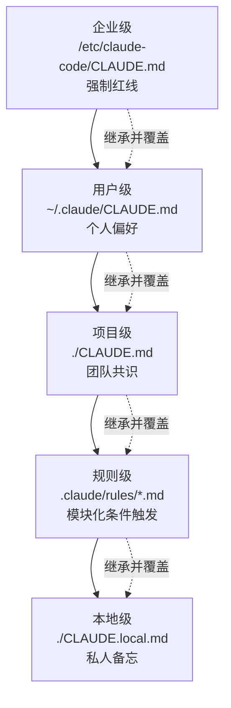
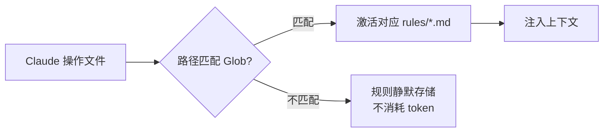
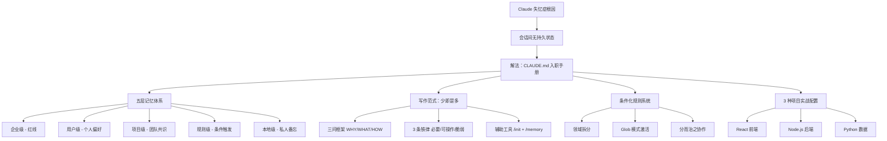

# 给 AI 写一份"入职手册"：CLAUDE.md 写作与五层记忆体系

## 速查表（一页纸地图）

| 模式/概念 | 一句话定义 | 核心比喻 | 典型场景 |
|---------|----------|---------|---------|
| 失忆症根因 | 每次新会话 Claude 都是"入职第一天" | 技术过硬但第一天上班的新员工 | 反复纠正模型错误的根源 |
| 五层记忆体系 | 企业/用户/项目/规则/本地 层层叠加 | 公司制度文件分层架构 | 多层级规则冲突与覆盖 |
| 三问框架 | WHY / WHAT / HOW 内容筛选标准 | 招聘需求三段式拆解 | 决定什么该写进 CLAUDE.md |
| 少即是多 | 指令密度与遵循概率成反比 | 高峰期地铁塞人 | 控制 CLAUDE.md 长度 |
| 条件化规则 | Glob 模式限定作用范围的懒加载 | 不同岗位配专属手册 | 巨型项目的模块化规则治理 |

## 0. 全章比方：员工手册的工程化

把 Claude 想象成一名技术过硬、但每天清晨都"格式化记忆"的新员工。你的工作不是教它技术，而是为他准备一份**专属入职手册**——它翻开就能立刻投入工作。本章用"公司制度分层"和"作战备忘录"两条比喻，帮你把这份手册的写法一次说透。

---

## 2.1 为什么 AI 需要"记忆"

### 类比：技术过硬但每天失忆的新人

Claude 每次新会话都相当于其"入职第一天"。它不知道你项目用 Fastify 还是 Express、用 pnpm 还是 npm、用 TS 还是 JS。它的训练数据是全网公开代码的统计分布，所以默认会选择"最主流"的方案——而这往往恰恰撞上你团队规范的"红线"。

**根因**：会话间缺乏持久状态。这不是某个模型的缺陷，而是当前所有大模型的共性。

**解法**：把团队约定从人脑中外化为机器可读的声明式文件——`CLAUDE.md`。

### 💡 关键洞察：约定 vs 配置

Claude 缺失的不是**能力**，而是**上下文**。既然每次都是入职第一天，那就为它准备一份专属手册——这种思路在软件工程中早已屡见不鲜：`.editorconfig`、`tsconfig.json`、`.prettierrc` 都是把隐性约定外化为显性配置。`CLAUDE.md` 的"读者"从编译器变成了具备自然语言理解能力的大模型——这就是**配置驱动思维在 AI 时代的自然延伸**。

---

## 2.2 五层记忆体系

### 类比：公司制度文件分层

| 层级 | 文件比喻 | 位置 | 管理者 | 范围 |
|------|---------|------|--------|------|
| 企业级 | 《集团行为准则》 | `/etc/claude-code/CLAUDE.md` | IT 部门 | 全公司强制 |
| 用户级 | 《个人偏好档案》 | `~/.claude/CLAUDE.md` | 开发者个人 | 跨项目个人 |
| 项目级 | 《项目开发手册》 | `./CLAUDE.md` | Tech Lead | 团队共享 |
| 规则级 | 《专项操作指引》 | `.claude/rules/*.md` | 领域专家 | 模块化条件触发 |
| 本地级 | 《私人便签》 | `./CLAUDE.local.md` | 开发者个人 | 仅自己可见 |



### 关键规则：叠加而非覆盖 + 具体性优先

5 个层级遵循**叠加而非覆盖**原则——Claude Code 读取所有层级合并为完整上下文。当冲突时：
- **常规层级**：具体性优先（如项目级"2 空格缩进" > 用户级"4 空格缩进"）
- **企业级例外**：拥有绝对强制力，无法绕过

### 💡 关键洞察：文件引用机制

任何层级记忆文件中都可用 `@path/to/file` 语法引入其他文件，支持最多 5 层嵌套递归——`CLAUDE.md` 不再承载所有细节，而是作为"索引总纲"灵活指向各个专题文档。

---

## 2.3 CLAUDE.md 写作范式

### 类比：高峰期地铁塞人

> 上下文窗口就像一张面积固定的办公桌。CLAUDE.md 在每次对话初始化时被完整注入——你写的每一行，都会在每次交互中消耗 Token 配额。桌面占满后，模型不得不"扔掉"早期关键信息。

### 关键数据（Anthropic 工程实践）

- System Prompt 内置约 50 条核心指令
- 用户自定义 CLAUDE.md 加入后，若总指令数突破 **150 条**，指令遵循质量显著衰减
- **铁律**：指令密度与遵循概率成反比

### 三问筛选框架

| 问 | 作用 | 示例 | 效果 |
|----|------|------|------|
| **WHY** | 揭示决策底层逻辑 | 「选 Fastify 因 schema-based validation 与"类型安全优先"战略一致」 | 帮模型举一反三 |
| **WHAT** | 划定行为边界 | 「必须用 pnpm；禁止 npm/yarn」 | 建立红线 |
| **HOW** | 固化操作流程 | 「执行数据库迁移请运行 `pnpm db:migrate`」 | 减少命令拼写错误 |

**经验法则**：大多数规则只需要 WHAT 层面一句话即可；只有易被误解或模型容易"好心办坏事"的关键决策，才值得补充 WHY。

### 关键代码：反面 vs 正面 CLAUDE.md 对比

**❌ 反面：模糊的"正确的废话"**

```markdown
# 项目说明
这是一个电商平台的后端服务，我们团队有5个人...
代码要写得好一些，注意性能。
测试要全面。
请遵循最佳实践。
```

**问题**：「写得好一些」到什么程度？「全面」覆盖哪些场景？「最佳实践」是谁的最佳实践？模型读完获取可操作信息几乎为零。

**✅ 正面：精准的"操作手册"**

```markdown
# 订单服务 API
## 技术栈
- Node.js 20 + TypeScript 5.3（严格模式）
- Fastify 4 框架（不使用 Express）
- Prisma ORM + PostgreSQL 15
- pnpm 8 包管理（不使用 npm/yarn）
## 项目结构
- src/routes/ — 路由定义，只做参数解析和响应构造
- src/services/ — 业务逻辑层，所有核心逻辑在此
- src/repositories/ — 数据访问层，封装 Prisma 调用
- src/schemas/ — Zod 验证 schema，与路由一一对应
## 关键约定
- API 统一返回：{ success: boolean, data?: T, error?: { code, message } }
- 错误码 UPPER_SNAKE_CASE（如 ORDER_NOT_FOUND）
- 表名 snake_case 复数，主键 UUID，必带 created_at / updated_at
## 常用命令
pnpm dev     # 启动开发服务器，端口 3000
pnpm test    # 运行测试（vitest）
pnpm build   # TypeScript 编译 + 类型检查
pnpm db:migrate  # 执行 Prisma 迁移
```

### 3 条铁律

- **必要性**：每条都是 Claude 必须知道且无法自行推断的信息
- **可操作性**：每条都是具体、明确、可执行的指令
- **脆弱性测试**：删去任一条，Claude 都会犯错或偏离预期

### 💡 关键洞察：黄金检验标准

> 「引自原文」：如果删去某条规则后，Claude 依然能做出正确的行为，那么这条规则不该出现在 CLAUDE.md 中。

### 辅助工具：`/init` 与 `/memory`

| 工具 | 用途 | 局限 |
|------|------|------|
| `/init` | 自动扫描项目结构生成 CLAUDE.md 初稿 | 无法推断架构决策 / 团队约定等隐性知识 |
| `/memory` | 对话过程中动态更新记忆文件 | 需手动选择目标文件 |

---

## 2.4 条件化规则系统

### 类比：不同岗位配专属手册

`.claude/rules/` 把"一本大而全的手册"进化为"按需取用的模块化知识库"：

- **领域拆分**：每文件专注一个主题
- **智能激活**：通过 YAML Frontmatter 的 `paths` 字段声明 Glob 模式，仅当操作匹配路径时才激活



### 关键代码：测试规范规则文件

**用途**：仅在编辑测试文件时激活规范

```markdown
<!-- .claude/rules/testing.md -->
---
paths:
  - "**/*.test.ts"
  - "**/*.spec.ts"
  - "tests/**"
---

# 测试规范
- 采用 vitest 作测试框架，禁用 jest
- 每个测试文件必须包含 describe 代码块，且其名称需要与被测模块保持一致
- 模块模拟统一使用 vi.mock()，禁止手动 Mock
- 异步测试一律采用 async/await 语法，禁止使用 done 回调
- 测试数据需要通过 factory 函数生成，严禁在测试中硬编码
```

### 关键代码：API 设计规范规则文件

**用途**：仅在编辑路由或 Schema 文件时激活

```markdown
<!-- .claude/rules/api-design.md -->
---
paths:
  - "src/routes/**"
  - "src/schemas/**"
---

# API 设计规范
- 每个路由必须配置对应的 Zod schema 以进行入参验证
- 列表接口统一支持分页参数：page（从 1 开始计数）和 limit（默认 20，最大值 100）
- 错误响应结构必须包含机器可读的 code 字段与人类可读的 message 字段
```

### 💡 关键洞察：多人协作下的分而治之

模块化组织方式让各领域专家可独立维护其专属规则文件，大幅降低 Git 合并冲突概率——前端工程师维护 `frontend.md`、后端工程师维护 `api-design.md`、DBA 把控 `database.md`，各司其职。

> ⚠️ 若规则文件未配置 `paths`，系统会视为**全局无条件规则**强制加载——务必为每个规则文件设定精准的 `paths` 限定。

---

## 2.5 实战：3 种典型项目配置

### 设计哲学：聚焦"最高频出错点"

CLAUDE.md 不是 React/Python 教科书，而是**精确制导武器**——只记录本项目独有、Claude 无法自行推断的关键信息。

### 2.5.1 React 前端项目

**最大痛点**：组件粒度 / 状态归属 / 样式方案——Claude 最容易"自作主张"导致风格割裂。

```markdown
# 电商平台前端项目规范
## 技术栈
- 核心：React 18 + TypeScript（严格模式）
- 构建 / 包管：vite + pnpm
- 状态管理：
  - 服务器状态：TanStack Query (React Query)
  - 客户端全局状态：Zustand
  - 样式方案：Tailwind CSS（严禁使用 CSS Modules 或 styled-components）
## 组件规范
- 范式：仅使用函数组件 + Hooks，禁止 class 组件
- 命名：PascalCase 文件（如 ProductCard.tsx）；Props 类型命名 ComponentName + Props
- 目录结构：通用 UI 原子 → src/components/ui/；业务领域 → src/components/features/
## 状态管理决策树（重点）
- 服务器数据（API 响应、缓存、同步）→ TanStack Query
- 全局客户端状态（主题、登录态、购物车临时态）→ Zustand
- 组件局部状态（表单输入、Dropdown 展开、Modal 显示）→ useState
## 常用命令
pnpm dev    # 启动开发服务器，端口 5173
pnpm build  # 生产环境构建
pnpm test   # 运行 vitest 单元测试
pnpm lint   # ESLint 代码检查
```

**💡 关键设计**：状态管理决策树把"工具清单"升级为"场景到工具的映射逻辑"——直接告诉 Claude 在遇到具体问题时该选哪把钥匙。

### 2.5.2 Node.js 后端项目

**最大痛点**：分层架构的职责边界——若 route 层直接调用 Prisma，业务逻辑会泄漏到基础设施层。

```markdown
# 订单微服务后端规范
## 技术栈
- 运行时：Node.js 20 + TypeScript 5.3
- 框架：Fastify 4（严禁使用 Express）
- 数据库：Prisma ORM + PostgreSQL 15
- 工具链：pnpm（包管理）、Zod（数据验证）
## 分层架构（严格单向依赖）
- routes/ — 解析请求参数、校验输入、调用 controller、构造 HTTP 响应
- controllers/ — 编排 service 调用、处理 HTTP 语义、异常捕获与转换
- services/ — 核心业务规则实现、事务控制、多 repository 协调
- repositories/ — 封装 Prisma 查询、数据映射（严禁其他层级直接调用 Prisma）
## API 响应标准
- 统一返回：{ success: boolean, data?: T, error?: { code, message } }
- 分页：page（从 1 开始），limit（默认 20，最大值 100）
- 错误码：UPPER_SNAKE_CASE 格式
## 常用命令
pnpm dev          # 启动开发服务器，端口 3000
pnpm test         # 运行 vitest 测试套件
pnpm build        # tsc 编译
pnpm db:migrate   # 执行 Prisma 数据库迁移
pnpm db:studio    # 启动 Prisma Studio 可视化界面
```

**💡 关键设计**：「严禁其他层级直接调用 Prisma」是一条**不可逾越的架构铁律**——直接决定项目的可维护性与生命力。

### 2.5.3 Python 数据项目

**最大痛点**：数据科学领域的工程习惯——滥用 `inplace=True` 破坏可追溯性，混用 `None` 与 `pd.NA` 导致缺失值混乱。

```markdown
# 用户行为分析系统规范
## 技术栈
- 环境：Python 3.11 + uv（管理依赖与虚拟环境）
- 核心库：pandas 2.x、scikit-learn、matplotlib + seaborn
- 代码规范：严格使用 typing 模块、文档字符串采用 Google Style
## 项目结构
- notebooks/：探索性分析（Jupyter），命名 "序号-描述.ipynb"
- src/data/：数据加载、清洗与管道构建
- src/features/：特征工程逻辑
- src/models/：模型定义、训练流程与评估指标
- tests/：pytest 单元测试套件
## 数据处理约定（重点）
- 缺失值：统一使用 pd.NA，禁止 None 或裸用 np.nan
- 日期列：统一转换为 datetime64，输出/存储格式 YYYY-MM-DD
- 内存优化：低基数分类变量必须显式转换为 category 类型
- DataFrame：禁止使用 inplace=True，所有转换操作必须返回新副本
## 常用命令
uv sync             # 安装/同步依赖环境
uv run pytest       # 运行测试套件
uv run jupyter lab  # 启动 Jupyter Lab
uv run python -m src.train  # 执行模型训练脚本
```

### 💡 关键洞察：3 份文件共同法则

> 「引自原文」：这 3 份文件的篇幅均控制在二三十行，但字字珠玑，每一行都是干货。

它们的共同特征：**摒弃 Claude 早已熟知的通用知识，精准聚焦于特定领域与本项目独有的约定和抉择**。

---

## 横向对比：3 种项目 CLAUDE.md 配置差异

| 维度 | React 前端 | Node.js 后端 | Python 数据 |
|------|-----------|-------------|-------------|
| 最高频出错点 | 组件粒度 / 状态归属 | 分层架构职责边界 | 数据处理不可逆性 |
| 决策树重点 | 状态管理选型 | 层级调用方向 | 缺失值 / 日期格式 |
| 架构铁律 | 禁止 class 组件 | 严禁跨层调用 Prisma | 禁止 inplace=True |
| 状态管理 | TanStack Query / Zustand / useState | 暂存于 controller 层 | DataFrame 必须返回新副本 |

---

## 工程踩坑清单

| 踩坑场景 | 症状 | 规避方案 |
|---------|------|---------|
| CLAUDE.md 过长 | 突破 150 条指令临界值，遵循质量骤降 | 每条做"脆弱性测试"：删去后 Claude 会犯错才保留 |
| 写"代码要写得好一些" | 模型获取可操作信息为零 | 用具体数字 / 工具名 / 命名约束替代抽象要求 |
| 用 CLAUDE.md 装 React 基础 | Token 浪费 + 噪声干扰 | 只写本项目独有约定 |
| 规则文件不配 paths | 强制全局加载，违背懒加载设计 | 每个 rules/*.md 必须声明 Glob 模式 |
| 用户级与项目级冲突未思考 | 缩进 / 命名规则混乱 | 遵循"具体性优先"原则，强制项放项目级 |
| 团队规范改动未更新 CLAUDE.md | 模型继续按旧规范执行 | 每次重大技术决策变更同步更新文件 |

---

## 全章知识地图



---

## 贯穿主线：一句话哲学总结

> **CLAUDE.md 的价值不在于多，而在于精准**——只记录 Claude 必须知晓、却无法自行推断的关键信息。

---

## 学习路径建议

1. **第 1 步**：用 `/init` 生成项目级 CLAUDE.md 初稿
2. **第 2 步**：用"三问框架"审视每一条规则是否值得保留
3. **第 3 步**：执行"脆弱性测试"逐行删减直到删不动为止
4. **第 4 步**：将大型规则拆解到 `.claude/rules/*.md` 并配置 paths
5. **第 5 步**：建立团队规范变更 → 同步更新 CLAUDE.md 的协作机制

每一步完成后，务必在真实项目中实测一周再进入下一阶段。