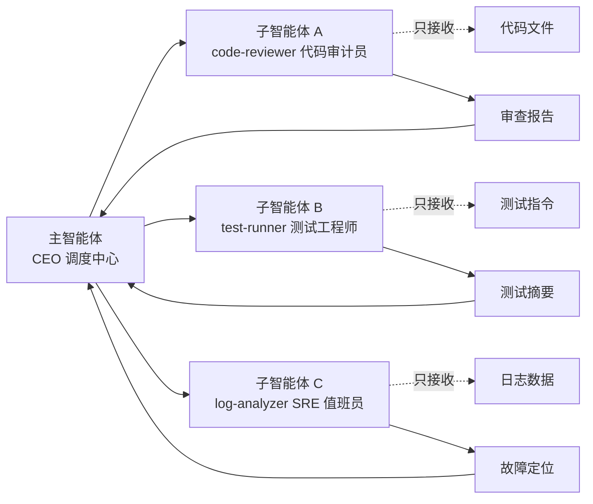
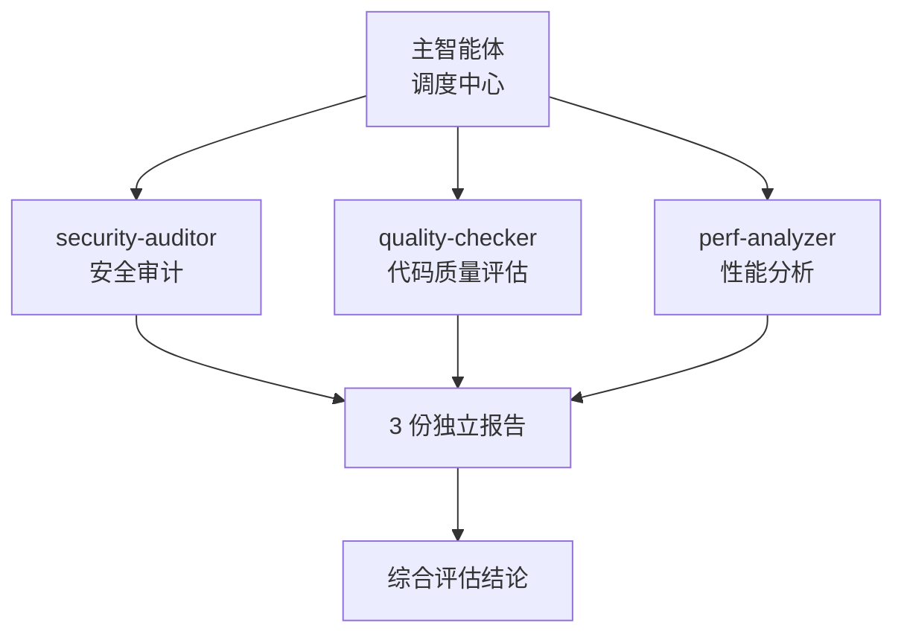
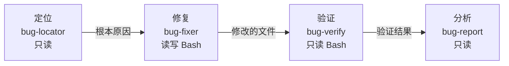
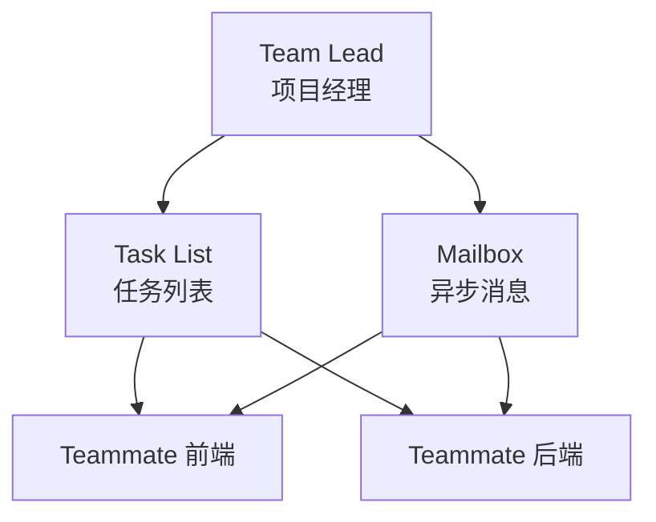
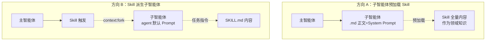
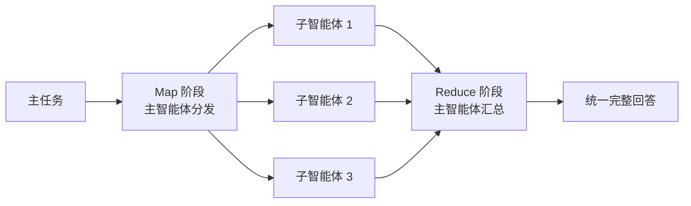
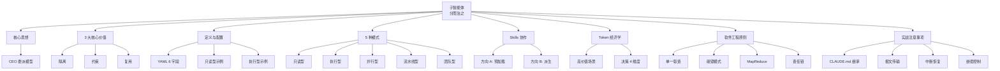

# 当 Claude 学会当 CEO：子智能体委派式架构

## 速查表（一页纸地图）

| 模式/概念 | 一句话定义 | 核心比喻 | 典型场景 |
|---------|----------|---------|---------|
| CEO 委派模型 | 主智能体拆任务，子智能体在隔离上下文中执行 | 老板 vs 部门员工 | 所有子智能体的总纲 |
| 3 大核心价值 | 隔离 / 约束 / 复用 | 进程隔离 / 最小权限 / 组件化 | 评估子智能体必要性 |
| 5 种模式 | 只读 / 执行 / 并行 / 流水线 / 团队 | 观察员 / 信噪优化 / 侦探组 / 装配线 / 公司 | 5 层递进的能力谱系 |
| Skills × 子智能体 | 方向 A 子智能体预加载 Skill / 方向 B Skill 派生子智能体 | 操作手册 vs 调度者 | 解决"专业知识"来源 |
| Token 经济学 | 输入 >> 输出的高噪声任务用子智能体反而省 Token | 信噪比 | 决策何时启用 |
| 4 大软件工程原则 | 单一职责 / 舱壁 / MapReduce / 责任链 | 经典设计模式迁移 | 架构直觉 |

## 0. 全章比方：把 Claude 当 CEO 用

把 Claude 主对话想象成一位样样都懂、但信息一多就抓狂的 CEO。**子智能体（Subagent）** 就是这位 CEO 下属的"独立办公室员工"——每位员工拥有**独立的办公空间（上下文窗口）**、**专属的权限清单（工具白名单）**、**明确的工作职责（YAML 配置）**。CEO 把脏活、累活、噪声活委派出去，自己只看员工的精炼汇报。本章用「CEO 委派」「侦探三人组」「船舶水密舱」三个连续比喻，把子智能体这套"委派式思考"的架构体系一次说透。



**关键解读**：
- 主智能体 = 调度者（负责拆任务 + 收结果）
- 子智能体 = 执行者（独立空间 + 最小权限 + 单一职责）
- 信息流 = 报文传递（非共享内存）——子智能体之间不能直接通信

---

## 4.1 CEO 委派模型：子智能体的核心思想

### 类比：CEO vs 部门员工

小冰每天让 Claude 直接看 500 行错误日志来定位 bug，Claude 的注意力被日志噪声稀释，回复越来越泛泛。**如果让 Claude 当 CEO**，把"日志分析"委派给"log-analyzer 员工"，这位员工在自己的办公室里消化 500 行日志，最后只回报一句："根因定位：src/payment/charge.ts:89 缺少空值检查"——主对话从此清爽。

### 三大核心价值

> 子智能体的定义：**具备独立上下文窗口、受限工具权限及明确任务范围的 Claude 实例。**

| 价值 | 含义 | 软件工程对应 | 实战效果 |
|------|------|-------------|---------|
| **隔离** | 上下文窗口独立，文件读取/命令输出/中间推理全部封锁在子智能体内 | 进程隔离 / 地址空间 | 500 行日志噪声归零 |
| **约束** | 工具白名单从系统底层卡死边界，Prompt 劝导无效 | 最小权限原则 | code-reviewer 物理上无法 Edit 文件 |
| **复用** | Markdown 格式定义，支持团队共享 / 项目迁移 | 组件化 / 标准化模块 | 新员工入职即用 |

### 💡 关键洞察：约束不是"建议"

传统 Prompt 中"请不要修改文件"是被 LLM 随时可忽略的建议；子智能体的 `tools: [Read, Grep, Glob]` 是**物理层**的强制约束——未列出的工具在系统层面根本不可见、不可调用。这是"机制（Mechanism）优于策略（Policy）"的经典安全设计。

---

## 4.2 子智能体的定义与配置

### YAML 前置元数据：6 大字段

```markdown
---
name: code-reviewer                       # 1. 唯一标识符
description: 审查代码质量、安全漏洞和性能问题的专家。  # 2. 触发描述
  当用户要求代码审查、安全审计或质量评估时使用
tools: [Read, Grep, Glob]                 # 3. 工具白名单（最关键）
model: sonnet                             # 4. 指定模型（成本优化杠杆）
permissionMode: plan                      # 5. 权限模式（plan=全局只读）
skills: [secure-coding]                   # 6. 预加载 Skill（可选）
hooks: { PreToolUse: [...] }              # 7. 事件钩子（可选）
---

# 角色定义
你是一名资深的代码审查专家，拥有 10 年以上的工程经验。
...
```

**字段速解**：

- `name` — 系统日志、调试追踪、内部调用链的唯一键值
- `description` — 主智能体进行**语义匹配**的"广告牌"，决定自动委派
- `tools` — 最小权限的安全闸门，列举外的工具**不可见、不可调用**
- `model` — Haiku 用于模式化任务（测试、过滤），Sonnet/Opus 用于深度推理
- `permissionMode: plan` — 比工具白名单更严格的**系统级**只读模式
- `skills` / `hooks` — 高级字段，让子智能体预加载知识包 / 事件钩子

### 关键代码：只读型子智能体 vs 执行型子智能体

**只读型**（code-reviewer）—— 仅观察：

```yaml
---
name: code-reviewer
description: 审查代码质量、安全漏洞和性能问题的专家。当用户要求代码审查、安全审计或质量评估时使用
tools: [Read, Grep, Glob]
model: sonnet
permissionMode: plan
---
```

**执行型**（test-runner）—— 需 Bash 执行：

```yaml
---
name: test-runner
description: 运行项目测试套件并分析测试结果。当用户要求运行测试、检查测试覆盖率或分析测试失败原因时使用
tools: [Read, Grep, Glob, Bash]
model: haiku   # 模式化任务选 Haiku，省成本
---
```

**执行流程**：
1. 确认项目的测试命令（package.json / CLAUDE.md）
2. 运行测试套件
3. 分析输出结果，区分通过/失败
4. **仅输出摘要**（禁止完整测试日志）

### 关键代码：执行型输出格式（强约束）

```markdown
### 测试摘要
总计: X 个测试 | 通过: Y 个 | 失败: Z 个 | 跳过: W 个

### 失败详情
- test_name | 失败原因（一句话） | at file_path:line_number

### 建议
[如果存在明显失败模式]
```

> 「引自原文」：输出中严禁包含完整的测试日志，仅需要输出上述格式的摘要信息。

### 两种使用方式

- **自动委派**：用户只说"帮我审查 src/payment/ 目录的代码变更"，主智能体根据 description 自动匹配 code-reviewer
- **显式请求**：用户直接说"用 code-reviewer 审查这个 PR"

---

## 4.3 5 种子智能体模式

> 5 种模式不是分类清单，而是 5 种**截然不同的架构范式**——每一种精准对应特定任务特征。

### 4.3.1 只读型：安全的观察者

| 维度 | 内容 |
|------|------|
| 工具 | `Read`, `Grep`, `Glob`（三大只读） |
| 类比 | 审计员/检察官——指出问题，绝不擅改 |
| 典型场景 | 代码审查、安全审计、架构分析、依赖检查 |
| 强化机制 | `permissionMode: plan` 让整个会话被标记为系统级只读 |

> 赋予实体完成其职责所必需的精确权限，不多亦不少——这就是**最小权限原则**在 AI Agent 领域的自然延伸。

### 4.3.2 执行型：高噪声任务处理器

| 维度 | 内容 |
|------|------|
| 工具 | `Read`, `Grep`, `Glob`, `Bash`（含前缀白名单） |
| 类比 | 信噪比优化器——输入 500 行，仅输出 5 行结论 |
| 典型场景 | 测试执行、日志分析、代码格式化、批量处理 |
| 设计模式 | 外观模式（Facade Pattern）—— 简化复杂子系统的接口 |

**关键代码：Bash 精细化控制**

```yaml
tools:
  - Read
  - Grep
  - Glob
  - Bash (npm test:*)     # 仅允许 npm test 前缀
  # 严禁：Bash (*)  ← 这等于放弃所有防线
```

### 4.3.3 并行型：多专家工作流



| 维度 | 内容 |
|------|------|
| 类比 | 3 位侦探协同办案——A 查物证、B 访人证、C 调监控 |
| 前提 | 子任务之间**完全独立**，无共享状态、无依赖关系 |
| 设计模式 | MapReduce——主智能体 Map 调度，Reduce 汇总 |
| 并行机制 | `Ctrl+B` 将子智能体转入后台运行，主线程不阻塞 |

**反例**：若子任务存在逻辑依赖（如"必须先定位 bug 才能修复"），并行模式失效——后续任务因缺乏前置输入而失败。

### 4.3.4 流水线型：串行处理链



| 维度 | 内容 |
|------|------|
| 类比 | Unix 管道 `cat log.txt \| grep ERROR \| sort \| uniq -c` |
| 核心技术 | 交接契约（Handoff Contract）——每阶段输出格式必须匹配下一阶段输入 |
| 设计模式 | 责任链模式（Chain of Responsibility） |
| 安全保障 | 各阶段工具权限**截然不同**，最小权限贯穿全链 |

### 关键代码：bug 修复流水线（4 阶段契约）

```yaml
# 阶段 1：定位（只读）
name: bug-locator
description: 定位产生 bug 的根本原因
tools: [Read, Grep, Glob]
permissionMode: plan
## 输出格式（下游依赖此格式）
根本原因文件: [file_path:line_number]
问题描述: [一句话概述]
调用链: [从入口到出错点的完整路径]
修复方向: [简要修复思路]
---
```

```yaml
# 阶段 2：修复（读写 + Bash）
name: bug-fixer
description: 基于定位结果修复 bug
tools: [Read, Grep, Glob, Edit, Write, Bash]
## 输出格式
修改的文件: [file_path_1, file_path_2, ...]
每处修改的原因: [逐一说明]
潜在副作用: [如果有，请详细说明]
建议的测试命令: [用于验证修复的具体命令]
---
```

```yaml
# 阶段 3：验证（只读 + Bash）
name: bug-verify
description: 验证 bug 修复是否有效
tools: [Read, Grep, Glob, Bash]
permissionMode: plan
## 输出格式
验证结果: [通过/未通过]
测试执行记录: [已执行命令及结果]
回归影响: [是否导致其他用例失败]
遗留风险: [如有；如无则填"无"]
---
```

```yaml
# 阶段 4：报告（只读）
name: bug-report
description: 分析修复的影响范围并生成报告
tools: [Read, Grep, Glob]
permissionMode: plan
## 输出格式
Bug 摘要: [一句话精准概括]
根本原因: [文件路径 + 具体原因]
修复方案: [改动要点摘要]
验证状态: [通过/未通过]
影响范围: [涉及的模块、API、用户场景]
后续建议: [是否通知下游/更新文档]
---
```

> **交接契约**：bug-locator 输出"根本原因文件 + 修复方向" → bug-fixer 的启动输入；bug-fixer 输出"修改的文件 + 建议的测试命令" → bug-verify 的验证依据。这种**上下游格式严丝合缝的契约**是流水线型可靠运行的基石。

### 4.3.5 团队型：自组织协作



| 维度 | 内容 |
|------|------|
| 区别 | 4 种普通子智能体"一次性"执行；团队型子智能体**长期存续**、实时通信、自主分工 |
| 3 大组成 | Team Lead（调度）+ Teammate（多专业成员）+ 共享基础设施（Task List + Mailbox） |
| 4 种典型协作 | 竞争假设 / 并行审查 / 模块归属 / 方案审批（魔鬼代言人） |
| 成本 | 运行开销高（持续 Token 消耗），仅复杂协作场景值得 |

**判断标准**：若子智能体之间需要**多轮通信与深度协调** → 团队型；若每个子智能体仅执行一次任务即可完结 → 简单并行/流水线型。

### 5 种模式速查

| 模式 | 工具特征 | 适用任务 | 设计模式对应 |
|------|---------|---------|------------|
| 只读型 | 仅 Read/Grep/Glob | 审查、审计、分析 | 观察者模式 |
| 执行型 | + Bash（前缀） | 测试、日志、批处理 | 外观模式 |
| 并行型 | 多子智能体同时 | 多维独立分析 | MapReduce |
| 流水线型 | 串行 + 交接契约 | 多阶段依赖流程 | 责任链模式 |
| 团队型 | 长期存续 + 通信 | 复杂协作 / 重构 | Agent Team |

---

## 4.4 子智能体与 Skills 的协作

> 核心问题：子智能体的"专业知识"究竟源自何处？

### 2 种原子组合模式



| 维度 | 方向 A：子智能体预加载 Skill | 方向 B：Skill 派生子智能体 |
|------|---------------------------|------------------------|
| 包含关系 | 子智能体**包含** Skill | Skill **派生**子智能体 |
| 角色定位 | 子智能体是执行者，Skill 是操作手册 | Skill 是调度者，子智能体是执行容器 |
| System Prompt | 子智能体 `.md` 正文 | `agent` 字段指定的 Agent 类型 |
| 适用场景 | 流水线中需领域知识的角色（bug-fixer + secure-coding） | 一次性重型任务（codebase-health-check） |
| 选择信号 | 需**维持角色状态 / 多轮交互** | **单次性 + 严格隔离 + 复用流程** |

### 💡 关键洞察：判断"谁是主角"

> 「引自原文」：方向 A 选子智能体是主角；方向 B 选 Skill 是主角。

### 关键代码：方向 A — bug-fixer 预加载 secure-coding

```yaml
# .claude/agents/bug-fixer.md
---
name: bug-fixer
description: 基于定位结果修复 bug，遵循团队安全编码规范
tools: [Read, Grep, Glob, Edit, Write, Bash]
skills: [secure-coding]   # 预加载安全编码 Skill
---
你是一名 bug 修复专家。你将接受来自 bug-locator 的定位结论，并据此执行修复。在修复过程中，必须严格遵循 secure-coding Skill 中定义的安全编码规范。
```

```yaml
# .claude/skills/secure-coding/SKILL.md
---
name: secure-coding
description: Secure coding checklist for bug fixes and new features
user-invocable: false   # 工具书型，菜单中不显示
---
# 安全编码规范
## 空值防御
- 输入校验：所有外部输入必须进行非空检查
- 安全访问：优先使用可选链 (?.) 访问嵌套属性
- 数据判空：数据库查询结果在业务逻辑使用前必须显式判空
## 错误处理
- 统一异常：业务逻辑异常必须使用项目统一的 AppError 类
- 拒绝静默失败：严禁空 catch 块
- 超时控制：所有异步操作必须配置明确的超时时间
## 日志规范
- 专用接口：生产环境严禁使用 console.log
- 信息完整：错误日志必须包含 errorCode + Stack trace
- 数据脱敏：严禁在日志中输出敏感信息
```

**关键点**：
- `user-invocable: false` 表示该 Skill 不出现在用户 `/` 菜单中
- 子智能体启动时**自动预加载**，作为"工具书"
- 同一个 `secure-coding` Skill 既可供 bug-fixer 预加载，也可被 code-reviewer 调用——**Skill 是可复用的知识模块，子智能体是这些知识的灵活消费者**

---

## 4.5 Token 经济学：何时省？何时贵？

### 反直觉结论：合理使用子智能体反而**降低**总 Token 消耗

> 「引自原文」：高价值场景（输入 >> 输出）——子智能体价值显著；低价值场景（输入 ~ 输出）——子智能体隔离开销不划算。

### 关键数据：5 轮对话对比

| 维度 | 不使用子智能体 | 使用子智能体 | 节省 |
|------|--------------|------------|------|
| 噪声 Token 总量 | 50000（每轮重复传输 10000） | 100（仅摘要进入主对话） | 99.8% |
| 主对话 5 轮累计 | 125000 | 75500 | -39.6% |
| 子智能体内部 | 0 | 41000 | — |
| **总计** | **125000** | **116500** | **-6.8%** |

> 节省比例随对话轮数增加而显著提升——10 轮可达 10% 以上，20 轮可达 20% 以上。

### Prompt Caching 的削弱效应

Anthropic 的 Prompt Caching 对缓存命中 Token 仅收标准价的 10%，**削弱了**上述成本优势。纳入缓存因素后，节省率从 6.8% 回落至 **1%~2%**。

### 💡 关键洞察：成本优化只是子智能体价值的 1/3

| 维度 | 子智能体价值 | Prompt 缓存能否替代 |
|------|------------|------------------|
| **Token 节省** | 1%~6.8% | ✅ 部分替代 |
| **上下文窗口保护** | 避免噪声挤占存储、提前触发压缩 | ❌ 无法替代 |
| **响应质量提升** | 纯净上下文 → 注意力不分散 | ❌ 无法替代 |

### 启用决策的 4 大核心维度

| 维度 | 触发条件 | 价值 |
|------|---------|------|
| 大规模文件读取 | 读取 > 5 个文件 | 输入噪声隔离 |
| 高频输出生成 | 完整测试报告 / 构建记录 | 输出噪声过滤 |
| 上下文完整性保护 | 长期任务规划 | 保留后续交互空间 |
| 操作权限与安全边界 | 涉及写入 / 网络 / 外部命令 | 风险管控（沙箱） |

---

## 4.6 从软件工程看子智能体：4 大经典设计原则

> 核心观点：子智能体架构**未凭空创造**新概念，而是将软件工程数十年的经典智慧**创造性地迁移**到 AI Agent 架构。

### 原则 1：单一职责原则（SRP）

| 软件工程定义 | AI Agent 映射 |
|------------|--------------|
| 一个类只应有一个引起它变化的理由 | 每个子智能体只做一件事 |
| 职责说明书：类的 API 文档 | 角色 Prompt：子智能体的 `.md` 配置文件 |
| 变更隔离：修改 A 不影响 B | 修改 code-reviewer.md 不影响 bug-fixer.md |

```yaml
# 高内聚的独立类
- code-reviewer：仅做代码质量审查
- test-runner：仅执行测试并收集结果
- bug-locator：仅定位 bug 根本原因
```

### 原则 2：舱壁模式（Bulkhead Pattern）

| 造船工程 | 微服务架构 | AI Agent 架构 |
|---------|-----------|--------------|
| 水密隔板防止单舱进水沉没 | 防止单服务故障引发级联雪崩 | 子智能体上下文隔离 |
| 故障锁定在局部 | 服务降级 | 异常锁定在子智能体沙箱 |

> 「引自原文」：如果 log-analyzer 子智能体在处理海量日志时遭遇死循环、幻觉爆发或格式崩溃，由此产生的"故障"会被严格封锁在子智能体的独立沙箱内，主系统稳定性得到保障。

### 原则 3：MapReduce 模式



- **Map** 阶段：主智能体调度者，拆解任务 → 分发至子智能体（工作节点）
- **Reduce** 阶段：主智能体收集 + 整合 + 提炼各子智能体输出

### 原则 4：责任链模式（Chain of Responsibility）

| 经典实现 | AI Agent 变体 |
|---------|--------------|
| Unix 管道：`cat log.txt \| grep ERROR \| sort \| uniq -c` | 流水线型子智能体 |
| Java Servlet Filter Chain | bug-locator → bug-fixer → bug-verify → bug-report |
| Node.js Express 中间件 | 4 阶段工具权限逐级收敛 |

> 流水线型模式是该模式的变体：不同于传统责任链中由"某个"处理器终结请求，流水线型模式要求"**每个**"处理器均对请求进行部分处理，并将中间结果传递给下一环节。

---

## 4.7 实战注意事项（4 大生产陷阱）

### 4.7.1 CLAUDE.md 继承与优先级

**优先级顺序**（高 → 低）：

```
子智能体定义文件  >  项目级 CLAUDE.md  >  用户级 CLAUDE.md
```

- 项目根目录的 `CLAUDE.md` 对所有子智能体**自动生效**
- 子智能体自身的定义文件可**补充甚至覆盖**项目级规则
- 继承 = 全自动，无需显式声明

### 4.7.2 上下文的"报文传输"模式

> 「引自原文」：子智能体之间**无法直接通信**——既无权访问主对话的历史记录，也无法感知其他子智能体的存在。

| 机制 | 报文传输 | 共享内存 |
|------|---------|---------|
| 通信方式 | 主智能体显式传递 | 节点间直接读取 |
| 耦合度 | 低（解耦） | 高（耦合） |
| 设计要求 | 输出格式必须**高度结构化** | 需同步机制 |

**工程启示**：务必确保每个阶段的输出格式具备高度结构化特征，以便主智能体准确提取并顺利转发。

### 4.7.3 中断恢复机制

子智能体在执行过程中因网络波动或手动终止而被中断时，**内存中的中间工作成果将会丢失**。

**应对策略**：让子智能体将中间产物持久化至文件。

```markdown
# 示例：日志分析子智能体的断点恢复
工作日志：.claude-work/log-analysis.md
- 已分析区间：2024-01-01 ~ 2024-01-15
- 已发现异常：[error_code_500, ...]
- 断点：2024-01-16 00:00:00
```

新的子智能体启动时先读取该文件，**精准定位断点并接续工作**。

### 4.7.4 嵌套深度控制

| 嵌套层数 | 调试难度 | 信息损耗 | 推荐度 |
|---------|---------|---------|--------|
| 1 层 | 低 | 无 | ✅ 推荐 |
| 2 层 | 中 | 轻微 | ⚠️ 谨慎 |
| 3 层+ | 指数级上升 | 严重 | ❌ 禁止 |

> 「引自原文」：如果发现业务逻辑需要 3 层以上的嵌套，这通常意味着任务分解的粒度存在缺陷——此时应重新架构设计，将深层嵌套"扁平化"，转而采用更高效的并行处理或流水线结构。

### 5 种模式的选择矩阵

| 任务特征 | 推荐模式 |
|---------|---------|
| 只需观察代码 / 数据 | 只读型 |
| 高噪声输入需精炼输出 | 执行型 |
| 多个独立维度需同时分析 | 并行型 |
| 多阶段有明确依赖关系 | 流水线型 |
| 子智能体间需多轮通信与协调 | 团队型 |

> **组合原则**：模式之间可嵌套（如流水线某阶段内部嵌入并行型），但**嵌套不宜超过 2 层**。对于大多数日常开发场景，仅使用只读型和执行型就已足够——**切记不要过度设计**。

---

## 横向对比：5 种模式 × 4 大软件工程原则

| 软件工程原则 | 只读型 | 执行型 | 并行型 | 流水线型 | 团队型 |
|------------|------|------|------|--------|------|
| 单一职责（SRP） | ✅ 核心 | ✅ 核心 | ✅ 核心 | ✅ 核心 | ✅ 核心 |
| 舱壁（Bulkhead） | ✅ 上下文隔离 | ✅ 上下文隔离 | ✅ 上下文隔离 | ✅ 上下文隔离 | ✅ 上下文隔离 |
| MapReduce | — | — | ✅ 完美映射 | — | — |
| 责任链 | — | — | — | ✅ 变体 | — |
| 最小权限 | ✅ 强 | ⚠️ 需前缀约束 | ⚠️ 视配置 | ✅ 逐级收敛 | ⚠️ 需分级 |

---

## 工程踩坑清单

| 踩坑场景 | 症状 | 规避方案 |
|---------|------|---------|
| 用 `tools: [Bash(*)]` 全通配 | 等于放弃所有防线 | 严格使用 `Bash (prefix:*)` 前缀白名单 |
| 子智能体输出完整测试日志 | 主对话被噪声淹没 | 强约束输出格式："严禁包含完整日志" |
| 流水线交接契约不严 | bug-fixer 找不到定位结论 | 每个阶段明确"输出格式（下游依赖此格式）" |
| 团队型用于一次性任务 | 持续 Token 消耗，成本失控 | 仅复杂多轮协作才用团队型 |
| 子智能体嵌套 3 层+ | 调试难度指数级上升 | 重新设计任务粒度，扁平化 |
| 任务用单智能体直接跑 500 行日志 | 注意力稀释，输出质量下降 | 委派给 log-analyzer 子智能体 |
| Skills 写进 CLAUDE.md 让子智能体继承 | 通用规范与领域知识混淆 | 方向 A：子智能体预加载 Skill；方向 B：Skill 派生子智能体 |
| 中断后从头重跑子智能体 | 浪费时间与 Token | 持久化中间产物到 `.claude-work/` 目录 |
| `model: opus` 用于模式化任务 | 成本失控 | 简单任务用 Haiku，深度推理才用 Sonnet/Opus |

---

## 全章知识地图



---

## 贯穿主线：一句话哲学总结

> **子智能体是 AI Agent 时代的"委派式思考"**——把 Claude 从"事必躬亲的全能实习生"升级为"懂得分工的成熟管理者"，清晰界定每个任务的职责边界、能力要求与交付标准，让合适的执行者做合适的事。

---

## 学习路径建议

1. **第 1 步**：从 `code-reviewer`（只读型）开始，体验子智能体配置与自动委派
2. **第 2 步**：尝试 `test-runner`（执行型），体会 Bash 前缀白名单与输出格式约束
3. **第 3 步**：构建 bug 修复 4 阶段流水线（locator → fixer → verify → report），体会交接契约
4. **第 4 步**：用方向 A 让 bug-fixer 预加载 secure-coding Skill，体会"角色 + 知识"分离
5. **第 5 步**：仅在需要多轮协作的复杂重构场景才启用团队型，**切记不要过度设计**

每一步完成后，在真实项目中验证 1~2 周，确认 Token 成本与响应质量均符合预期再进入下一阶段。
