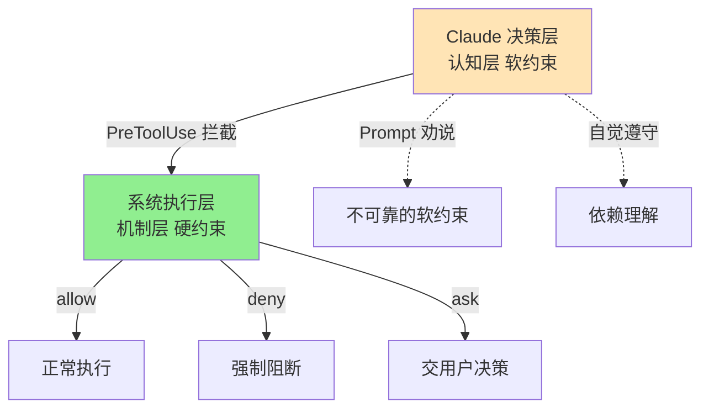
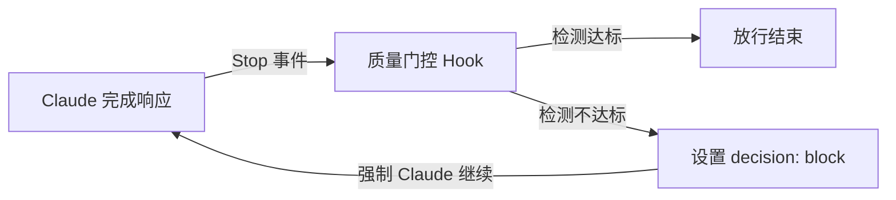
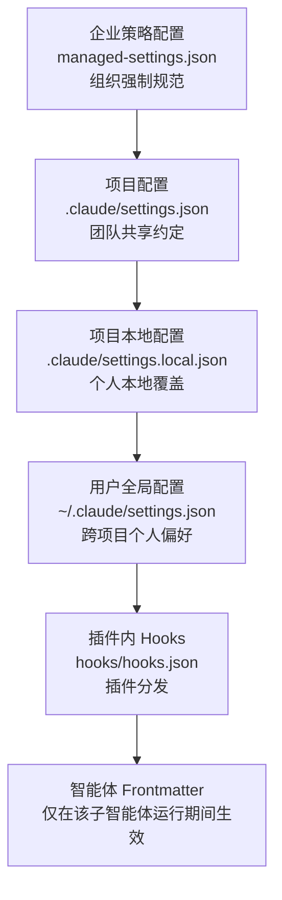
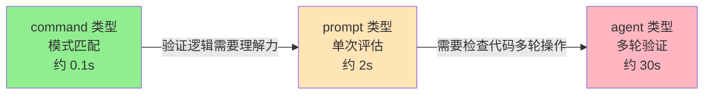
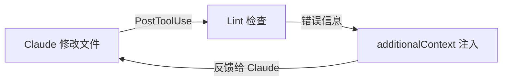
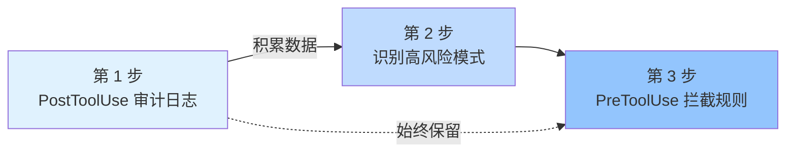

# 当 Claude 需要红绿灯：Hooks 事件驱动的强制约束

## 速查表（一页纸地图）

| 概念 | 一句话定义 | 核心比喻 | 典型场景 |
|------|----------|---------|---------|
| Hooks 体系定位 | 在系统执行层拦截 Claude 行为，是机制不是建议 | 红绿灯/限速器 | 强制安全/质量约束 |
| 17 个事件 | 覆盖会话/工具/子智能体/完成 4 大类生命周期 | 路口的 17 个摄像头 | 何时触发 Hook |
| 3 种处理器 | command（确定性）/ prompt（语义）/ agent（多轮） | 摄像头/雷达/AI 巡查车 | 选哪种验证方式 |
| 6 层配置位置 | 企业/项目/本地/用户/插件/Frontmatter | 6 级权限管理 | 在哪配置 Hook |
| 纵深防御 3 道防线 | 危险命令拦截 / 敏感文件保护 / 全量操作审计 | 机场安检 3 道关卡 | 工程实战 |
| Stop Hook 质量门控 | 任务完成时强制验收，失败则阻止停止 | 工厂出厂质检 | 确保任务达标 |

## 0. 全章比方：红绿灯、限速器与路障

小张深夜加班，疲惫中把 .env 文件推上去了——3 个环境的数据库连接串、API 密钥、支付网关测试账号全部泄露，整个团队耗费半天完成密钥轮换。

CLAUDE.md 告诉 Claude「这里限速 60km/h」——这是交通标志，靠自觉。Skills 教 Claude「弯道应该减速」——这是驾驶手册，靠理解。**Hooks 则是物理路障**——当 Claude 试图执行 `rm -rf /` 时，PreToolUse Hook 在系统层面直接阻断，**决策被强制推翻，无法落地**。

本章用「**策略（建议） vs 机制（强制）**」这条主线，把 Hooks 这套"红绿灯系统"的 17 个事件、3 种处理器、6 层配置位置、4 类工程实战一次说透。



**关键解读**：
- 上半部分是"软约束"（CLAUDE.md、Skills、子智能体都在这一层）
- 下半部分是"硬约束"（Hooks 独此一家）
- 软约束靠 LLM 自觉；硬约束靠系统层强制
- 这就是 "机制（Mechanism）优于策略（Policy）" 的安全设计原则

---

## 5.1 Hooks 在 Claude 扩展体系中的定位

### 类比：3 种约束力递增的护栏

| 机制 | 比喻 | 工作层面 | 触发方式 | 约束性质 |
|------|------|---------|---------|---------|
| CLAUDE.md | 交通标志（这里限速 60） | 认知层 | 始终加载 | 建议 |
| Skills | 驾驶手册（弯道要减速） | 认知层 | 语义匹配 | 引导 |
| **Hooks** | **路障/限速器（强制）** | **系统执行层** | **事件自动触发** | **强制** |

> 「引自原文」：作为语言模型，Claude 在理论上具备忽略 Prompt 中任何约束的能力。Hooks 的工作层面截然不同——它不作用于 Claude 的认知层，而是直接在系统执行层拦截其行为。

### 4 大维度对比

| 维度 | CLAUDE.md | Skills | Hooks |
|------|----------|--------|-------|
| 对 Claude 的控制 | 引导 | 规范 | 强制 |
| 机制 | 始终加载 | 语义匹配 | 事件自动触发 |
| 工作层面 | 认知层 | 认知层 | 系统执行层 |
| 类比 | 交通标志 | 驾驶手册 | 路障/限速器 |

三者配合使用效果最佳：**交通标志让你知晓规则，驾驶手册让你掌握操作方法，而路障/限速器确保在你忘记规则或判断失误时，系统依然能守住安全底线。**

---

## 5.2 事件生命周期：17 个事件全景

### 5 大分类速查

| 分类 | 事件数 | 核心事件 | 触发时机 |
|------|------|---------|---------|
| **会话级** | 3 | `SessionStart`, `SessionEnd`, `PreCompact` | 会话生命周期 |
| **工具调用** | 5 | `PreToolUse`, `PostToolUse`, `PostToolUseFailure`, `PermissionRequest`, `UserPromptSubmit` | 工具执行前后 |
| **子智能体** | 2 | `SubagentStart`, `SubagentStop` | 子智能体生命周期 |
| **完成** | 2 | `Stop`, `Notification` | 任务完成/通知 |
| **较新** | 5 | `TeammateIdle`, `TaskCompleted`, `ConfigChange`, `WorktreeCreate`, `WorktreeRemove` | 多智能体协作/审计/工作流 |

### 5.2.1 关键事件 1：`PreToolUse`（最强大）

> **整个 Hooks 系统中最强大的事件**——在 Claude 决定调用某个工具之后、工具实际执行之前触发。

**3 种操作能力**：
- `allow` — 绕过权限检查直接执行
- `deny` — 阻止执行并说明原因
- `updatedInput` — **静默修改输入参数后执行**（最强大）

```json
{
  "hookSpecificOutput": {
    "hookEventName": "PreToolUse",
    "permissionDecision": "allow",
    "updatedInput": {
      "command": "rm -r /tmp/test --dry-run"
    }
  }
}
```

> 「引自原文」：将原本危险的 `rm -r /tmp/test` 命令静默修改为 `rm -r /tmp/test --dry-run`，既让 Claude 继续完成任务，又避免了文件被真正删除的风险。

### 5.2.2 关键事件 2：`PreToolUse` vs `PermissionRequest`

| 维度 | PreToolUse | PermissionRequest |
|------|-----------|------------------|
| 触发时机 | 每次工具调用前**无条件**触发 | 仅在 Claude 需要**用户手动确认**时触发 |
| 设计意图 | 通用拦截器 | 自动批准/拒绝权限请求 |
| 编程响应 | `permissionDecision: allow/deny/ask` | `decision.behavior: allow/deny` |

### 5.2.3 关键事件 3：`Stop`（质量门控核心）



> 「引自原文」：这是实现"质量门控"机制的核心——如果检测到输出内容未满足预设标准（如代码规范、安全策略等），可以通过设置 `decision: "block"` 阻止会话结束，强制 Claude 继续修正或完善工作，直至符合要求。

### 5.2.4 关键事件 4：`SubagentStart` / `SubagentStop`

- `SubagentStart` — 在子智能体启动时触发，**无法阻止**启动，但可通过 `additionalContext` 注入关键上下文
- `SubagentStop` — 在子智能体完成任务后触发；输入数据包含 `transcript_path`（主会话记录）和 `agent_transcript_path`（子智能体自身记录）

### 💡 关键洞察："能否阻止"是最核心的分类维度

**具备阻止能力的事件**（用于"控制流程"）：
- `PreToolUse`, `PermissionRequest`, `UserPromptSubmit`, `Stop`
- `SubagentStop`, `TeammateIdle`, `TaskCompleted`
- `ConfigChange`, `WorktreeCreate`

**只读模式事件**（用于"观察记录"）：
- `PostToolUse`, `Notification`, `SubagentStart`
- `SessionStart`, `SessionEnd`, `PreCompact`
- `PostToolUseFailure`, `WorktreeRemove`

> 「引自原文」：最常用的 3 个事件是：**PreToolUse**（工具执行前的"守门员"）、**PostToolUse**（工具执行后的"质量守卫"）、**Stop**（任务完成时的"质量门控"）。如果时间有限，优先精通这 3 个，即可构建出健壮的自动化闭环。

---

## 5.3 配置体系：6 个层级，6 种用途



| 层级 | 路径 | 作用域 | 优先级 |
|------|------|------|------|
| 企业策略 | `managed-settings.json` | 组织强制规范 | 最高 |
| 项目配置 | `.claude/settings.json` | 团队共享 | 高 |
| 项目本地 | `.claude/settings.local.json` | 个人本地覆盖（已 .gitignore） | 中 |
| 用户全局 | `~/.claude/settings.json` | 跨项目个人偏好 | 低 |
| 插件内 | `hooks/hooks.json` | 插件分发 | 视情况 |
| 智能体内联 | 子智能体 Frontmatter | 仅子智能体运行期 | 最高（精度最高） |

### 3 层嵌套配置结构

```json
{
  "hooks": {
    "PreToolUse": [
      {
        "matcher": "Bash",
        "hooks": [
          {
            "type": "command",
            "command": "/.claude/hooks/block-dangerous.sh",
            "timeout": 30
          }
        ]
      }
    ]
  }
}
```

**关键说明**：
- `matcher` 指定该组 Hook 适用的工具范围（`Bash` / `Write|Edit` / `*`）
- 对 `Stop`, `Notification`, `UserPromptSubmit` 等事件，matcher 字段被忽略
- 对 `SubagentStart` / `SubagentStop` 事件，matcher 匹配的是**子智能体类型名称**而非工具

---

## 5.4 3 种处理器类型：确定性的阶梯

> 3 种类型构成一个"**确定性递减，灵活性递增**"的阶梯。



### 5.4.1 command 类型：确定性规则

**最常用且最可靠**——执行 Shell 命令或脚本。

```json
{
  "type": "command",
  "command": "/.claude/hooks/check-security.sh",
  "timeout": 30
}
```

**3 个退出码语义**：

| 退出码 | 含义 | 系统行为 |
|------|------|---------|
| **0** | 成功 | 解析 stdout JSON 作为决策 |
| **2** | 有意阻止 | stderr 内容作为错误原因反馈给 Claude |
| **其他** | 脚本异常 | stderr 仅在调试模式可见；不阻断主流程 |

> 「引自原文」：退出码 2 的设计至关重要——它严格区分了"有意阻止操作"与"脚本自身故障"。脚本自身故障不应阻碍正常工作流——这正如烟雾报警器自身发生故障时，不应因此禁止人员进出大楼。

### 5.4.2 prompt 类型：单次大模型评估

**当验证逻辑需要一定判断力，但不需要执行多步操作时**。

```json
{
  "type": "prompt",
  "prompt": "评估这段代码修改是否引入了安全漏洞。$ARGUMENTS",
  "model": "Claude-haiku-4-5",
  "timeout": 30
}
```

**响应 JSON 格式**：
```json
{"ok": true, "reason": "代码修改安全，未引入已知漏洞模式"}
{"ok": false, "reason": "检测到潜在的 SQL 注入风险：用户输入未经转义直接拼接到查询字符串"}
```

### 5.4.3 agent 类型：多轮子智能体验证

**当需要实际查看代码文件、执行搜索或多步操作时**——启动一个子智能体使用 Read/Grep/Glob 工具进行多轮验证。

```json
{
  "type": "agent",
  "prompt": "检查所有修改的文件是否通过了单元测试。运行测试套件并验证结果。$ARGUMENTS",
  "timeout": 120
}
```

> agent 类型的子智能体最多运行 **50 轮对话/操作**后必须返回决策。

### 选型原则

> **能用 command 类型的不用 prompt 类型，能用 prompt 类型的不用 agent 类型**——确定性规则在速度和可靠性上永远优于大模型判断。

---

## 5.5 hookSpecificOutput：与 Claude 交流的协议

### 协议升级（2025 年）

早期版本使用顶层 `decision` + `reason` 字段，**新版本推荐使用嵌套在 `hookSpecificOutput` 对象中的 `permissionDecision` 格式**。

```json
{
  "hookSpecificOutput": {
    "hookEventName": "PreToolUse",
    "permissionDecision": "deny",
    "permissionDecisionReason": "此命令试图删除受保护的系统目录",
    "additionalContext": "受保护的路径模式: /etc, /usr, /var"
  }
}
```

### permissionDecision 3 种值

| 值 | 行为 | 适用场景 |
|------|------|---------|
| `allow` | 绕过权限系统直接执行 | 已通过预审批 |
| `deny` | 阻止执行 | 危险操作 |
| `ask` | 交由用户确认 | 「我不确定，请由人来决定」 |

> 「引自原文」：`ask` 是一个微妙却实用的选项——它并非自动拒绝，而是表达"我不确定，请由人来决定"的态度。

### 3 个通用顶层字段

| 字段 | 作用域 | 含义 |
|------|------|------|
| `continue: false` + `stopReason` | 所有事件 | "紧急制动"——立即终止 Claude 处理 |
| `suppressOutput: false` | 所有事件 | 是否隐藏 Hook 输出 |
| `systemMessage` | 所有事件 | 直接显示给用户，不传给 Claude |

### 💡 关键洞察：additionalContext 构建反馈闭环

`additionalContext` 字段适用于**所有事件类型**，其内容将被注入 Claude 的上下文。



> PostToolUse Hook 可通过 `additionalContext` 将代码静态分析（Lint）结果反馈给 Claude，Claude 在接收到这些信息后**会自动修复问题**——整个过程不需要人工干预。

---

## 5.6 工程实战一：安全防护体系（3 道防线）

> 让我们回到本章开篇那个令人棘手的案例。现在，我们将利用 Hooks 构建一套完整的安全防护体系，从以下 3 道防线为项目保驾护航：**危险命令拦截、敏感文件保护、全量操作审计**。

### 5.6.1 防线 1：PreToolUse 危险命令拦截

### 关键代码：block-dangerous.sh

```bash
#!/bin/bash
# /.claude/hooks/block-dangerous.sh
INPUT=$(cat)
# 调试信息输出至 stderr（stdout 严格保留给 JSON）
COMMAND=$(echo "$INPUT" | jq -r '.tool_input.command')
echo "DEBUG: Checking Command: $COMMAND" >&2

# 危险命令模式列表
DANGEROUS_PATTERNS=(
  "rm -rf"
  "rm -fr"
  "rm -f $HOME"
  ":(){ :|:&};:"           # Fork bomb
  "chmod 777 /"
  "git push --force origin main"
  "git reset --hard origin"
  "DROP DATABASE"
  "DROP TABLE"
  "TRUNCATE"
  "curl | sh"
  "curl | bash"
)

for pattern in "${DANGEROUS_PATTERNS[@]}"; do
  if [[ "$COMMAND" == *"$pattern"* ]]; then
    echo "BLOCKED: $pattern" >&2
    cat <<EOF
{"hookSpecificOutput":{"hookEventName":"PreToolUse","permissionDecision":"deny","permissionDecisionReason":"拦截危险命令模式: $pattern"}}
EOF
    exit 0
  fi
done

# 放行
echo '{"hookSpecificOutput":{"hookEventName":"PreToolUse","permissionDecision":"allow"}}'
exit 0
```

**设计要点**：
- 调试信息必须输出至 `stderr`，**stdout 严格保留给 JSON 决策结果**
- 使用 `jq` 工具解析输入，避免脆弱的字符串匹配
- 每次拦截操作都附带**清晰具体的原因说明**

### 5.6.2 防线 2：PreToolUse 敏感文件保护

```bash
#!/bin/bash
# /.claude/hooks/protect-files.sh
INPUT=$(cat)
FILE_PATH=$(echo "$INPUT" | jq -r '.tool_input.file_path')

if [[ -z "$FILE_PATH" || "$FILE_PATH" == "null" ]]; then
  echo '{"hookSpecificOutput":{"hookEventName":"PreToolUse","permissionDecision":"allow"}}'
  exit 0
fi

FILENAME=$(basename "$FILE_PATH")

# 受保护文件名
PROTECTED_FILES=(".env" ".env.local" ".env.production" "credentials.json" "secrets.yaml" "id_rsa" "id_ed25519")
# 受保护扩展名
PROTECTED_EXTENSIONS=("pem" "key" "p12" "pfx")
# 受保护目录
PROTECTED_DIRS=(".git/" ".ssh/" "node_modules/")

# 3 重检查：目录 → 文件名 → 扩展名
# （任一命中即 deny）
```

**匹配器配置**：
```json
{
  "matcher": "Write|Edit",
  "hooks": [{"type": "command", "command": "/.claude/hooks/protect-files.sh"}]
}
```

> 匹配器配置为 `Write|Edit`（管道符表示"或"），确保仅在发生文件写入或编辑时触发，从源头阻断风险。

### 5.6.3 防线 3：PostToolUse 全量操作审计

```bash
#!/bin/bash
# /.claude/hooks/audit-log.sh
INPUT=$(cat)
LOG_DIR="${CLAUDE_PROJECT_DIR:-.}/.claude/logs"
mkdir -p "$LOG_DIR"
LOG_FILE="$LOG_DIR/audit-$(date +%Y-%m-%d).log"
TIMESTAMP=$(date +%s)
TOOL_NAME=$(echo "$INPUT" | jq -r '.tool_name')
TOOL_INPUT=$(echo "$INPUT" | jq -c '.tool_input')

echo "[$TIMESTAMP] $TOOL_NAME: $TOOL_INPUT" >> "$LOG_FILE"
echo '{}'
exit 0
```

**匹配器配置**：
```json
{
  "matcher": "*",
  "hooks": [{"type": "command", "command": "/.claude/hooks/audit-log.sh"}]
}
```

> 在合规性要求严格的企业环境中，这是不可或缺的机制——它清晰地回答了"Claude 在什么时间对什么目标执行了什么操作"这一核心审计问题。

### 5.6.4 完整配置（事前/事中/事后闭环）

```json
{
  "hooks": {
    "PreToolUse": [
      {
        "matcher": "Bash",
        "hooks": [{"type": "command", "command": "/.claude/hooks/block-dangerous.sh"}]
      },
      {
        "matcher": "Write|Edit",
        "hooks": [{"type": "command", "command": "/.claude/hooks/protect-files.sh"}]
      }
    ],
    "PostToolUse": [
      {
        "matcher": "*",
        "hooks": [{"type": "command", "command": "/.claude/hooks/audit-log.sh"}]
      }
    ]
  }
}
```

> 这套配置构建了一个涵盖 **"事前拦截 → 事中防护 → 事后审计"** 的完整安全闭环：将原本依赖"人工谨慎"的脆弱流程，升级为"代码即法律"的自动化安全体系。

---

## 5.7 工程实战二：代码质量自动化

### 5.7.1 PostToolUse：自动格式化（关注点分离）

```bash
#!/bin/bash
# /.claude/hooks/auto-format.sh
INPUT=$(cat)
FILE_PATH=$(echo "$INPUT" | jq -r '.tool_input.file_path')

if [[ -z "$FILE_PATH" || "$FILE_PATH" == "null" ]]; then
  echo '{}'; exit 0
fi

EXTENSION="${FILE_PATH##*.}"
case "$EXTENSION" in
  js|ts|tsx|json|md|css|scss|html)
    if command -v npx &> /dev/null; then
      npx prettier --write "$FILE_PATH" 2>/dev/null
      echo '{"hookSpecificOutput":{"additionalContext":"已用 Prettier 格式化"}}'
    fi
    ;;
  py)
    if command -v black &> /dev/null; then
      black "$FILE_PATH" 2>/dev/null
      echo '{"hookSpecificOutput":{"additionalContext":"已用 Black 格式化"}}'
    fi
    ;;
  go)
    if command -v gofmt &> /dev/null; then
      gofmt -w "$FILE_PATH" 2>/dev/null
      echo '{"hookSpecificOutput":{"additionalContext":"已用 gofmt 格式化"}}'
    fi
    ;;
esac
echo '{}'
```

> 「引自原文」：该 Hook 的精妙之处在于实现了"**关注点分离**"——Claude 不需要感知项目具体采用何种格式化规范，只需要专注于代码逻辑编写，格式化过程将在后台无感完成。

**设计原则**：**优雅降级**——如果检测到格式化工具未安装，Hook 静默跳过而非抛出错误。Hook 自身的异常不应阻塞核心工作流。

### 5.7.2 PostToolUse：Lint 反馈循环

```bash
#!/bin/bash
# /.claude/hooks/lint-check.sh
INPUT=$(cat)
FILE_PATH=$(echo "$INPUT" | jq -r '.tool_input.file_path')

if [[ "$FILE_PATH" == *.js || "$FILE_PATH" == *.ts || "$FILE_PATH" == *.jsx || "$FILE_PATH" == *.tsx ]]; then
  LINT_RESULT=$(npx eslint "$FILE_PATH" 2>&1 || true)
  if [[ $? -ne 0 ]]; then
    ESCAPED=$(echo "$LINT_RESULT" | head -30 | jq -Rs .)
    echo "{\"hookSpecificOutput\":{\"additionalContext\":\"ESLint 发现问题: $ESCAPED\"}}"
  else
    echo '{"hookSpecificOutput":{"additionalContext":"ESLint 检查通过"}}'
  fi
fi
echo '{}'
```

> 自动格式化确保了代码的"美观"，而 Lint 检查则保障了代码的"正确"——两者结合构建起"修改 → 检查 → 反馈 → 修复"的自动化闭环。

### 5.7.3 Stop Hook：质量门控（防死循环）

```bash
#!/bin/bash
# /.claude/hooks/verify-build.sh
INPUT=$(cat)

# 防止死循环的关键检查
STOP_HOOK_ACTIVE=$(echo "$INPUT" | jq -r '.stop_hook_active')
if [[ "$STOP_HOOK_ACTIVE" == "true" ]]; then
  echo '{}'; exit 0
fi

# 检测项目类型并运行测试
if [[ -f "package.json" ]]; then
  TEST_RESULT=$(npm test 2>&1 || true)
  TEST_PASSED=false
elif [[ -f "pyproject.toml" || -f "pytest.ini" ]]; then
  TEST_RESULT=$(pytest 2>&1 || true)
  TEST_PASSED=false
elif [[ -f "go.mod" ]]; then
  TEST_RESULT=$(go test 2>&1 || true)
  TEST_PASSED=false
else
  echo '{"hookSpecificOutput":{"additionalContext":"未检测到测试框架"}}'
  exit 0
fi

if [[ "$TEST_PASSED" == "true" ]]; then
  echo '{"hookSpecificOutput":{"additionalContext":"所有测试通过"}}'
else
  # 截取前 50 行错误日志并转义
  TEST_ESCAPED=$(echo "$TEST_RESULT" | head -50 | jq -Rs .)
  cat <<EOF
{"decision":"block","reason":"测试失败，请修复后再停止","hookSpecificOutput":{"additionalContext":"$TEST_ESCAPED"}}
EOF
fi
```

> 「引自原文」：脚本中的 `stop_hook_active` 字段是防止系统陷入"死循环"的关键所在——其逻辑类似于递归函数的终止条件。如果缺失这一检查，Claude 将陷入"修复+测试失败+再修复"的死循环，无法自行脱困。

---

## 5.8 子智能体 Hooks：精准的上下文管理

### 5.8.1 全局 vs Frontmatter：精度问题

> 假设你拥有一个名为 `db-reader` 的子智能体，专门用于执行 SQL 查询。若需要审查其执行的每一条 Bash 命令以防范 SQL 注入风险，在**全局 settings.json 中配置 Hook 并非最佳方案**——全局配置会无差别拦截所有 Bash 命令，涵盖编译代码、运行测试、安装依赖等与数据库无关的操作，不仅浪费系统性能，还极易引发误拦截。

**更优方案：直接在子智能体的 Frontmatter 中定义 Hook**。

### 关键代码：db-reader 子智能体的 Frontmatter Hook

```markdown
---
name: db-reader
description: 只读数据库分析工具
tools: [Read, Grep, Glob, Bash]
hooks:
  PreToolUse:
    matcher: "Bash"
    hooks:
      - type: command
        command: "/.claude/hooks/check-sql-injection.sh"
  Stop:
    hooks:
      - type: prompt
        prompt: 检查查询结果是否包含 PII（如姓名、邮箱、手机号）。若包含，请回复 ok: false 并要求进行脱敏处理。
---
你是一名数据库分析专家，仅执行 SELECT 查询，严禁执行任何修改数据的 SQL 语句。
```

**核心优势**：
- **生命周期紧密绑定** — Hook 随子智能体的启动而激活，任务完成后自动清理
- **配置与子智能体定义集成**于同一文件，可随 .md 文件一同分发
- 用户不需要额外修改全局 settings.json，**极大降低配置复杂度**

### 5.8.2 SubagentStart：自动注入上下文

```json
{
  "hooks": {
    "SubagentStart": [
      {
        "matcher": "code-reviewer",
        "hooks": [
          {
            "type": "command",
            "command": "echo '{\"hookSpecificOutput\":{\"hookEventName\":\"SubagentStart\",\"additionalContext\":\"团队编码规范：使用 camelCase 命名；行长上限 100 个字符；公共 API 必须包含 JSDoc 注释\"}}'"
          }
        ]
      }
    ]
  }
}
```

> 每次启动 `code-reviewer` 子智能体时，系统自动注入团队的编码标准。

### 5.8.3 SubagentStop：验证输出质量

```bash
#!/bin/bash
# verify-review-quality.sh
INPUT=$(cat)
AGENT_TYPE=$(echo "$INPUT" | jq -r '.agent_type')
STOP_ACTIVE=$(echo "$INPUT" | jq -r '.stop_hook_active')

# 仅验证 code-reviewer 子智能体
if [[ "$AGENT_TYPE" != "code-reviewer" ]]; then exit 0; fi
# 防止死循环
if [[ "$STOP_ACTIVE" == "true" ]]; then exit 0; fi

TRANSCRIPT=$(echo "$INPUT" | jq -r '.agent_transcript_path')
if [[ -n "$TRANSCRIPT" && -f "$TRANSCRIPT" ]]; then
  HAS_ISSUES=$(grep -c "issue" "$TRANSCRIPT" || true)
  HAS_SUGGESTIONS=$(grep -c "recommend" "$TRANSCRIPT" || true)
  # 发现了问题但未提供修复建议 → 阻止停止
  if [[ "$HAS_ISSUES" -gt 0 && "$HAS_SUGGESTIONS" -eq 0 ]]; then
    echo '{"decision":"block","reason":"发现了问题但未提供修复建议，请补充每个问题的改进方案"}'
    exit 0
  fi
fi
echo '{}'
```

### 5.8.4 3 层防护机制对照

| 层级 | 职责 | 关键问题 |
|------|------|---------|
| **Frontmatter Hook** | 内部自检 | "我的输出是否完整？" |
| **SubagentStart Hook** | 外部注入 | "给你必要的背景信息" |
| **SubagentStop Hook** | 外部验收 | "你的工作成果是否达标？" |

---

## 5.9 异步 Hooks：后台执行不阻塞

### 默认 vs 异步

| 维度 | 同步（默认） | 异步（async: true） |
|------|----------|-------------------|
| 主流程 | 暂停等待 | 立即继续 |
| 响应延迟 | 几毫秒到 30 秒 | 不阻塞 |
| 输出传递 | 当轮 | 下一个对话轮次 |

```json
{
  "type": "command",
  "command": "/.claude/hooks/run-tests-background.sh",
  "async": true,
  "timeout": 300
}
```

### 2 个关键限制

| 限制 | 含义 |
|------|------|
| **类型限制** | 仅 `command` 类型支持异步；`prompt` 和 `agent` 必须同步 |
| **拦截能力限制** | 异步 Hooks **无法阻止**当前操作——主流程在 Hook 启动的瞬间即已继续执行 |

**适用场景**：
- ✅ 日志记录、异步通知、后台数据验证、非关键性质量审计
- ❌ 需要实时阻断的安全检查（SQL 注入防御、敏感信息过滤）

---

## 5.10 环境变量与调试

### 5.10.1 8 个核心环境变量

| 环境变量 | 作用域 | 核心用途 |
|---------|------|---------|
| `CLAUDE_PROJECT_DIR` | 所有 Hook | 项目根目录绝对路径 |
| `CLAUDE_SESSION_ID` | 所有 Hook | 当前会话唯一标识符 |
| `CLAUDE_TOOL_NAME` | 所有 Hook | 触发当前 Hook 的工具名称 |
| `CLAUDE_FILE_PATH` | 所有 Hook | 当前操作涉及的文件绝对路径（若适用） |
| `CLAUDE_ENV_FILE` | 仅 SessionStart | 环境变量持久化文件路径 |
| `CLAUDE_NOTIFICATION` | 仅 Notification | 具体的通知消息内容 |
| `CLAUDE_CODE_REMOTE` | 所有 Hook | 是否在远程 Web 环境中运行 |
| `CLAUDE_PLUGIN_ROOT` | 仅 Plugin Hook | 插件安装的根目录路径 |

### 5.10.2 调试"三板斧"

**板斧 1：将调试信息输出至 stderr**

```bash
echo "DEBUG: Checking file $FILE_PATH" >&2  # 调试信息
echo '{"decision":"allow"}'                  # JSON 决策
```

> 由于 stdout 专用于输出 JSON 决策结果，所有调试信息必须重定向至 stderr。

**板斧 2：手动测试 Hook 脚本**

```bash
echo '{"tool_name":"Bash","tool_input":{"command":"rm -rf /"}}' | ./.claude/hooks/block-dangerous.sh
echo "Exit Code: $?"
```

**板斧 3：使用 `claude --debug` 查看完整执行细节**

调试模式将显示匹配的 Hook 列表、各脚本的执行耗时和返回结果。

### 5.10.3 2 个常见陷阱

**陷阱 1：Shell 配置文件污染 stdout**

若 `~/.zshrc` 或 `~/.bashrc` 中包含无条件的 `echo` 语句（如欢迎信息），这些输出会污染 stdout 导致 JSON 解析失败。

**修复**：用 `[[ $- == *i* ]]` 条件判断包裹：
```bash
if [[ $- == *i* ]]; then
  echo "Welcome!"  # 仅在交互式 Shell 中输出
fi
```

**陷阱 2：直接编辑 settings.json 后 Hook 不生效**

Claude Code 仅在启动时捕获配置快照，运行期间对文件的修改不会自动同步。

**修复**：在 `/hooks` 菜单中确认变更，或重启当前会话。

---

## 5.11 工程设计方法论

### 3 个核心维度

| 维度 | 选择 | 决策依据 |
|------|------|---------|
| **拦截时机**（事件选择） | 操作前 / 操作后 / 完成时 / 生命周期 | 4 大类事件 |
| **判断方式**（类型选择） | command / prompt / agent | 确定性递减原则 |
| **配置作用域**（位置选择） | 团队 / 个人 / 子智能体 | 6 层优先级 |

### 事件选型速查

| 需求 | 事件 |
|------|------|
| 操作前拦截 | `PreToolUse` / `UserPromptSubmit` |
| 操作后反馈 | `PostToolUse` |
| 完成时检查 | `Stop` / `SubagentStop` |
| 生命周期管理 | `SessionStart` / `SessionEnd` |

### "三步走"演进策略



> **第一步**：配置 `PostToolUse` + `matcher: "*"` 的审计日志 Hook，观察 Claude 实际的工具调用模式，积累数日的真实运行数据。
>
> **第二步**：基于审计数据识别高风险操作模式，进而设计针对性的 `PreToolUse` 拦截规则。
>
> **第三步**：逐步收紧拦截规则，同时**始终保留日志记录功能**，确保在发生误拦截时能快速定位问题根源。

### 团队级 Hook 准则

> 「引自原文」：Hooks 是团队级的基础设施，而非个人实验玩具。在 `.claude/settings.json` 中配置的 Hook 将对**所有克隆该仓库的成员**生效。若成员因不明原因被意外拦截，将严重阻碍工作流并引发挫败感。

**3 条铁律**：
1. 提交 Hook 配置前，必须与团队充分讨论并达成共识
2. 每个拦截规则都必须附带清晰的原因说明
3. 利用审计日志实时监控 Hook 触发频率，及时发现并修正误拦截

---

## 横向对比：4 类实战场景的工具选型

| 场景 | 事件 | 处理器 | 匹配器 | 设计意图 |
|------|------|------|------|---------|
| 危险命令拦截 | `PreToolUse` | command | `Bash` | 事前阻断 |
| 敏感文件保护 | `PreToolUse` | command | `Write\|Edit` | 事前阻断 |
| 全量操作审计 | `PostToolUse` | command | `*` | 事后记录 |
| 自动格式化 | `PostToolUse` | command | `Write\|Edit` | 事后增强 |
| Lint 反馈 | `PostToolUse` | command | `Write\|Edit` | 反馈闭环 |
| 测试质量门控 | `Stop` | command | (忽略) | 完成时强制 |
| 注入编码规范 | `SubagentStart` | command | `code-reviewer` | 启动时注入 |
| 验证输出质量 | `SubagentStop` | bash 脚本 | 子智能体名 | 完成时验收 |
| 后台测试运行 | `PostToolUse` | command (async) | `Write\|Edit` | 不阻塞 |

---

## 工程踩坑清单

| 踩坑场景 | 症状 | 规避方案 |
|---------|------|---------|
| 调试信息输出到 stdout | JSON 解析失败 | 调试信息必须 `>&2` |
| Shell 配置文件 echo 污染 | Hook 启动即失败 | 用 `[[ $- == *i* ]]` 包裹 |
| 直接编辑 settings.json | 修改不生效 | 在 `/hooks` 菜单确认或重启会话 |
| 异步 Hook 用于安全检查 | 危险命令被放行 | 关键安全检查必须同步 |
| agent Hook 无超时控制 | 长时间卡住 | 设置 `timeout` 字段（默认 60s） |
| 团队 Hook 未经讨论 | 成员被误拦截挫败 | 团队充分讨论 + 附带原因说明 |
| Stop Hook 缺少 `stop_hook_active` 检查 | 死循环 | 必须检查该字段防止递归 |
| Stop Hook 退出码错误 | 行为不符合预期 | 0=成功 / 2=有意阻止 / 其他=异常 |
| PostToolUse 期望阻止已发生操作 | 设计误区 | 只能反馈，不能阻止——用 PreToolUse |
| matcher 配置为 `*` 在 PreToolUse | 性能浪费 | 精确指定工具名（Bash/Write/Edit） |

---

## 全章知识地图

```mermaid
graph TD
    A[Hooks<br/>事件驱动自动化] --> B[5.1 定位]
    B --> B1[策略 vs 机制]
    B --> B2[认知层 vs 执行层]
    A --> C[5.2 17 事件]
    C --> C1[会话级]
    C --> C2[工具调用]
    C --> C3[子智能体]
    C --> C4[完成事件]
    C --> C5[较新事件]
    A --> D[5.3 6 层配置]
    A --> E[5.4 3 种处理器]
    E --> E1[command]
    E --> E2[prompt]
    E --> E3[agent]
    A --> F[5.5 通信协议]
    F --> F1[hookSpecificOutput]
    F --> F2[permissionDecision]
    A --> G[5.6 安全防护]
    G --> G1[危险命令拦截]
    G --> G2[敏感文件保护]
    G --> G3[全量操作审计]
    A --> H[5.7 质量自动化]
    H --> H1[自动格式化]
    H --> H2[Lint 反馈]
    H --> H3[Stop 门控]
    A --> I[5.8 子智能体 Hooks]
    I --> I1[Frontmatter]
    I --> I2[SubagentStart]
    I --> I3[SubagentStop]
    A --> J[5.9 异步 Hooks]
    A --> K[5.10 环境变量调试]
    A --> L[5.11 设计方法论]
    L --> L1[三步走策略]
    L --> L2[团队铁律]
```



---

## 贯穿主线：一句话哲学总结

> **Hooks 是 Claude Code 唯一运行于系统执行层的扩展机制**——它把"理应发生却常被遗忘"的关键检查（敏感文件保护、代码格式化规范、测试验收流程）从依赖自觉的"软约束"升级为不可绕过的系统级"硬约束"，让 Claude 做的每一件事都更可靠。

---

## 学习路径建议

1. **第 1 步**：从 `PostToolUse` + `matcher: "*"` 的审计日志 Hook 开始，观察 Claude 实际工具调用模式
2. **第 2 步**：基于 1~2 周审计数据，识别高风险命令模式，配置第一条 `PreToolUse` 拦截规则（推荐从 `Bash` 危险命令开始）
3. **第 3 步**：配置敏感文件保护 Hook（`PreToolUse` + `Write|Edit` 匹配器）
4. **第 4 步**：尝试 `Stop` Hook 实现测试质量门控，注意必须检查 `stop_hook_active` 防死循环
5. **第 5 步**：将 `PreToolUse` 升级为 `updatedInput` 静默修改模式（`--dry-run` 自动注入等高级技巧）
6. **第 6 步**：为关键子智能体配置 Frontmatter Hooks，实现比全局配置更精准的管控
7. **第 7 步**：使用 `async: true` 优化长时间操作的 Hook 体验（如后台测试运行）

每一步完成后，**始终保留审计日志功能**，确保发生误拦截时能快速定位问题根源。
