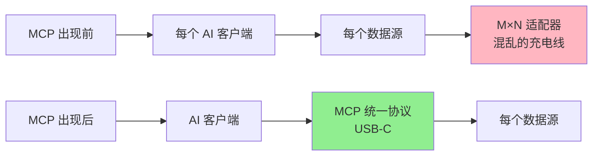
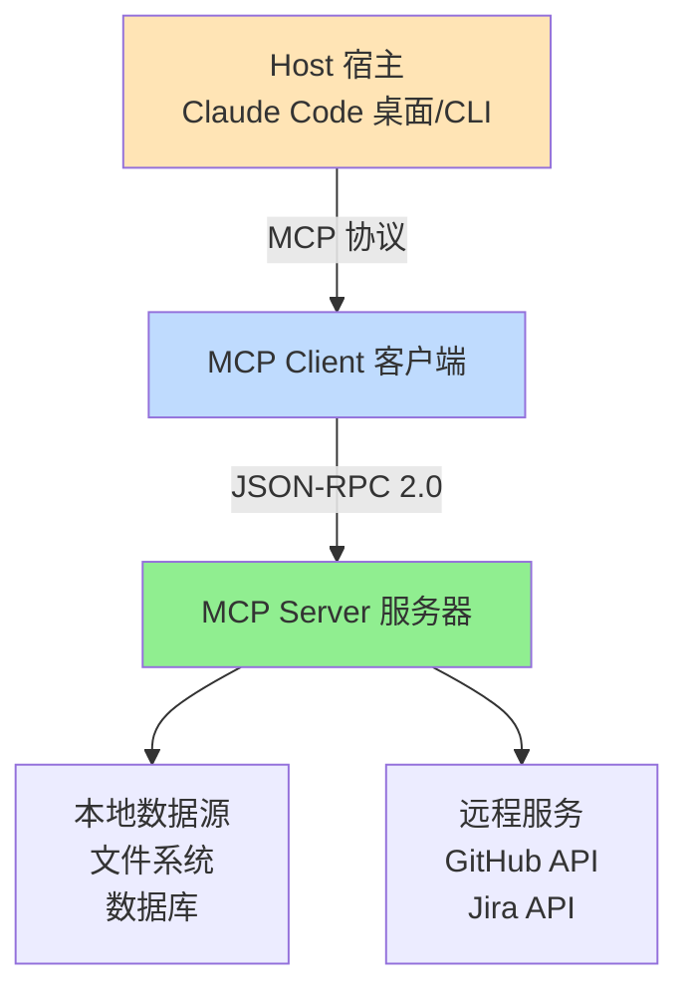
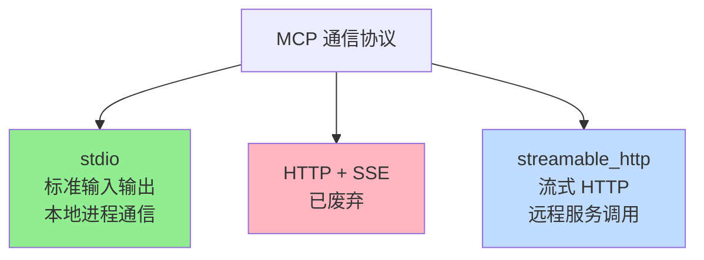
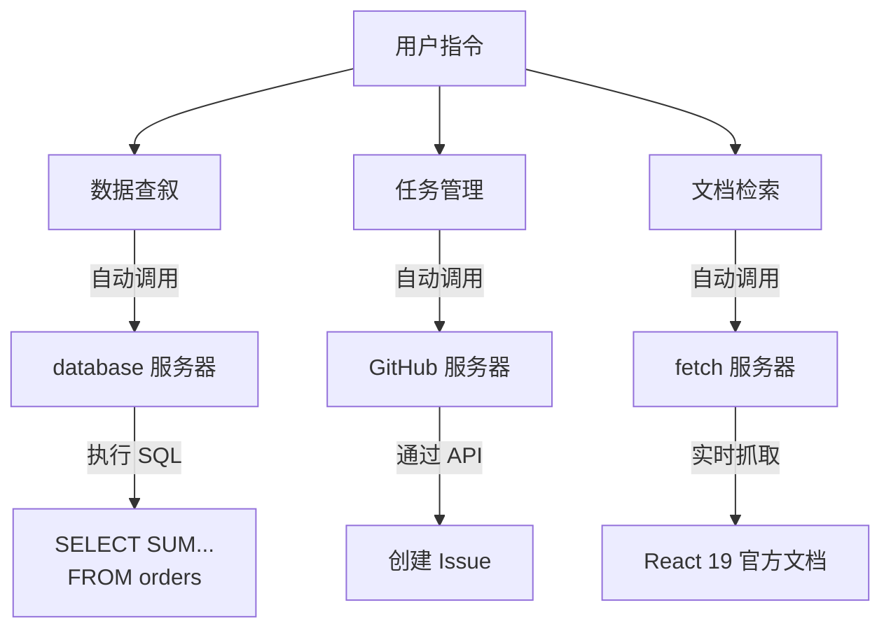
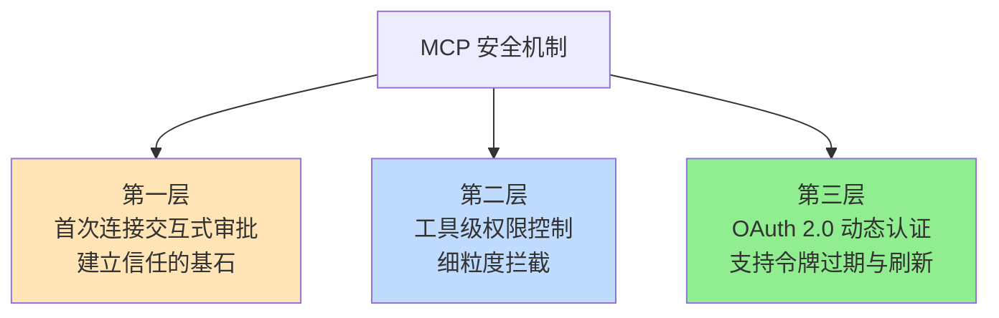
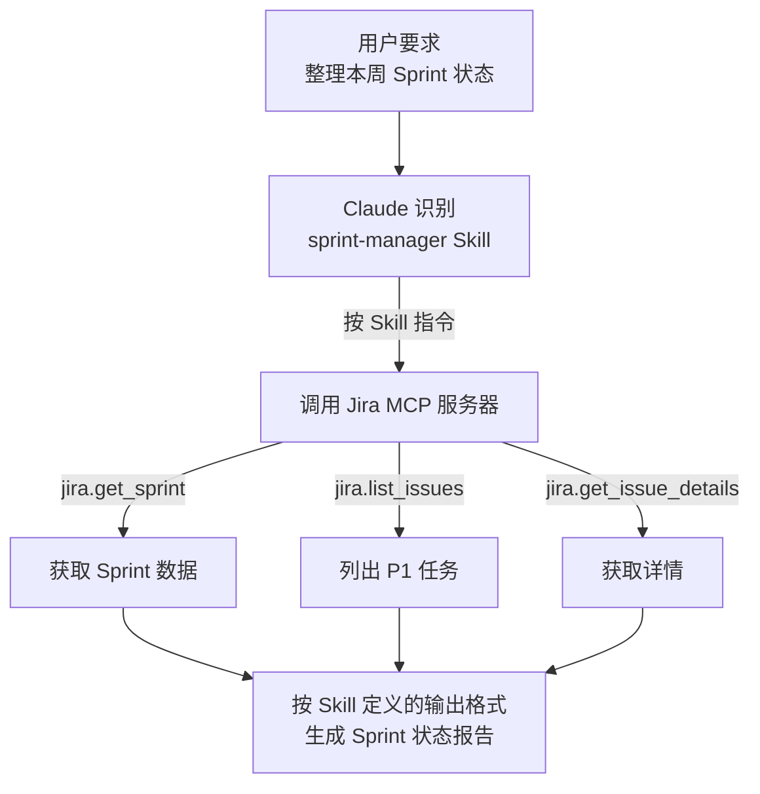
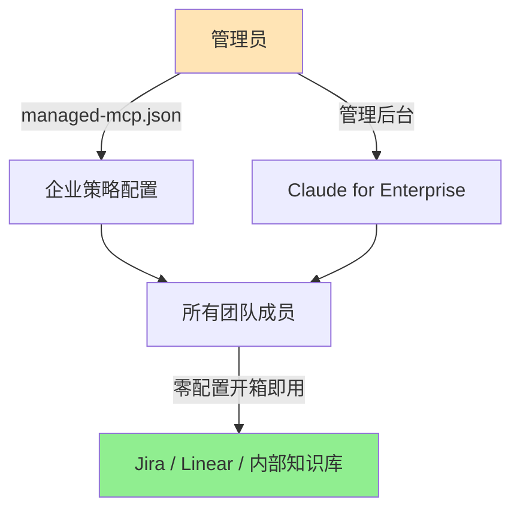
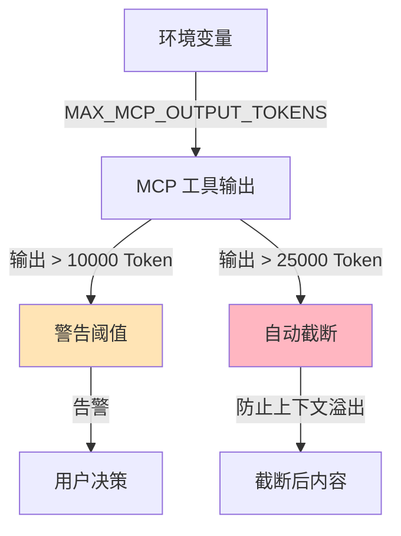
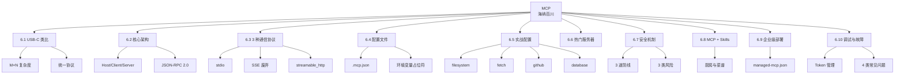

# AI 工具集成领域的 USB-C：MCP 协议

## 速查表（一页纸地图）

| 概念 | 一句话定义 | 核心比喻 | 典型场景 |
|------|----------|---------|---------|
| MCP 协议 | AI 客户端与数据源之间的统一开放协议 | AI 工具集成领域的 USB-C | 连接 Jira/GitHub/数据库/文档 |
| M×N 复杂度 | 每个 AI 客户端 × 每个数据源都需要专属适配器 | USB-C 前的充电线地狱 | 集成成本爆炸 |
| 3 种通信协议 | stdio / HTTP+SSE（已废弃 SSE） / streamable_http | 本地快递 / 远程专线 | 本地进程 / 远程服务 |
| JSON-RPC 2.0 | MCP 通信的消息格式基石 | 普通话 / 全球通用协议 | 跨语言、跨平台 |
| 厨房与菜谱 | MCP 是厨房（原料+设备）、Skills 是菜谱（流程+规范） | 专业厨房 vs 标准菜谱 | 能力 × 流程的二维矩阵 |
| 三层安全机制 | 首次连接审批 + 工具级权限 + OAuth 2.0 | 机场安检 3 道关卡 | 信任的边界 |

## 0. 全章比方：USB-C 普及前的充电线

小冰接了个需求："让 Claude 帮我们分析下 Jira 中上周所有 P1 级 bug 的分布规律。" 她脑里盘算：Jira 部署在公司内网，Claude 运行在云端服务器——这俩世界之间横着一道天然的网络隔离墙。

> 「引自原文」：咖哥说："在 MCP 出现之前，这条线的两端每次都需要重新搭桥——GitHub 想接入 Claude 得写一个适配器，Jira 想接入 Claude 又得写另一个；一旦更换 AI 客户端，所有适配器还得推倒重来。这本质上是一个 M×N 的复杂度难题。"

小冰立刻反应过来："就像 USB-C 普及前的充电线？每台设备都得配一根专用线，出差恨不得带上六七根？" 咖哥点头：**MCP 就是 AI 工具集成领域的 USB-C**。

本章用「**统一协议打破 M×N 复杂度**」这条主线，把 MCP 的核心架构、3 种通信协议、配置文件、三层安全机制、MCP+Skills 协作一次说透。



**关键解读**：
- 上半部分是 MCP 出现前的"M×N 复杂度地狱"
- 下半部分是 MCP 出现后的"M+N 标准化连接"
- 接入 Claude 的 MCP 服务器，理论上可无缝兼容任何遵循该标准的 AI 客户端

---

## 6.1 MCP 是什么：AI 工具集成领域的 USB-C

### 核心定义

**MCP（Model Context Protocol，模型上下文协议）**——由 Anthropic 于 2024 年 11 月发布的开放协议，2025 年 12 月捐赠给 Linux 基金会。在短短 13 个月内，从单一企业项目蜕变为由行业联盟管理的行业标准。

> 「引自原文」：MCP 自 2024 年 11 月发布至 2025 年 12 月捐赠给 Linux 基金会，其在短短 13 个月内便从单一企业项目蜕变为由行业联盟管理的行业标准——这一演进速度本身，便有力证明了 AI 工具生态对标准化的迫切需求。

### 解决了什么核心问题

| 维度 | MCP 出现前 | MCP 出现后 |
|------|----------|----------|
| 集成方式 | 每对 AI 客户端×数据源都要写适配器 | 一次实现，所有兼容客户端可用 |
| 复杂度 | M×N 指数级 | M+N 线性 |
| 维护成本 | 换 AI 客户端 → 推倒重来 | 协议不变，客户端自由切换 |
| 生态扩展 | 双向孤岛 | 单边适配即双边受益 |

### MCP 与 Skills / Hooks 的定位差异

| 机制 | 工作层面 | 核心价值 | 一句话 |
|------|---------|---------|-------|
| **MCP** | 拓展 Claude 的**数据和服务触达边界** | 连接能力 | 厨房（原料+设备） |
| **Skills** | 指导 Claude 的**执行策略** | 调用逻辑 | 菜谱（流程+规范） |
| **Hooks** | 界定 Claude 的**行为禁区** | 安全防线 | 红绿灯（强制约束） |

三者相辅相成——MCP 赋予连接能力，Skills 规范调用逻辑，Hooks 筑牢安全防线，共同构建起一套完备的 AI 工程化体系。

---

## 6.2 核心架构：客户端-服务器模型

### 三大角色



| 角色 | 含义 | 例子 |
|------|------|------|
| **Host**（宿主） | 提供 AI 交互界面的应用 | Claude Code 桌面版、CLI |
| **MCP Client**（客户端） | 内嵌在 Host 中、负责与 Server 通信的模块 | Claude Code 的 MCP 适配层 |
| **MCP Server**（服务器） | 暴露特定数据源/工具能力的后端服务 | filesystem、fetch、GitHub MCP |

### 关键设计原则

- **关注点分离** — Host 关心对话体验，Client 关心协议通信，Server 关心数据封装
- **双向能力** — Server 不仅能"提供数据"给 Client，还能"接收指令"操作外部系统
- **环境变量替换** — 配置文件中的 `${GITHUB_TOKEN}` 等占位符会在运行时被替换，**配置文件可安全纳入版本控制**

---

## 6.3 通信协议：3 种传输方式



| 协议 | 适用场景 | 优势 | 局限 |
|------|---------|------|------|
| **stdio** | 本地进程通信 | 简单、零网络配置、启动快 | 只能本机使用 |
| **HTTP + SSE** | ~~远程服务调用~~ | ~~（已废弃）~~ | — |
| **streamable_http** | 远程服务调用 | 兼容 HTTP 生态、可跨网络 | 需要部署服务 |

### 消息格式基石

所有通信基于 **JSON-RPC 2.0** 协议——这一选择赋予了 MCP 跨语言、跨平台的天然能力。

```json
{
  "jsonrpc": "2.0",
  "id": 1,
  "method": "tools/list",
  "params": {}
}
```

```json
{
  "jsonrpc": "2.0",
  "id": 1,
  "result": {
    "tools": [
      {"name": "read_file", "description": "读取文件内容"},
      {"name": "write_file", "description": "写入文件内容"}
    ]
  }
}
```

> 「引自原文」：MCP 的核心价值不仅在于其连接能力，更在于实现了**连接的标准化**。如今接入 Claude 的 MCP 服务器，理论上可无缝兼容任何遵循该标准的 AI 客户端；反之，随着标准的推广普及，能接入 Claude 的 MCP 服务器生态也将持续扩容。

---

## 6.4 配置文件：.mcp.json 标准结构

### 关键代码：标准配置文件

```json
{
  "mcpServers": {
    "filesystem": {
      "command": "npx",
      "args": ["-y", "@modelcontextprotocol/server-filesystem", "/path/to/dir"]
    },
    "fetch": {
      "command": "npx",
      "args": ["-y", "@modelcontextprotocol/server-fetch"]
    },
    "github": {
      "type": "http",
      "url": "https://api.githubcopilot.com/mcp/",
      "headers": {
        "Authorization": "Bearer ${GITHUB_TOKEN}"
      }
    },
    "database": {
      "command": "npx",
      "args": ["-y", "@bytebase/dbhub", "--dsn", "${DATABASE_URL}"]
    }
  }
}
```

### 4 个核心字段

| 字段 | 含义 | 适用协议 |
|------|------|---------|
| `command` + `args` | 启动命令 + 参数 | stdio 协议 |
| `type: "http"` + `url` | HTTP 端点 URL | streamable_http 协议 |
| `headers` | HTTP 请求头 | streamable_http 协议 |
| `env` / `${VAR}` | 环境变量占位符 | 所有协议 |

### 💡 关键洞察：环境变量占位符

> 「引自原文」：配置中的 `${GITHUB_TOKEN}` 和 `${DATABASE_URL}` 为环境变量占位符，请在使用前确保已在终端环境中正确设置。借助此配置，开发者可在单个 Claude 会话中无缝完成以往需要在多个工具间切换的复杂工作流。

**意义**：
- 密钥不进版本控制
- 不同环境（开发/测试/生产）可用同一份配置
- 团队共享配置 + 个人覆盖

---

## 6.5 实战配置：全栈开发者 MCP 套件

> 一份专为全栈开发者设计的 MCP 配置文件，集成了文件系统、网络请求、代码协作及数据库管理功能。

### 4 大服务器组合

| 服务器 | 主要用途 | 通信协议 |
|--------|---------|---------|
| `filesystem` | 本地文件读写 | stdio |
| `fetch` | 网页抓取（HTTP 请求） | stdio |
| `github` | GitHub 协作管理（PR / Issues / 代码检索） | HTTP (SSE) |
| `database` | 多数据库统一接入与管理 | stdio |

### 3 个实战场景



- **数据查叙**："帮我统计数据库中最近 7 天的订单总额" → 自动调用 database 服务器执行 SQL
- **任务管理**："整理上述 bug 描述并将之创建为一个新的 GitHub Issue" → 自动调用 GitHub 服务器通过 API 提交工单
- **文档检索**："获取 React 19 官方文档中关于 Server Components 的最新说明" → 自动调用 fetch 服务器实时抓取网页

---

## 6.6 热门第三方 MCP 服务器速查

| 服务器名称 | 主要用途 | 通信协议 |
|----------|---------|---------|
| **GitHub MCP** | GitHub 协作管理（PR / Issues / 代码检索） | HTTP (SSE) |
| **Notion MCP** | Notion 文档读取与写入 | HTTP (SSE) |
| **Sentry MCP** | 错误追踪与日志分析 | HTTP (SSE) |
| **Context7** | 检索最新技术文档 | stdio |
| **Bytebase DBHub** | 多数据库统一接入与管理 | stdio |

### 关键代码：filesystem 服务器启动示例

```bash
npx -y @modelcontextprotocol/server-filesystem <path>
```

> 启动 server-filesystem 时，请将 `<path>` 替换为你希望授权访问的实际目录路径。

---

## 6.7 安全机制：信任的边界

> 「引自原文」：MCP 极大地扩展了 Claude 的能力边界，使其能够直接操作外部系统——这一特性既是其核心优势所在，也引入了显著的安全风险。

### 6.7.1 三层纵深安全机制



**第一层：首次连接的交互式审批**

每当你配置了一台新的 MCP 服务器，Claude 在首次尝试连接该服务器前会自动暂停，并向用户展示服务器的详细信息（来源、权限范围等），**请求明确的显式授权**。该步骤为强制交互流程，**无法绕过**。

**第二层：细粒度的工具级权限控制**

即使整合 MCP 服务器已获得全局授权，Claude 在调用具体工具时仍需要保持警惕——特别是针对具有副作用的操作（文件写入、代码执行、数据库修改等）。Claude 会在执行前再次拦截，向用户展示即将执行的具体指令细节，并等待**二次确认**。

**第三层：基于 OAuth 2.0 的动态认证**

对于远程 MCP 服务器，**推荐采用 OAuth 2.0 协议**而非长期有效的静态 API 密钥。这种方式不仅便于与企业现有的统一身份认证系统集成以实现单点登录，而且支持**令牌的自动过期与刷新机制**。

### 6.7.2 3 类安全风险与防护

| 风险 | 描述 | 防护措施 |
|------|------|---------|
| **提示注入攻击** | 恶意内容通过 MCP 服务器注入 Claude 上下文（"忽略之前的指令…"） | 仅使用可信来源的 MCP 服务器 |
| **工具权限滥用** | 单个工具权限安全，但多个工具组合产生意外后果（如"读文件"+"发邮件"→ 文件泄露） | 遵循最小权限原则 |
| **冒名顶替** | 恶意工具伪装成合法工具的名称和描述 | 仅安装来自可信来源的包 |

### 💡 关键洞察：评估 MCP 服务器信任度与评估 npm 包无本质区别

> 「引自原文」：核心在于考察其来源（是源自官方的 `@modelcontextprotocol` 命名空间，还是个人开发者）、维护活跃度、下载量及社区口碑。选择知名的官方服务器是确保安全的起点。

**3 条安全实践**：
1. 连接数据库时**务必使用只读账号**
2. 管理 API 密钥时，**通过环境变量注入，严禁硬编码**
3. 优先选择**官方命名空间**的服务器

---

## 6.8 MCP + Skills：厨房与菜谱

> 「引自原文」：MCP 解决了"能做什么"的问题，Skills 解决了"怎么做"的问题。

### 官方类比

| 比喻 | 含义 | 对应 |
|------|------|------|
| **专业厨房** | 配备所有必要设备与原料——冰箱（数据库）、炉灶（API 调用）、食材（数据源）、刀具（工具） | **MCP** |
| **标准菜谱** | 提供详尽的操作指南——所需食材、操作步骤、火候控制、烹饪时长 | **Skills** |

> 拥有厨房意味着厨师具备制作任何菜肴的能力，但具体"做什么"和"怎么做"完全依赖厨师的临场发挥。每当来了新厨师（即新的用户请求），他都需要重新摸索厨房的使用方式，难以保证菜肴质量的稳定性。
>
> 然而，若缺乏配套的厨房设备，再完美的菜谱也无法落地执行。

### 协作模式



### 双重优势

| 优势 | 含义 |
|------|------|
| **数据获取** | 通过 MCP 实时访问 Jira、GitHub、数据库等外部系统 |
| **流程规范** | 借助 Skills 遵循一致的处理方式，输出稳定可靠 |
| **去人工化** | Claude 不再依赖用户每次的详尽指令，也不仰仗临场判断 |

---

## 6.9 企业级部署：managed-mcp.json

> 对拥有数十甚至上百名工程师的团队而言，依赖个人自行配置 MCP 服务器并非可扩展的方案。

### 集中管理模式



**管理员职责**：
- 通过 `managed-mcp.json` 配置文件（或 Claude for Enterprise 管理后台）为组织内所有用户预配置 MCP 服务器
- 这些服务器将**自动对所有成员生效**，不需要个人进行任何操作
- 管理员还可预先授权这些服务器，**免除每位用户首次使用时的审批弹窗流程**

### 双赢价值

| 维度 | 对开发者 | 对安全 |
|------|---------|-------|
| 价值 | 零配置、开箱即用 | 集中式审计与管控 |
| 表现 | 公司的 Jira、Linear、内部知识库及数据仓库以 MCP 形式接入 | 所有 MCP 访问均经由严格审查的服务器 |

---

## 6.10 调试与故障排除

### 6.10.1 3 种调试手段

| 命令 | 用途 |
|------|------|
| `claude mcp list` | 列出所有已配置的服务器及其当前状态 |
| `claude mcp test <server>` | 专门测试特定服务器的连接连通性 |
| `claude mcp --debug` | 启用 MCP 调试模式 |

### 6.10.2 Token 管理机制

> MCP 工具可能返回海量数据——例如未加 LIMIT 限制的数据库查询可能返回数万行记录。



| 阈值 | 行为 | 配置 |
|------|------|------|
| **警告阈值** | 10000 Token 时显示警告 | 默认 |
| **截断阈值** | 25000 Token 时自动截断 | 默认 |
| **自定义配置** | 通过 `MAX_MCP_OUTPUT_TOKENS` 环境变量调整 | 视情况 |

### 6.10.3 4 类常见问题速查

| 问题现象 | 可能原因 | 解决方案 |
|---------|---------|---------|
| **服务器无法启动** | 命令或路径配置错误 | 检查 `command` 和 `args` 参数；尝试在终端手动运行该命令以验证 |
| **连接超时** | 网络不稳定或服务器响应过慢 | 设置环境变量 `MCP_TIMEOUT`（单位为毫秒），适当延长等待时间 |
| **认证失败** | Token 缺失或已过期 | 确认相关环境变量（如 `API_KEY` 等）已正确设置；检查 Token 有效性并及时刷新 |
| **输出被截断** | 返回数据量超过 Token 限制 | 调大 `MAX_MCP_OUTPUT_TOKENS` 上限；优化查询逻辑（如增加 `LIMIT`） |
| **JSON 解析错误** | 服务器标准输出 stdout 被日志污染 | 确保服务器将调试日志、错误信息等非数据内容输出至标准错误（stderr），保持 stdout 仅包含纯净的 JSON 数据 |

---

## 6.11 MCP vs Hooks vs Skills：3 大扩展机制定位

| 维度 | MCP | Hooks | Skills |
|------|-----|-------|--------|
| 工作层面 | 系统执行层（外部数据） | 系统执行层（行为约束） | 认知层（指导策略） |
| 核心价值 | 拓展数据和服务触达边界 | 界定行为禁区 | 指导执行策略 |
| 一句话比喻 | 厨房（原料+设备） | 红绿灯（强制约束） | 菜谱（流程+规范） |
| 典型应用 | 连接外部 API / 数据库 | 拦截危险命令 | 行业知识封装 |
| 用户感知 | 自动委派，工具列表出现 | 透明执行，按需触发 | 显式或语义触发 |
| 协作关系 | 赋予**连接能力** | 筑牢**安全防线** | 规范**调用逻辑** |

---

## 横向对比：MCP 4 大通信场景

| 场景 | 推荐协议 | 配置文件位置 | 安全等级 |
|------|---------|------------|---------|
| 本地文件读写 | stdio | `.mcp.json` | 中（白名单目录） |
| 本地数据库查询 | stdio | `.mcp.json` + 只读账号 | 高 |
| 远程 GitHub 协作 | HTTP (SSE) / streamable_http | `.mcp.json` + OAuth | 高 |
| 远程 Jira / Linear | HTTP (SSE) / streamable_http | 企业 `managed-mcp.json` | 最高 |

---

## 工程踩坑清单

| 踩坑场景 | 症状 | 规避方案 |
|---------|------|---------|
| 硬编码 API Token | 配置文件泄露密钥 | 始终用 `${ENV_VAR}` 占位符 |
| 数据库用读写账号 | 一次误操作删表 | MCP 数据库连接必须用只读账号 |
| 单一 AI 客户端锁定 | 换工具 → 推倒重来 | 严格遵循 MCP 标准协议 |
| MCP 服务器来源不明 | 提示注入 / 工具冒名 | 优先 `@modelcontextprotocol` 官方命名空间 |
| 启动时未授权即调用 | 用户体验混乱 | 配置 `managed-mcp.json` 预授权 |
| 忽略 Token 截断 | 数据库大查询炸上下文 | 优化查询 + 设置 `MAX_MCP_OUTPUT_TOKENS` |
| 多个 MCP 工具组合 | 权限叠加意外后果 | 最小权限原则（仅授予必要工具） |
| stdout 混入日志 | JSON 解析失败 | 所有日志走 stderr，stdout 严格保留 |
| MCP 超时未设置 | 大文件读取卡住 | 设置 `MCP_TIMEOUT` 环境变量 |
| 把 MCP 当 Skills 用 | 期望"流程规范" | MCP 是厨房、Skills 是菜谱——分工不同 |

---

## 全章知识地图



---

## 贯穿主线：一句话哲学总结

> **MCP 是 AI 工具生态的"USB-C 标准"**——通过统一的开放协议打破 M×N 复杂度，让连接能力可标准化、可复用、可跨客户端共享；而与 Skills 的"厨房与菜谱"组合，则构成了"能力 × 流程"的完整工程化体系，让 Claude 既能"触达外部"又能"稳定执行"。

---

## 学习路径建议

1. **第 1 步**：从 `filesystem` MCP 服务器开始，体验本地文件读写的 MCP 调用
2. **第 2 步**：配置 `fetch` 服务器，实现 Claude 实时抓取网页内容
3. **第 3 步**：接入 `database`（务必只读账号），让 Claude 跨数据库查询
4. **第 4 步**：配置远程服务（GitHub / Jira），体验 HTTP + OAuth 流程
5. **第 5 步**：编写配套 Skills（如 `sprint-manager`），让 MCP 工具被规范调用
6. **第 6 步**：在团队中部署 `managed-mcp.json`，实现"零配置开箱即用"
7. **第 7 步**：建立 MCP 服务器的"准入评估机制"——优先官方命名空间、社区口碑良好、活跃维护

每一步完成后，记录使用的 Token 消耗和响应质量，验证 MCP 带来的实际效率提升。
