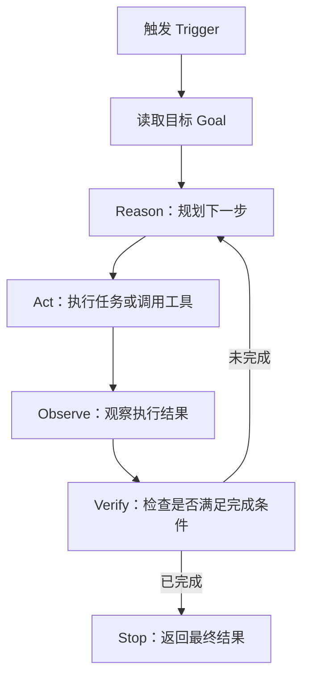

# Agent Loops：把“提示 Agent”升级为“设计循环系统”

## 一句话总结

Agent Loop 的核心不是让一堆 Agent 24/7 花哨地互相调用，而是把“人类反复提示、检查、反馈”的过程系统化：给 Agent 一个清晰目标，让它执行、观察、验证、迭代，并在满足可检查的完成条件时停止。

## 核心观点

1. **Loop engineering 是替代“人作为提示者”的系统设计**  
   传统方式是人不断给 Agent 新提示、看结果、再反馈。Loop engineering 则是设计一个系统，让 Agent 自己根据目标反复行动、检查和修正。

2. **一个 Loop 至少包含三个元素**
   - Trigger：什么时候启动
   - Action：启动后做什么
   - Stop condition：什么时候停

3. **Agent Loop 最重要的两根支柱是 Goal 和 Verification**
   - Goal：目标是什么，最好尽量客观。
   - Verification：Agent 如何知道自己完成了，如何检查结果并决定是否继续迭代。

4. **不是所有任务都需要复杂 Agent Loop**
   很多任务只需要一个简单的 solo loop：一个 Agent 自己 reason、act、observe、repeat。没有必要为了跟风而做多 Agent swarm 或 24/7 自动运行。

5. **Loop 的价值是提高第一轮交付质量，而不是保证 100% 完美**
   作者强调，Agent Loop 不会神奇地产生完美结果，但它能把原本需要人类多轮反馈的部分自动化，让初稿更接近可用状态。

6. **Loop 的效果取决于“完成标准”是否可检查**
   如果 stop condition 很主观，比如“直到你满意”，循环质量会不稳定，也可能运行太久。越能写成明确指标，Loop 越可靠。

## 内容结构

| 部分 | 核心内容 |
|---|---|
| 背景 | 社区开始讨论 agent loops、loop engineering，但定义混乱 |
| 定义 | 用系统替代人类持续提示 Agent 的过程 |
| 基础循环 | reason -> act -> observe -> verify -> repeat / stop |
| 适用边界 | 多数人不需要 24/7 agent swarm；要按场景判断 |
| 案例 1 | 生成 YouTube thumbnail，生成 10 个方案、评分、挑选、迭代 |
| 案例 2 | 用 Three.js 生成 3D 飞机，浏览器验证并反复修正 |
| 案例 3 | 用 HTML/CSS 复刻 Abbey Road 图片，截图验证但效果仍有限 |
| 方法论 | 先定义 done，再定义如何 check |
| 成功要素 | 可检查目标、硬停止、好工具、记忆、checker、计划、日志、成本意识 |

## 关键概念

### 1. 什么是 Agent Loop

Agent Loop 是一个让 AI 不断执行以下循环的系统：

1. Reason：判断下一步要做什么
2. Act：执行操作，例如写代码、调用工具、生成内容
3. Observe：观察结果，例如跑测试、截图、读取输出
4. Verify：检查是否满足完成条件
5. Repeat or Stop：不满足就继续，满足就停止



### 2. Loop Engineering 的本质

视频里给出的定义很准确：

> Loop engineering is replacing yourself as the person who prompts the agent. You design the system that does that instead.

也就是说，人不再每次手动说“这里改一下、那里再检查一下”，而是提前设计：

- 目标是什么
- 每轮该怎么检查
- 检查不过要怎么继续
- 最多跑多久或跑几轮
- 什么情况下必须停

这不是“提示词变长”，而是把提示、执行、反馈、验收做成一个自动化闭环。

### 3. Done Criteria：Loop 的命门

作者反复强调两个问题：

1. **What does done mean?**
2. **How will it check?**

如果这两个问题答不清，Loop 很容易变成“Agent 忙了很久，但产出并没有真正变好”。

| 任务类型 | Done Criteria 示例 | Verification 示例 |
|---|---|---|
| 写代码 | 所有测试通过，lint 无错误，目标功能可运行 | 跑测试、跑 lint、启动服务、检查日志 |
| 做网页 UI | 截图与设计参考相似，移动端无重叠 | Playwright 截图、视觉检查、控制台检查 |
| 做视频剪辑 | 字幕和节奏点对齐，错误片段被删除 | 渲染视频、检查时间轴、对齐 transcript |
| 写脚本 | 输出符合格式，示例输入能跑通 | 执行脚本、检查 stdout、比对预期结果 |
| 做缩略图 | 小尺寸清晰、有好奇心、对比强 | Rubric 打分、生成多个版本、挑选优化 |

越客观的完成条件越好，例如：

```text
Keep iterating until all tests pass and screenshot comparison has no layout overlap.
```

比下面这种更稳定：

```text
Keep iterating until you are satisfied.
```

## 三种常见 Loop 架构

| 架构 | 怎么工作 | 适合场景 | 风险 |
|---|---|---|---|
| Solo Loop | 一个 Agent 自己计划、执行、观察、迭代 | 大多数个人任务、代码修改、内容生成、轻量验证 | 容易自我确认，需要工具验证 |
| Maker-Checker | 一个 Agent 做，一个 Agent 评审/打分/反馈 | 主观质量较强的任务，如文案、设计、缩略图 | checker 本身也可能不可靠 |
| Manager + Helpers | 一个主 Agent 拆任务，多个子 Agent 并行执行 | 大项目、多文件、多模块、多研究源 | 成本高，协调复杂，容易放大错误 |

作者的实践偏向：大多数情况下用 Solo Loop 就够了，不要一上来就做复杂 agent swarm。

## 案例/演示

### 案例 1：YouTube 缩略图 Loop

目标：让 Claude Code 基于 MrBeast 缩略图风格生成 10 个 thumbnail concepts。

流程：

1. 生成 10 个缩略图概念。
2. 用 rubric 评分：
   - 小尺寸清晰度
   - 好奇心
   - 情绪拉力
   - 视觉对比
3. 选出前三。
4. 找出每个概念最弱的地方。
5. 改进并重新评分。
6. 对最强方案持续迭代，直到满足标准。

作者指出这个案例的问题是：停止条件是“until satisfied”，偏主观。如果要改进，可以做一个专门的 scoring agent，并用更多 evaluation 来提升评分可靠性。

### 案例 2：Three.js 3D 飞机

目标：用 Three.js 做一个可以旋转、查看的 3D 飞机。

Loop 做了什么：

1. 写 Three.js 代码。
2. 打开浏览器。
3. 检查是否正常渲染。
4. 旋转、查看、确认交互。
5. 根据问题继续修改。

结果不是完美，但比“直接一句话让它做个 3D 飞机”要好很多。这个案例说明：Loop 的价值是让 Agent 自动进行“构建 -> 查看 -> 修正”的闭环。

### 案例 3：用代码复刻 Abbey Road 图片

目标：不使用图片生成，只用 HTML/CSS 复刻 Beatles Abbey Road 经典照片。

Loop 过程：

1. 生成 HTML/CSS 版本。
2. 放进浏览器。
3. 截图。
4. 与参考图比较。
5. 继续修改。
6. 最多 8 轮；平均分达到 9 分则停止。

结果仍然不像原图，但它确实逐轮变好。这个案例的启发是：即使有 Loop，如果工具能力和验证能力不足，最终结果仍可能有限。Loop 不能替代正确工具，例如图像生成任务硬用 HTML/CSS 复刻就天然受限。

## 可照做操作步骤

### 设计一个 Agent Loop

1. **先写清楚任务目标**
   - 不要写“做得好一点”。
   - 尽量写成可观察结果，例如：
     - “生成一个可交互的 Three.js 飞机页面”
     - “让所有测试通过”
     - “生成 10 个缩略图方案并选出最高分版本”

2. **定义 Done Criteria**
   - 回答：什么叫完成？
   - 尽量用客观条件：
     - 测试通过
     - 截图无明显布局错误
     - 文件存在
     - 输出符合 schema
     - 分数达到阈值

3. **定义 Verification 方法**
   - 回答：Agent 怎么检查？
   - 根据任务选择工具：
     - 代码：测试、lint、构建
     - UI：浏览器截图、控制台日志、响应式检查
     - 视频：渲染、时间轴、字幕对齐
     - 文案：rubric、示例对照、单独 checker

4. **设置 Hard Stop**
   - 避免无限循环。
   - 示例：
     - 最多 8 轮
     - 最多 45 分钟
     - 连续 2 轮没有提升就停止
     - 遇到不可解决依赖就停止并报告

5. **决定 Loop 架构**
   - 简单任务：Solo Loop
   - 需要评审：Maker-Checker
   - 大型多模块任务：Manager + Helpers

6. **让 Agent 先计划再执行**
   - 先输出计划、检查点和验证方式。
   - 再开始执行。

7. **要求记录日志**
   - 每轮记录：
     - 做了什么
     - 检查结果
     - 为什么继续或停止
     - 下一轮改什么

8. **结束时输出最终结果和剩余风险**
   - 不要只说“完成了”。
   - 应包括：
     - 最终产物
     - 通过的验证
     - 未解决问题
     - 建议人工复查点

### 一个可复用 Prompt 模板

```text
目标：
请完成 [具体任务]。

完成标准：
- [客观标准 1]
- [客观标准 2]
- [客观标准 3]

验证方式：
- 使用 [工具/命令/截图/测试] 检查结果。
- 每轮执行后记录检查结果。

循环规则：
- 如果未满足完成标准，请继续修改并重新验证。
- 最多迭代 [N] 轮。
- 如果连续 [N] 轮没有明显改善，请停止并说明原因。

最终输出：
- 完成了什么
- 验证结果
- 文件/链接/产物位置
- 剩余风险或人工复查建议
```

## 什么让 Loop 真正有效

视频总结了几个关键要素：

| 要素 | 作用 |
|---|---|
| Checkable Goal | 目标必须能检查，否则 Loop 只是在自嗨 |
| Hard Stop | 防止跑太久、烧成本、进入死循环 |
| Good Tools | Agent 必须有能观察现实结果的工具 |
| Memory | 记录前几轮尝试，避免重复犯错 |
| Separate Checker | 主观任务可以让独立 checker 评分 |
| Planning First | 先计划验证路径，再执行 |
| Logging | 让每轮迭代可追踪、可复盘 |
| Cost Awareness | Loop 运行越久，成本越高，必须值得 |

## 常见误区

1. **误区：Agent Loop 就是多 Agent swarm**
   不是。最常见、最实用的 Loop 可能只是一个 Agent 自己 reason、act、observe、repeat。

2. **误区：不让 Agent 24/7 跑就是落后**
   作者明确反对这种焦虑。是否需要 24/7 Agent，取决于你的工作场景。个人知识工作者通常不需要全天候 swarm。

3. **误区：Loop 会自动带来完美输出**
   Loop 只是提高迭代质量，不保证最终结果完美。工具选错、验证标准差，结果仍然会差。

4. **误区：主观评分也能稳定自动化**
   主观任务可以自动评分，但需要更谨慎。最好用 rubric、独立 checker、多样例评估来降低偏差。

5. **误区：循环越久越好**
   长时间运行可能只是浪费成本。作者提到有些 loop 跑了 12 小时以上，但对自己不一定有用。

6. **误区：别人的工作流可以直接照搬**
   Peter Steinberger、Boris Cherny 这类人的 loop 工作流可能适合大型代码库、团队协作或高强度工程场景，但不一定适合每个人。

## 值得质疑的地方

1. **“不应该再 prompting coding agents”略带夸张**
   更准确的说法是：对于高频、可验证、可迭代的任务，应逐步从手动 prompt 迁移到 loop；但一次性、探索性、低成本任务仍然适合普通 prompt。

2. **Loop 容易把错误规模化**
   如果目标定义错、验证方式错、工具权限过大，Loop 会更快地产生更多错误，而不是更快地产生价值。

3. **主观任务的验证仍然困难**
   缩略图、设计、文案、审美类任务很难用单一指标判断。Loop 可以辅助，但最终仍可能需要人工判断。

4. **成本和上下文污染要管理**
   多轮循环会消耗模型调用、工具调用和时间。长循环还可能让 Agent 越来越依赖错误假设。

## 可执行建议

1. **从 Solo Loop 开始，不要从 swarm 开始**
   先让一个 Agent 完成“执行 -> 验证 -> 修改”的闭环。等这个模式稳定后，再考虑 maker-checker 或 manager-helper。

2. **每次设计 Loop 前先写两个问题**
   - What does done mean?
   - How will it check?

3. **把验证工具配齐**
   Agent 不能只“想象自己完成了”。代码要能跑测试，UI 要能截图，视频要能渲染，数据要能校验。

4. **给每个 Loop 设置硬停止**
   推荐至少设置：
   - 最大轮数
   - 最大运行时间
   - 无改善停止条件

5. **把主观标准尽量转成 rubric**
   例如缩略图不要只写“好看”，而是拆成：
   - 小尺寸清晰度
   - 对比度
   - 情绪吸引力
   - 好奇心
   - 信息密度

6. **把 Loop 用在高频或高价值任务上**
   适合：
   - 自动修复测试失败
   - UI 生成和截图回归
   - 视频剪辑与节奏对齐
   - 多资料研究和报告生成
   - 代码重构和验证

   不太适合：
   - 一次性小问题
   - 没有明确验收标准的开放闲聊
   - 工具无法验证的纯主观任务

## 一句话复盘

Agent Loop 的真正价值不是“让很多 Agent 看起来很忙”，而是把目标、行动、观察、验证和停止条件设计成一个可重复系统，让 Agent 自动完成原本由人类承担的反馈迭代；它是否有用，取决于目标是否可检查、工具是否能验证、循环是否有硬停止，以及成本是否值得。
