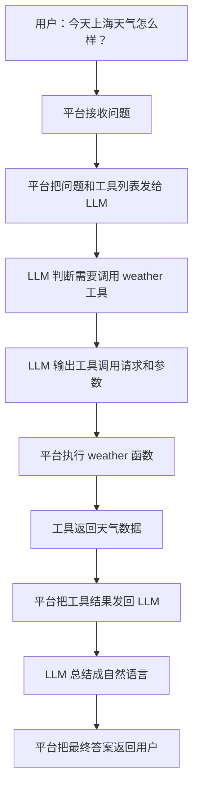
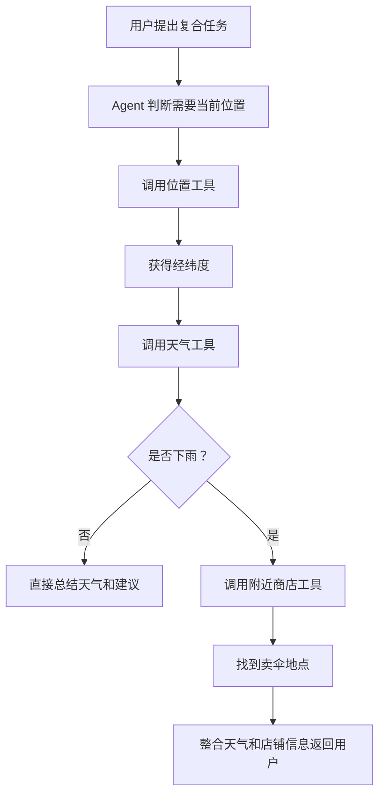
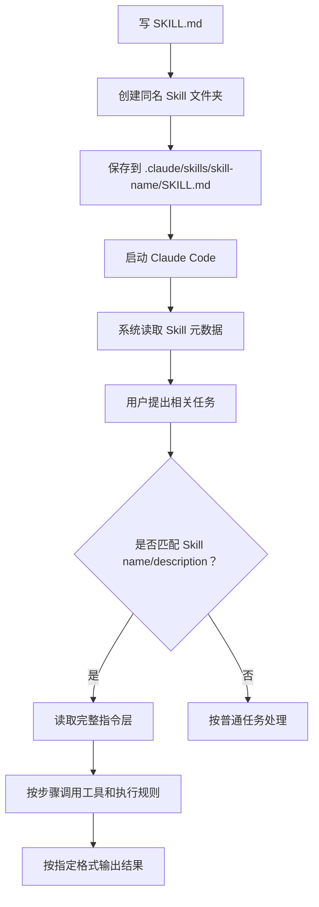

# 从 LLM 到 Agent Skill：打通 AI 底层逻辑

## 一句话总结

这期视频用工程视角串起了 LLM、Token、Context、Prompt、Tool、MCP、Agent 和 Agent Skill：大模型本质上是基于 Token 的预测函数，Context 是它每次处理任务时看到的全部信息，Tool 和 MCP 让它连接外部世界，Agent 让它能持续规划和调用工具，而 Agent Skill 则把可复用的任务规则沉淀成文档，让 Agent 在特定场景下稳定执行。

## 核心观点

1. **LLM 是 AI 应用的核心发动机**  
   Large Language Model 通常基于 Transformer 架构。视频没有深入解释 Transformer 细节，只强调它是现代大模型的基础。大模型并不是“理解人类语言”后再回答，而是把文本转成数字，在数学空间里计算，再逐步预测下一个 Token。

2. **Token 是模型处理文本的最小单位**  
   模型不直接处理“字”或“词”，而是处理 Token。Tokenizer 负责把文本切分成 Token，并映射成 Token ID；模型输出 Token ID 后，再由 Tokenizer 解码回文本。

3. **Context 是模型的临时记忆**  
   模型本身没有人类意义上的记忆。每次对话看似“记得前文”，是因为平台把历史消息、当前输入、系统规则、工具列表、已输出 Token 等信息一起放进 Context 发给模型。

4. **Prompt 决定模型要做什么，System Prompt 决定模型应该怎样做**  
   User Prompt 是用户输入的任务，System Prompt 是开发者在后台配置的角色、规则和行为边界。二者共同影响模型输出。

5. **Tool 让模型获得外部能力，但真正执行工具的是平台**  
   模型只能输出文本形式的工具调用意图，例如“调用 weather 工具，参数 city=Shanghai”。平台接收这个调用请求，真正执行函数，并把结果再交回模型总结。

6. **MCP 解决工具接入标准碎片化问题**  
   如果每个平台都有自己的工具接入规范，开发者需要为 OpenAI、Anthropic、Google 等分别写适配代码。MCP（Model Context Protocol）试图提供统一的工具接入标准，类似 Type-C 接口。

7. **Agent 是能自主规划并多轮调用工具的系统**  
   当任务需要“先查位置，再查天气，如果下雨再找伞店”这种多步骤链路时，模型需要根据中间结果决定下一步。具备这种持续规划、工具调用和任务完成能力的系统，就是 Agent。

8. **Agent Skill 是给 Agent 的可复用任务说明书**  
   当某个任务有固定规则、判断条件、步骤和输出格式时，不应每次都写一大段 Prompt，而应沉淀为 Agent Skill。Skill 通常是一个 `SKILL.md` 文档，包含元数据和指令层。

## 内容结构

| 概念 | 视频中的定位 | 关键理解 |
|---|---|---|
| LLM | AI 技术核心 | 一个接收数字、输出数字的巨大数学函数 |
| Token | 文本处理基本单位 | 不等同于字或词，是 tokenizer 学到的切分单元 |
| Tokenizer | 人和模型之间的翻译器 | 编码文本为 Token ID，解码 Token ID 为文本 |
| Context | 模型每次处理任务时看到的信息总和 | 可视为临时记忆 |
| Context Window | Context 能容纳的最大 Token 数 | 决定一次能塞给模型多少信息 |
| RAG | 从长文档中取相关片段给模型 | 降低 Context 压力和调用成本 |
| Prompt | 给模型的任务或指令 | 越清晰具体，结果越可控 |
| User Prompt | 用户输入的具体问题 | 告诉模型“这次做什么” |
| System Prompt | 后台配置的角色和规则 | 告诉模型“按什么身份和规则做” |
| Tool | 可被平台调用的外部函数 | 让模型查询天气、计算、访问系统等 |
| MCP | 统一工具接入协议 | 让工具一次开发，多平台复用 |
| Agent | 能规划并持续调用工具完成任务的程序 | 从“问答”升级为“执行任务” |
| Agent Skill | Agent 的任务说明文档 | 固化步骤、规则、格式和示例 |

## 关键概念拆解

### 1. LLM：不是人在说话，而是在预测下一个 Token

视频用“Mark 的视频怎么样？”作为例子说明生成过程：

1. 用户输入问题。
2. 模型根据当前输入预测下一个 Token。
3. 模型把刚输出的 Token 追加回输入。
4. 再预测下一个 Token。
5. 重复直到输出结束标记。

所以，大模型输出看起来像一句话，其实是一次次“预测下一个单位”的连续过程。

### 2. Token：不等于字，也不等于词

视频强调，Token 和自然语言中的“字/词”没有严格一一对应关系：

- 常见英文词可能是一个 Token，例如 `hello`。
- 一个英文词也可能拆成多个 Token，例如 `helpful` 可拆成 `help` 和 `ful`。
- 中文词语也可能被拆成多个 Token。
- 某些符号甚至可能需要多个 Token 表示。

视频给出的粗略换算：

| Token 数 | 大致对应 |
|---|---|
| 1 token | 约 0.75 个英文单词 |
| 1 token | 约 1.5-2 个中文字 |
| 400,000 tokens | 约 600,000-800,000 个中文字，或约 300,000 个英文词 |

这组换算适合理解量级，但不应当当成严格公式，因为不同 tokenizer、语言和文本类型都会影响切分结果。

### 3. Context：模型“记得前文”的真正原因

模型本身不是人，不会自然记住对话。它能回答“我刚才说过什么”，是因为平台每次都会把之前的对话历史重新发给模型。

Context 包括：

- 当前用户问题
- 历史对话
- System Prompt
- 可用工具列表
- 工具返回结果
- 模型已经输出的内容

因此，Context 更像“这次任务的资料包”，而不是模型脑中的长期记忆。

### 4. Context Window：资料包能装多大

Context Window 指模型一次最多能处理多少 Token。窗口越大，能塞进模型的信息越多，但成本也会增加。

视频举例说，产品手册几千页时，不应该直接把整本手册塞进模型。更合理的方式是用 RAG：

1. 用户提出问题。
2. 系统从文档库中检索最相关片段。
3. 只把相关片段和问题一起发给模型。
4. 模型基于这些片段回答。

这可以减少成本，也避免 Context Window 被长文档撑爆。

### 5. Prompt：把需求说清楚

Prompt 就是给模型的指令或问题。视频用“写一首诗”说明：如果 Prompt 太模糊，模型可能写古诗、现代诗、打油诗，输出不可控。

更好的 Prompt 是：

> 请以秋叶为主题，写一首五言绝句，风格偏伤感。

它明确了主题、体裁和风格，因此输出更稳定。

### 6. System Prompt：让模型按某种身份和规则行动

视频举了数学辅导机器人的例子：

```text
你是一个耐心的数学老师。
当学生问数学题时，不要直接给答案。
请一步步引导学生理解解题过程。
```

当用户问“3+5 等于多少”时，有 System Prompt 的模型会引导学生思考；没有 System Prompt 时，它可能直接回答“8”。

System Prompt 的价值是把角色、边界和长期规则放到后台，让用户不必每次重复。

## Tool 调用流程

视频强调一个容易误解的点：**模型并不真正执行工具，平台才执行工具**。

以查询天气为例：



角色分工：

| 角色 | 责任 |
|---|---|
| 用户 | 提出任务 |
| LLM | 判断是否需要工具、选择工具、生成参数、总结工具结果 |
| Tool | 执行具体外部能力，例如查天气 |
| 平台 | 转发消息、提供工具列表、执行工具调用、把结果交回模型 |

关键点：模型只会“表达调用意图”，平台才是真正的执行者。

## MCP：统一工具接口

没有 MCP 时，同一个工具可能需要分别适配不同平台：

| 平台 | 问题 |
|---|---|
| ChatGPT | 要按 OpenAI 的工具标准写接入 |
| Claude | 要按 Anthropic 的工具标准写接入 |
| Gemini | 要按 Google 的工具标准写接入 |

MCP 的目标是让工具开发者只按一个协议开发，所有支持 MCP 的平台都能接入。

视频中的类比是 Type-C：不同设备使用统一接口，配件开发和使用都更方便。

## Agent：从单次问答到多步执行

Agent 的关键是：它不只是调用一次工具，而是能根据中间结果继续规划下一步。

视频中的例子：

> 这里今天的天气怎么样？如果下雨，请帮我找附近有没有卖伞的店。

Agent 需要：

1. 先调用位置工具，获取经纬度。
2. 用经纬度调用天气工具。
3. 判断是否下雨。
4. 如果下雨，再调用商店搜索工具。
5. 整合信息，给用户最终答案。



这就是 Agent 和普通 Tool Calling 的区别：普通工具调用更像单步函数执行，Agent 则包含目标理解、步骤规划、中间判断和持续执行。

## Agent Skill：把重复规则沉淀成文档

视频后半段的重点是 Agent Skill。

场景：你想让 Agent 在出门前根据天气提醒带东西。你的规则可能是：

- 下雨带伞
- 太阳强带帽子
- 空气差带口罩
- 风大带防风外套
- 手机无论如何都要带
- 输出格式必须先总结，再列清单

如果每次都把这些规则写进 Prompt，会非常麻烦。Agent Skill 就是把这些固定规则提前写成说明文档，让 Agent 在相关任务出现时自动读取和执行。

### Agent Skill 的基本结构

```markdown
---
name: go-out-checklist
description: Help users decide what to bring before going out based on location and weather.
---

# Goal

...

# Steps

...

# Rules

...

# Output Format

...

# Example

...
```

| 组成部分 | 作用 |
|---|---|
| 元数据层 | 包含 `name` 和 `description`，告诉 Agent 这个 Skill 是什么、什么时候用 |
| 指令层 | 具体写目标、步骤、规则、输出格式、示例 |

视频强调：系统启动时通常只读取 Skill 的元数据。只有当用户问题和 Skill 的名称/描述相关时，才读取完整指令层。这就是 progressive disclosure，可以节省 Token。

## 可照做操作步骤

下面是视频中创建 Agent Skill 的可操作流程，以 Claude Code 为例。

1. **设计 Skill 名称**
   - 例如：`go-out-checklist`
   - 名称应简短、明确、能表达任务用途。

2. **编写 `SKILL.md` 内容**
   - 文件上方写 YAML frontmatter。
   - 至少包含：
     - `name`
     - `description`
   - 下方写指令层，包括：
     - 目标
     - 执行步骤
     - 判断规则
     - 输出格式
     - 示例输入、工具返回、期望输出

3. **找到 Skill 存放目录**
   - 视频以 Claude Code 为例：
     - 用户目录下的 `.claude/skills`

4. **创建同名文件夹**
   - 在 `.claude/skills` 下创建文件夹。
   - 文件夹名必须和 Skill 名称一致：
     - `.claude/skills/go-out-checklist`

5. **创建固定文件名**
   - 在该文件夹内创建：
     - `SKILL.md`
   - 注意：`SKILL` 必须大写，否则系统可能无法识别。

6. **保存 Skill**
   - 把写好的 Skill 内容粘贴到 `SKILL.md`。
   - 保存并退出。

7. **启动 Claude Code**
   - 在任意空目录启动 Claude Code。
   - Claude Code 会扫描 skills 目录，读取新 Skill 的元数据。

8. **触发 Skill**
   - 输入类似：
     - “我要出门了，帮我看看今天带什么。”
   - 系统判断该问题与 `go-out-checklist` 相关后，读取完整 Skill 指令层。

9. **按 Skill 执行**
   - Agent 根据 Skill 要求调用 location 工具。
   - 用户批准工具调用。
   - Agent 调用 weather 工具。
   - 用户批准工具调用。
   - Agent 根据天气结果、判断规则和输出格式生成最终回答。



## Agent Skill 的设计要点

1. **description 很关键**  
   它决定系统是否能在正确场景下触发 Skill。描述太窄会漏触发，太宽会误触发。

2. **指令层要写成 Agent 能执行的 SOP**  
   不要只写抽象原则，最好写清：
   - 先做什么
   - 再做什么
   - 调用哪些工具
   - 根据什么条件判断
   - 最终输出成什么格式

3. **给示例能显著提升稳定性**  
   示例最好包含：
   - 用户输入
   - 工具返回
   - 期望输出

4. **Skill 适合沉淀高频、规则稳定的任务**  
   如果任务只做一次，普通 Prompt 就够了；如果经常重复，且有固定规则，就适合写成 Skill。

5. **高级 Skill 可以包含代码和资源**  
   视频提到 Agent Skill 不只是一份说明文档，还可以运行代码、引用资源。但基础能力的核心仍然是“让 Agent 在正确时机读取一份可复用说明书”。

## 常见误区

1. **误区：模型真的有长期记忆**  
   更准确地说，模型每次看到的是被平台组装好的 Context。它不是自然记住，而是每次被重新喂入历史信息。

2. **误区：Token 就是字或词**  
   Token 是 tokenizer 的切分单位，可能是词、词的一部分、多个字，甚至不可见字符的一部分。

3. **误区：大 Context Window 就可以粗暴塞全部资料**  
   即使窗口够大，也会增加成本，并可能稀释重点。长文档问答更适合 RAG。

4. **误区：模型在调用工具**  
   模型只输出工具调用请求，平台才真正执行工具函数。

5. **误区：MCP 是某个具体工具**  
   MCP 更像协议/标准，不是单一工具。它解决的是工具接入格式统一问题。

6. **误区：Agent Skill 很神秘**  
   基础 Agent Skill 本质上就是一份 Markdown 说明书，只是放在约定目录和固定文件名下，并配合系统的触发和加载机制。

## 值得质疑或补充的地方

1. **视频中部分模型版本与窗口大小应视为材料说法，不宜直接当作事实引用**  
   例如 GPT-5.4、Gemini 3.1 Pro、Claude Opus 4.6 等版本和窗口数字，需要以官方文档为准。作为学习概念的例子可以接受，但做技术选型时要重新核验。

2. **“Prompt Engineering 很少有人提”这个判断略绝对**  
   更准确的说法是：单纯“写提示词技巧”热度下降，但指令设计、系统提示、评估、上下文工程、Agent 工作流设计仍然非常重要。

3. **Tool / MCP / Agent 的安全问题没有展开**  
   一旦 Agent 能调用工具，权限、审批、日志、沙箱和越狱风险都会变得关键。真实系统不能只关注“能不能调用”，还要关注“能不能安全调用”。

## 可执行建议

1. **用一张表记住概念链路**
   - LLM：核心模型
   - Token：输入输出单位
   - Context：本次任务资料包
   - Prompt：任务指令
   - Tool：外部能力
   - MCP：工具接入标准
   - Agent：能持续规划和调用工具的执行系统
   - Skill：给 Agent 的可复用任务说明书

2. **以后看到 AI 产品时，用这套框架拆解**
   - 它底层调用哪个模型？
   - 它把哪些信息放进 Context？
   - 它有哪些工具？
   - 是否用了 MCP？
   - 它是否具备多步规划能力？
   - 它是否有 Skill / Workflow / Rules 这类可复用任务说明？

3. **写 Skill 时先写触发条件，再写执行步骤**
   - 触发条件决定“什么时候用”。
   - 执行步骤决定“用了之后怎么做”。
   - 输出格式决定“最终交付长什么样”。

4. **把高频 Prompt 升级成 Skill**
   - 如果某段 Prompt 你重复用了 3 次以上，并且每次都要带同样规则，就值得沉淀成 Skill。

5. **区分概念学习和工程落地**
   - 学概念时理解“模型-工具-平台-Agent”的分工。
   - 做工程时补上权限控制、异常处理、成本控制和评估机制。

## 一句话复盘

LLM 负责基于 Token 生成内容，Context 决定它这次能看到什么，Prompt 决定它要做什么，Tool 让它接触外部世界，MCP 统一工具接入方式，Agent 让它能多步规划和持续执行，而 Agent Skill 则把高频任务的步骤、规则和格式沉淀成可复用说明书。
