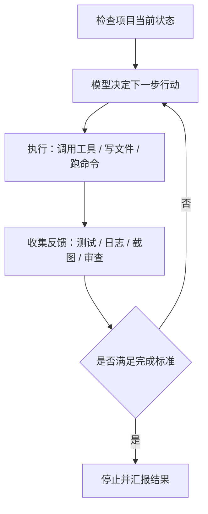
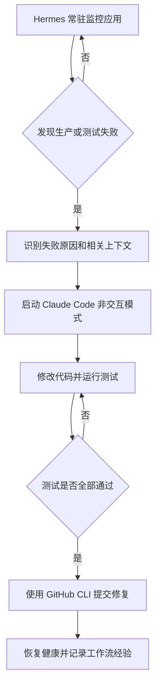
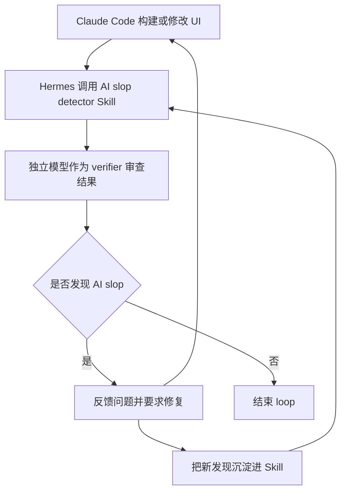

# Loop Engineering Totally 10x Hermes Agents：中文 digest

## 一句话总结

这段视频把 `loop engineering` 解释为：不再由人持续给 Agent 写提示词、检查结果、再提示，而是设计一个能自动判断状态、采取行动、收集反馈、验证结果并决定是否继续的循环系统；当它与 Hermes 这类常驻 Agent、Claude Code 非交互模式、自演化 Skill 和独立 verifier 结合时，才真正从“酷炫概念”变成可落地的自动化工作流。

## 来源类型

- 类型：视频转录 / 操作方法论 / 工具工作流说明
- 主题：Loop Engineering、Hermes Agent、Claude Code、自动验证、Skill 自演化
- 主要用途：为长期运行的 Agent 工作流设计目标、反馈、验证门、终止条件和状态管理
- 已清理内容：口头填充、重复表达、订阅引导、课程广告段落

## 核心观点

### 1. Loop Engineering 不是新概念，但它在 Agent 场景里变重要了

视频认为，循环并不新鲜。定时任务、cron job、CI 检查、测试重跑，本质上都带有 loop 的影子。但在大模型 Agent 里，新的变化是：模型已经可以在更长任务里持续推理、调用工具、观察反馈、修正路径，因此人不再必须做每一步的“中间提示词工程师”。

过去的开发模式是：

- 人提出任务
- Agent 执行一部分
- 人检查输出
- 人指出错误
- 人再次提示
- 循环直到完成

视频把这个称为：`你自己就是那个 loop`。

Loop engineering 要做的是把这个循环外包给系统：人只定义目标、约束和完成标准，Agent 自己决定下一步。

### 2. Prompt Engineering 控制“决策点”，Loop Engineering 控制“完整闭环”

视频强调，prompt engineering 主要影响 Agent 在某一次调用里的决策；而 loop engineering 覆盖的是一个完整工作系统：

1. 检查项目当前状态
2. 决定下一步行动
3. 调用工具、写文件、运行命令
4. 收集反馈
5. 判断是否完成，未完成则继续

因此 loop engineering 的重点不是“写一个更强 prompt”，而是设计一个能持续工作的系统。

## 关键概念

| 概念 | 专业解释 | 通俗理解 |
|---|---|---|
| Loop Engineering | 设计 Agent 的自动迭代系统，包括状态读取、行动、反馈、验证、终止条件 | 不再每一步催 Agent，而是给它一套“自己检查、自己返工、自己收工”的工作制度 |
| Deterministic Loop | 完成标准明确、可机器验证的循环 | 像考试选择题，有标准答案，比如测试全绿、构建通过 |
| Non-deterministic Loop | 完成标准依赖审美、判断或软性质量标准的循环 | 像看 UI 是否高级，需要评审者判断，不是简单对错 |
| Verification Gate | 把反馈转成“通过 / 不通过”的检查点 | 门卫，没过检查不能说完成 |
| Termination Condition | 明确的停止条件，防止过早结束或无限循环 | 告诉 Agent 什么时候该停手 |
| State Management | 跨多轮保存任务进度、目标、历史结论和当前状态 | 给 Agent 一本工作日志，避免聊着聊着忘了自己在干嘛 |
| Self-evolving Skill | Agent 根据工作流和反馈改进自己的 Skill 规则 | 工作手册会根据踩坑自动更新 |
| Adversarial Loop | 构建者和审查者分离，由不同模型互相检查 | 一个负责做，一个负责挑刺 |

## 视频提出的 Loop 五步模型

1. **检查状态**：读取项目、测试、UI、issue、生产环境或已有文件，明确当前情况。
2. **决定行动**：模型根据当前状态判断下一步最值得做什么。
3. **执行行动**：调用工具、修改代码、运行命令、写文件、发起部署或创建 PR。
4. **收集反馈**：读取测试结果、构建日志、截图、代码审查意见、UI 评估结果。
5. **判断是否完成**：如果通过验证门，则停止；否则把反馈带入下一轮。



## 两类 Loop

### 1. Deterministic Loop：确定性循环

确定性循环适合完成标准清晰的任务，例如：

- 测试全部通过
- 代码编译成功
- lint 没有错误
- 部署健康检查通过
- API 返回符合 schema
- 生产环境监控恢复正常

这类 loop 的优势是：Agent 不需要猜“好不好”，只需要持续修复直到指标达标。

视频中的例子是：把 Hermes 作为常驻监控 Agent，让它监控已部署应用。如果某次 commit 导致生产出错，Hermes 可以触发 Claude Code 非交互模式，让 Claude Code 修复问题，并持续运行测试，直到所有测试通过后再提交修复。

可抽象为：



### 2. Non-deterministic Loop：非确定性循环

非确定性循环适合没有简单机器标准的任务，例如：

- UI 是否有 AI 味
- 页面是否高级、统一、可读
- 产品功能实现是否符合用户意图
- 文案是否自然、有说服力
- 代码结构是否易维护

这类任务不能只靠“测试通过”判断，需要一个 verifier 或评审模型对质量做判断。

视频中的例子是：用 Hermes 执行 `AI slop detector` Skill，让 Claude 模型负责构建 UI，另一个模型负责审查 UI 是否存在 AI slop。如果发现问题，Agent 修复；如果修复后仍有问题，Skill 可以吸收这次反馈，更新自己的检测规则。



## 可照做操作步骤

### A. 设计一个确定性 Loop

1. 选择一个能被客观验证的任务，例如“修复生产失败直到测试全部通过”。
2. 定义明确的完成条件，例如：
   - `npm test` 全部通过
   - `npm run build` 成功
   - 健康检查返回 200
   - 没有未提交的意外文件
3. 准备 Agent 能读取的上下文：
   - 项目路径
   - 最近失败日志
   - 测试命令
   - 部署或健康检查命令
   - GitHub issue / PR / commit 信息
4. 让常驻 Agent 监控触发条件，例如生产报错、CI 失败、监控告警或定时检查。
5. 触发后启动 coding agent 的非交互模式，让它修复问题。
6. 每轮修复后运行验证命令。
7. 如果验证失败，把日志反馈给 Agent 继续修。
8. 如果验证通过，提交修复、记录摘要，并停止 loop。

### B. 设计一个非确定性 Loop

1. 先定义质量标准，不要只写“做得更好”。例如 UI 场景可以定义：
   - 不使用模板化渐变背景
   - 避免重复卡片堆叠
   - 字体层级和容器尺寸匹配
   - 组件密度符合产品场景
   - 没有明显 AI 生成式视觉套路
2. 把质量标准写成 Skill 或 checklist，让 verifier 可以重复使用。
3. 让一个模型负责实现，另一个模型负责审查。
4. 审查输出必须给出可执行反馈，例如“第 2 个卡片的标题过大，和容器比例不匹配”，而不是“看起来不高级”。
5. Agent 根据反馈修复。
6. 再次审查，直到没有高优先级问题或达到硬性迭代上限。
7. 如果人类仍发现问题，把这条问题补进 Skill，让下一次检测更强。

### C. 写 Loop Prompt 时建议包含的字段

```text
目标：
你要完成什么具体任务？

完成标准：
哪些检查通过后才能停止？

验证方式：
需要运行哪些命令、读取哪些日志、查看哪些截图或让哪个 verifier 审查？

错误处理：
如果工具调用失败、测试失败、依赖缺失、权限不足，你应该如何处理？

状态记录：
把进度、失败原因、尝试过的方案、下一步计划写到哪里？

硬性上限：
最多迭代几轮？最多运行多久？什么时候必须停下来汇报？

交付物：
最终需要提交代码、PR、报告、截图、文档还是运行结果？
```

## 一个可复用的 Loop 设计模板

```markdown
# Agent Loop Spec

## Objective
完成：[具体目标]

## Trigger
当以下情况发生时启动：
- [CI 失败 / 生产告警 / 用户请求 / 定时任务 / 文件变更]

## Context
Agent 启动时必须读取：
- [项目路径]
- [测试命令]
- [最近日志]
- [相关 Skill]
- [验收标准文件]

## Action Loop
每一轮必须执行：
1. 检查当前状态
2. 制定下一步行动
3. 执行修改或操作
4. 收集反馈
5. 判断是否达到 done criteria

## Verification Gates
必须通过：
- [命令 1]
- [命令 2]
- [截图审查 / verifier 审查]
- [人工确认，如需要]

## Error Handling
如果失败：
- 工具失败：记录错误并尝试一次替代方案
- 测试失败：读取失败日志并继续修复
- 权限不足：停止并请求人类介入
- 连续 N 次无进展：停止并总结阻塞

## Termination
满足以下任一条件则停止：
- 所有验证门通过
- 达到最大迭代次数：[N]
- 达到最大运行时间：[时长]
- 出现需要人工决策的阻塞

## Output
结束时输出：
- 做了什么
- 验证结果
- 修改文件
- 遗留风险
- 后续建议
```

## 让 Loop 真正工作的六个条件

### 1. Context Management

不要依赖聊天上下文。即使上下文窗口很大，系统提示、目标和早期约束也会被近期工具输出冲淡。长期任务要把关键状态写到外部文件里，例如：

- `GOAL.md`
- `TASK_STATE.md`
- `DONE_CRITERIA.md`
- `ATTEMPTS.md`
- `VERIFICATION_LOG.md`

### 2. Feedback Quality

Agent 的下一步质量取决于反馈质量。好的反馈应该具体、可定位、可执行。

差反馈：

- “UI 还不够好”
- “代码有问题”
- “继续优化”

好反馈：

- “`npm test` 中 `auth.spec.ts` 第 48 行断言失败，实际返回 401，期望 200”
- “移动端 375px 宽度下导航按钮与标题重叠”
- “第 3 个卡片使用了和其他卡片不同的字号，破坏层级一致性”

### 3. Verification Gates

反馈必须被转化成明确裁决。否则 Agent 不知道什么时候算完成。

确定性任务适合用命令作为 gate：

```bash
npm test
npm run build
npm run lint
```

非确定性任务适合用 verifier checklist：

- 是否存在明显模板化布局？
- 是否有文本溢出？
- 是否符合产品场景密度？
- 是否与现有设计系统一致？

### 4. Termination Condition

必须显式设置停止条件。否则 Agent 可能出现两种坏结果：

- 过早停止：问题没解决就宣布完成
- 过度循环：一直修改细节但没有实质进展

建议同时设置：

- 成功停止条件
- 最大迭代次数
- 最大运行时间
- 连续无进展停止条件
- 需要人工介入的条件

### 5. Error Handling

视频特别指出，很多人忽略错误处理。一个可运行的 loop 要说明工具失败时怎么做：

- 命令不存在：检查 package scripts 或文档
- 依赖缺失：判断是否允许安装
- 权限不足：停止并请求批准
- 测试 flaky：重跑一次并记录差异
- 外部服务不可用：记录阻塞，不要假装完成

### 6. State Across Turns

长期任务必须维护外部状态。否则聊天上下文变长后，Agent 可能忘记已经尝试过什么、为什么失败、当前目标是什么。

建议保存：

- 当前目标
- 已尝试方案
- 每轮验证结果
- 当前阻塞
- 下一步计划
- 最终完成依据

## 值得质疑的地方

### 1. “10x”表述偏营销

视频标题强调 10x，但正文没有给出可验证指标。更稳妥的理解是：loop 在某些重复检查、修复、验证任务里能显著减少人工介入，但不保证所有任务都 10 倍提升。

### 2. 对模型能力的描述需要谨慎

视频提到一些模型版本和发布节奏，但材料中夹杂了口误和转录错误，例如 “Fable 5”“OpenClaw / OpenClaw”“Clawed code / Clouded code”等。应把重点放在工作流思想，而不是把这些名称当成准确事实。

### 3. 非确定性 Loop 容易把主观判断伪装成客观验证

如果 verifier 的标准不清楚，它只是另一个会犯错的模型。非确定性任务需要：

- 明确评审 rubric
- 尽量用截图、对比、具体规则支撑判断
- 保留人工最终裁决
- 把人类反馈沉淀进 Skill

### 4. 自演化 Skill 有风险

Skill 自动更新听起来很强，但也可能把一次偶然反馈写成长期规则。建议采用“候选更新 -> 人工确认 -> 合并”的方式，而不是完全放任自动改规则。

## 和上一段 Agent Loops 材料的关系

这段视频和 “Finally. Agent Loops Clearly Explained.” 的共同点是：

- 都认为 loop 的核心是目标、行动、反馈、验证和停止条件
- 都强调 done criteria 比 prompt 更重要
- 都提醒不是所有任务都需要长时间 loop
- 都区分了客观验证和主观评审

区别在于：

- 上一段更像概念解释，重点讲 Reason / Act / Observe 和多种架构
- 这一段更偏工程落地，重点讲 Hermes 常驻 Agent、Claude Code 非交互模式、Skill 自演化、verifier 分离

可以把两者合并成一句话：

> Agent Loop 的本质是把人类原本负责的“检查、反馈、再提示”系统化；Hermes 这类常驻 Agent 的价值，是让这个系统能在触发条件出现时自动运行。

## 对我的启发

### 1. 不要先问“怎么写 prompt”，先问“怎么验收”

Loop 的质量上限通常不取决于 prompt 多漂亮，而取决于完成条件是否清晰、反馈是否可靠、失败时能否恢复。

### 2. 对知识工作也可以做轻量 loop

不是只有代码能用 loop。比如每日 AI 邮件摘要、视频 digest、资料归档，都可以设计为：

- 输入来源
- 摘要结构
- 保存路径
- 质量检查
- 文件命名规则
- 失败时重试或请求人工介入

### 3. Skill 是 loop 的长期记忆

如果一次工作流会重复出现，应该把判断标准、操作步骤、验收标准沉淀为 Skill。这样下一次 Agent 不需要重新靠聊天上下文记住规则。

### 4. 最实用的架构是 Builder + Verifier

对复杂任务，尤其是 UI、文档、代码 review、数据分析，建议分离两个角色：

- Builder：负责生成或修改
- Verifier：负责按标准挑错

这比让同一个模型“自己做、自己夸自己”更可靠。

## 可执行建议

1. 为常见任务建立 `DONE_CRITERIA.md`，先写验收标准，再让 Agent 工作。
2. 把重复工作流沉淀为 Skill，而不是每次复制长 prompt。
3. 对确定性任务，优先把测试、构建、lint、健康检查作为 gate。
4. 对非确定性任务，先写 rubric，再让 verifier 按 rubric 审查。
5. 所有长 loop 都设置硬性上限：最大轮数、最大时间、连续无进展停止。
6. 让 Agent 维护状态文件，记录每轮尝试和验证结果。
7. 对自演化 Skill 保留人工确认，不要让一次反馈自动污染长期规则。

## 一句话复盘

Loop Engineering 的关键不是让 Agent 无限运行，而是把“目标、反馈、验证、停止、记忆”设计清楚；Hermes 这类常驻 Agent 只是执行载体，真正决定效果的是你如何定义 done、如何检查 done、以及如何把每次反馈沉淀进下一次循环。
