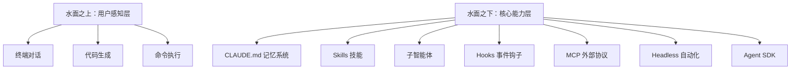
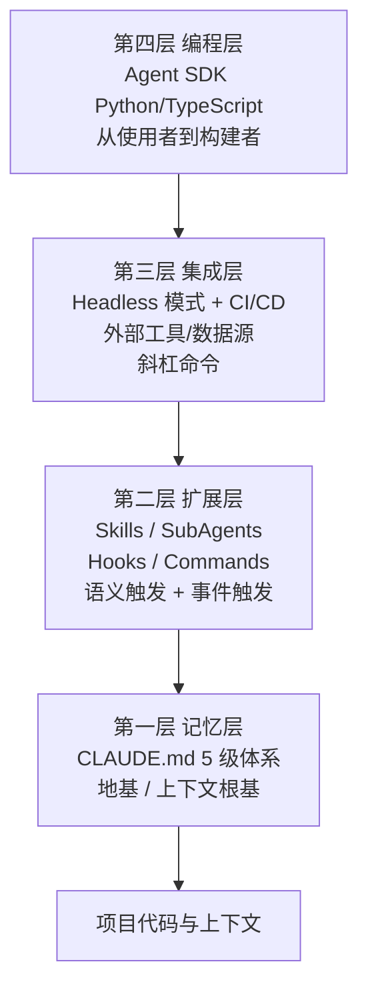
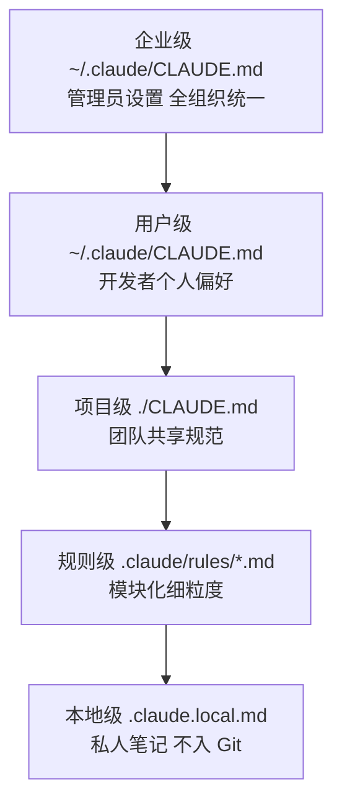
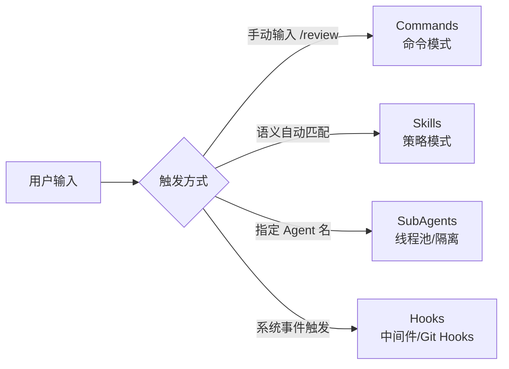
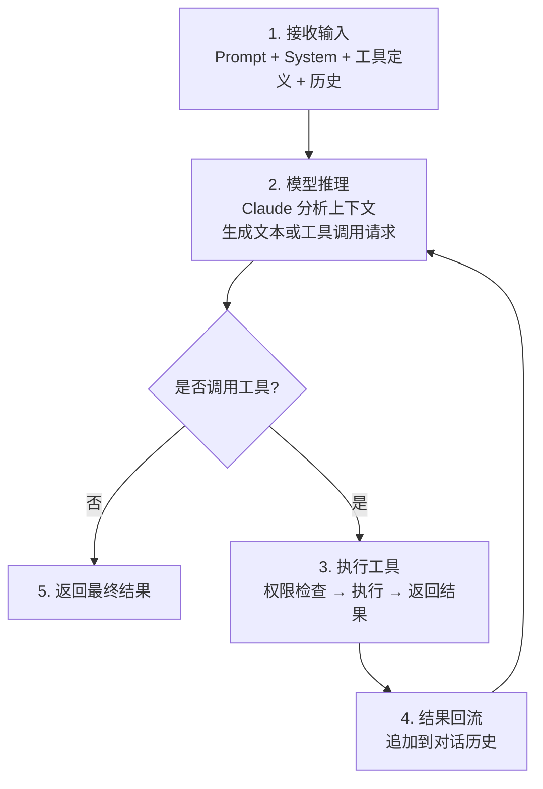
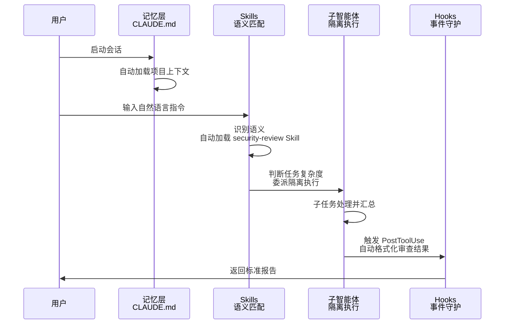
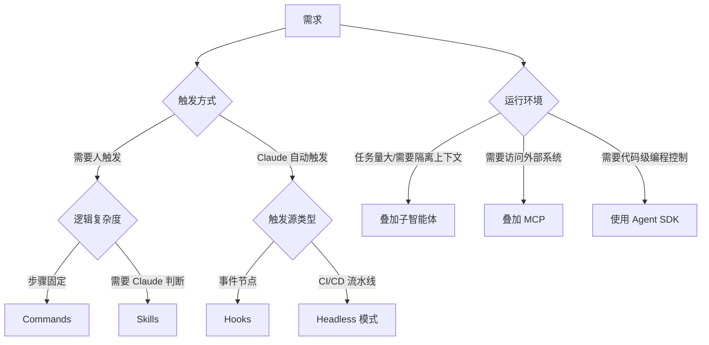
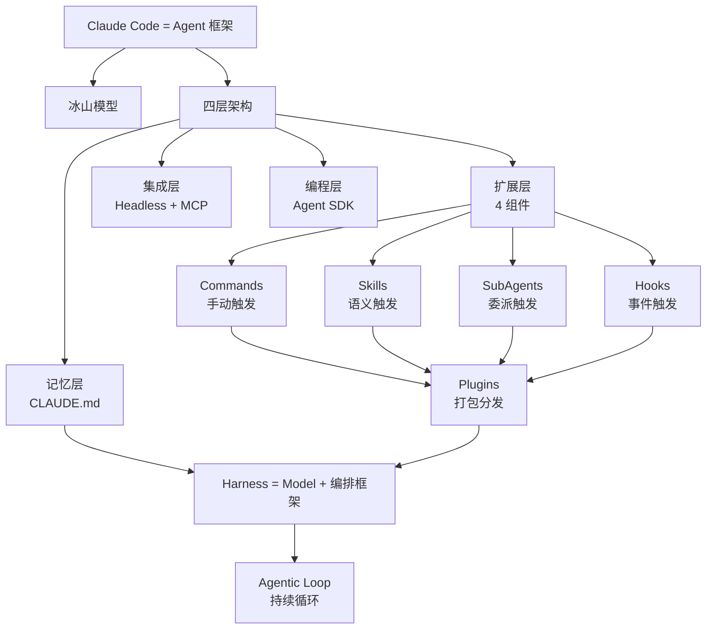

# 站在云端看一栋大楼：理解 AI Agent 框架的完整剖面

## 速查表（一页纸地图）

| 模式/概念 | 一句话定义 | 核心比喻 | 典型场景 |
|---------|----------|---------|---------|
| Agent 框架 | 给模型装上"手脚"的可编排系统 | 马匹 + 马具 | 把聊天工具改造成工程化系统 |
| 四层架构 | 记忆/扩展/集成/编程层层递进 | 摩天大楼（地基→楼层→水电→顶层） | 系统化梳理产品能力边界 |
| Harness | 包裹在模型外层的编排框架 | 套在马身上的挽具 | 决定模型能力的真正上限 |
| Agentic Loop | 模型推理→工具调用→结果回流的循环 | 大脑与手脚的对话 | 复杂任务自动化的核心机制 |
| Plugins | 把组件打包分发的封装机制 | 集装箱 / npm 包 | 团队复用、跨项目分发 |

## 0. 全章比方：一座冰山与一栋大楼

把 AI 编码工具想象成一座**冰山**：水面上露出的对话窗口、代码生成只是冰山一角；水面下隐藏的记忆系统、技能加载、子任务委派、事件拦截、外部协议连接等，才是真正撑起整座冰山的基座。本章用"冰山"和"摩天大楼"两个连续比喻，帮你从水面上一路潜到地基，再从地基一路爬到顶层工作室。

> **图 1-1：冰山模型**（原图 Mermaid 重绘）



**关键解读**：
- 大多数开发者只触达"水面之上"，所以遇到痛点就以为是模型不行
- 水面下的每一层都对应一类工程问题：失忆、风格飘忽、上下文溢出、自动化
- "框架化"的本质：把手动操作沉淀成系统配置，把个人智慧沉淀成团队规范

---

## 1.1 从命令行助手到 Agent 框架

### 类比：把一辆自行车改装成汽车

普通聊天工具像一辆自行车——简单直接、骑上就走。Agent 框架则像把这辆自行车拆掉，换装发动机、变速箱、悬挂系统，变成一辆可以自动驾驶、接入车联网、按场景切换驾驶模式的汽车。三大属性重新定义了它的能力边界：

- **可编程**：用代码直接驱动它，嵌入自动化流水线
- **可扩展**：通过配置文件注入新能力，不用改核心代码
- **可组合**：各模块像乐高积木一样自由拼装

### 痛点：把汽车当自行车骑

如果只用对话窗口，所有工程化能力都成了"隐藏关卡"。开发者常见的三大症状：
1. **失忆症**：每次新会话都要重述项目背景
2. **风格漂移**：同一份代码审查标准时有时无
3. **上下文爆炸**：处理多文件任务中途"断片"

### 💡 关键洞察：Agent = Model + Harness

模型本身只会"说话"，真正的"做事"能力来自包裹在外层的 Harness（马具）。同一匹马配上不同马具，能拉车、能耕地、能赛跑。这就是为什么"同一模型在不同 Harness 下表现差异，远大于不同模型在同一 Harness 下"——**Harness 比模型更重要**。

---

## 1.2 四层架构模型

> **图 1-2：四层架构摩天大楼模型**（原图 Mermaid 重绘）



**关键解读**：
- 自下而上：构建视角，关注基石与支撑
- 自上而下：使用视角，关注功能与体验
- 四层正交独立，可分层学习、按需启用

### 1.2.1 记忆层 — CLAUDE.md

### 类比：员工入职手册

新员工入职要先读员工手册，Claude Code 的"员工手册"就是 **CLAUDE.md**。每次对话开始时自动加载，省去反复重申背景的低效。

### 5 级记忆体系（类比 CSS 层叠优先级）

> **图 1-3：CLAUDE.md 5 级记忆体系**（原图 Mermaid 重绘）



**关键解读**：
- 层级越具体（如本地级），优先级越高——和软件配置的"全局→用户→项目→本地"覆盖模式如出一辙
- 项目级 CLAUDE.md 是日常开发的主战场

### 关键代码：项目级 CLAUDE.md 模板

**用途**：固化项目背景，让每次对话自动研读手册

```markdown
# 项目记忆 CLAUDE.md
## 技术栈
- 语言：TypeScript 5.x（启用严格模式）
- 框架：Fastify + Prisma
- 测试：Vitest（公共函数必须含单元测试）
- 包管理：pnpm（禁用 npm/yarn）
## 代码规范
- 组件风格：优先函数式组件，禁止 class
- 错误处理：统一用 Result 类型返回，严禁抛异常
- 提交规范：遵循 <type>[scope]: <description>
## 常用命令
- pnpm dev — 启动开发服务器
- pnpm test — 运行测试套件
- pnpm lint  — 执行代码检查
```

**关键点**：
- 上层 Skills / Hooks 等所有配置都依赖这一层精准的项目理解
- 看似朴素，实则是整栋大楼的地基

### 1.2.2 扩展层 — 四大组件

> **图 1-2 扩展层明细**（原图 Mermaid 重绘）



| 组件 | 触发方式 | 触发者 | 工程类比 |
|------|---------|--------|---------|
| Commands | 用户手动输入 | 人 | CLI 命令 |
| Skills | Claude 语义自动匹配 | AI | 策略模式（自动选择算法） |
| SubAgents | 用户指定或 Claude 委派 | 人或 AI | 线程池（隔离执行） |
| Hooks | 系统事件自动触发 | 系统 | 中间件 / Git Hooks |

**记忆口诀**：
- Commands：「你叫它做」
- Skills：「它自己知道该做」
- SubAgents：「它安排别人做」
- Hooks：「不管谁做，到了这一步就执行检查」

### 关键代码：典型 SKILL.md 配置

**用途**：声明一个技能，让 Claude 按语义自动加载

```markdown
---
name: code-reviewing
description: >
  Review code for best practices and potential issues.
  Use when the user asks to review changes or mentions reviewing.
allowed-tools:
  - Read
  - Grep
  - Glob
---

# Code Review Guidelines
你是一名专业的代码审查员……
```

**关键点**：
- `description` 字段是 Claude 决策是否激活此 Skill 的唯一依据
- `allowed-tools` 实现最小权限原则

### 关键代码：Hooks 配置示例

**用途**：在 Claude 调用 Bash 工具前自动运行安全检查

```json
{
  "hooks": {
    "PreToolUse": [
      {
        "matcher": "Bash",
        "command": "python .claude/hooks/safety_check.py",
        "blocking": true
      }
    ]
  }
}
```

**关键点**：
- `matcher` 指定拦截的工具类型
- `blocking: true` 表示检查失败时直接阻断

### 学习路径建议（咖哥原话改写）

> 「引自原文」：切勿急于求成，建议循序渐进——先 CLAUDE.md、再 Commands、再 Skills、再 Hooks、最后子智能体，每个组件实战两周。

### 1.2.3 集成层 — Headless 模式与 MCP

**两大支柱**：

| 支柱 | 方向 | 核心能力 | 工程价值 |
|------|------|---------|---------|
| Headless 模式 | Claude"走出去" | 非交互运行、CI/CD 嵌入 | 无人值守自动化 |
| MCP | 外部能力"走进来" | 标准协议接入工具/数据源 | 生态扩展 |

### 关键代码：CI/CD 中调用 Claude Code

**用途**：在 GitHub Actions 中自动审查 PR

```bash
# 在 CI/CD 流水线中调用 Claude Code
claude -p "审查最近一次提交的代码变更，重点关注安全隐患与性能问题" \
  --output-format json \
  --max-turns 10 \
  --allowed-tools Read,Grep,Glob
```

**参数意图**：
- `-p` 激活 Headless 非交互模式
- `--output-format json` 让脚本可解析输出
- `--max-turns` 精准控制成本
- `--allowed-tools` 白名单机制筑牢安全防线

### 1.2.4 编程层 — Agent SDK

### 类比：从住户变成建筑师

前三层你还是"住户"，使用现成的配置；跨越 Agent SDK 这条界线，你就成了"建筑师"，可以用 Python/TypeScript 直接编排全新 Agent。

### 关键代码：用 Agent SDK 构建代码健康度检查 Agent

**用途**：在自有应用中直接驱动 Claude 执行任务

```python
import claude_code

# 用 SDK 构建一个代码健康度检查 Agent
result = claude_code.query(
    prompt="分析 src/ 目录下所有 Python 文件的代码质量，给出健康度评分",
    allowed_tools=["Read", "Grep", "Glob"],
    max_turns=15
)
print(result)
```

**关键点**：
- 不再受限于终端交互界面
- Claude 能力可嵌入定时任务、Web 服务、数据处理管道等任意场景

### 💡 关键洞察：递归性

> 「引自原文」：Claude Code 本身，正是基于 Agent SDK 构建的一个 AI Agent。

洞察到这一层，对工具的认知就会从"一款产品"升维为"一种架构模式"。

### 1.2.5 底层视角：Harness 与 Agentic Loop

### 类比：马匹 + 马具

模型是马，Harness 是套在马身上的挽具与缰绳。马匹虽有力气，但若无马具便无法拉动车辆。公式：**Agent = Model + Harness**。

> **图 1-4：Agentic Loop 流程**（原图 Mermaid 重绘）



**关键解读**：
- Agentic Loop 是 Harness 的"心脏"，驱动整个系统持续运转
- 循环终止条件：① 模型主动停止；② 达到 `--max-turns` 上限

---

## 1.3 组件关系与协作

### 1.3.1 触发机制对比

> **表 1-1：四大组件对比**（原表结构改写）

| 组件 | 触发方式 | 触发者 | 是否需要记忆 | 典型场景 | 工程类比 |
|------|---------|--------|------------|---------|---------|
| Commands | 手动输入 | 人 | 是 | /review、/commit、/deploy | CLI 命令 |
| Skills | 语义自动匹配 | AI | 否 | 财务分析、API 设计 | 策略模式 |
| SubAgents | 指定或委派 | 人或 AI | 是 | 代码审查、日志分析 | 线程池（隔离） |
| Hooks | 事件自动触发 | 系统 | 否 | 提交前检查、格式化 | 中间件/Git Hooks |

### 二分法视角（确定性 vs AI 判断）

- **确定性触发**：Commands（用户指令）+ Hooks（系统事件）—— 行为可预期
- **AI 判断触发**：Skills（语义匹配）+ SubAgents（任务委派）—— 行为有弹性

**工程经验**：
- 安全性高场景 → 优先确定性 Hooks
- 灵活性高场景 → 优先 AI 判断 Skills

### 1.3.2 数据流：一个请求的旅程

### 场景：审查 src/payment/ 目录的代码变更

> **图 1-5：完整处理流程**（原图 Mermaid 重绘）



**关键解读**：
- 记忆层 + Skills + SubAgents + Hooks 全程无需用户额外干预
- 完美契合"关注点分离"原则：每模块单一职责，清晰接口协同

### 职责分配口诀

- CLAUDE.md → 知道什么（Know-what）
- Skills → 怎么做（Know-how）
- SubAgents → 谁来做（Who-does-it）
- Hooks → 能否做（Guard-rails）

### 1.3.3 Plugins：组合的打包与分发

### 类比：集装箱 / npm 包

Plugins 不是新能力，而是一种**打包机制**。类比：
- npm 之于 Node.js
- Docker 之于容器镜像
- Plugins 之于 Claude Code 组件

**关键区分**：
- Skills 定义"执行什么任务"（能力维度）
- Plugins 定义"如何打包共享"（分发维度）

**适用场景**：
- 个人项目：直接本地配置各组件，无需刻意创建 Plugins
- 团队项目：Plugins 是"新人一键配置到位"的利器

---

## 1.4 技术选型指南

> **图 1-6：组件选型决策树**（原图 Mermaid 重绘）



### 选型路径口诀

1. **触发方式**？人触发 → 步骤固定用 Commands，需要判断用 Skills
2. **自动触发**？事件节点用 Hooks，CI/CD 用 Headless 模式
3. **环境评估**？任务大 → 叠加子智能体；需外部 → 叠加 MCP；需编程 → 用 Agent SDK

### 应用场景速查

| 场景 | 推荐组件 | 核心理由 |
|------|---------|---------|
| 每次发布执行固定检查列表 | Commands | 步骤明确，手动一键触发 |
| 讨论财务自动获取专业指导 | Skills | 语义自动匹配，无需用户记忆命令 |
| 审查大型 PR 避免上下文溢出 | 子智能体 | 隔离上下文，仅回传精简结论 |
| 提交前自动阻止敏感信息泄露 | Hooks (PreToolUse) | 事件驱动强制拦截，无遗漏 |
| PR 提交后自动代码审查 | Headless + Commands | 无人值守环境，嵌入 CI/CD |
| 让 Claude 操作 GitHub Issue | MCP | 标准协议接入外部系统 |

---

## 工程踩坑清单

| 踩坑场景 | 症状 | 规避方案 |
|---------|------|---------|
| 不写 CLAUDE.md | 每次新会话都失忆 | 项目初始化时即固化项目记忆文件 |
| 滥用 Skills 装领域知识 | 触发条件模糊导致误激活 | description 字段写得明确具体 |
| 给每个操作加 Hooks | 性能损耗 + 维护成本飙升 | 只在安全/质量关键节点配置 |
| 子智能体嵌套过深 | 上下文膨胀反而加剧 | 单层委派 + 总结回传，避免递归 |
| Headless 模式不设 max-turns | Token 失控 | 必须显式限制 `--max-turns` |
| 团队无 Plugins 标准化 | 新人入职配置耗时 | 用 plugin.json 统一封装分发 |

---

## 全章知识地图



---

## 贯穿主线：一句话哲学总结

> **Harness 比 Model 更重要**——把工程化思维沉淀为系统配置，让个体智慧升华为团队规范。

---

## 学习路径建议

1. **第 1 步**：写好项目级 CLAUDE.md（地基）
2. **第 2 步**：学 Commands（最直观）
3. **第 3 步**：掌握 Skills（体会语义自动触发的妙处）
4. **第 4 步**：引入 Hooks（建立安全质量守护）
5. **第 5 步**：挑战子智能体（解决大规模复杂任务）

每步实战演练两周再进入下一阶段，贪多嚼不烂。