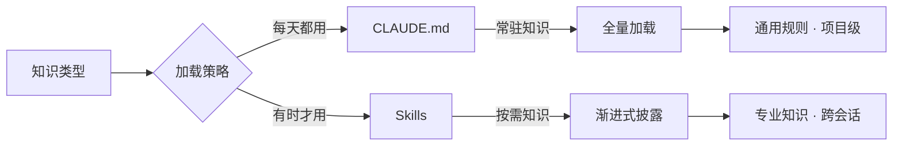
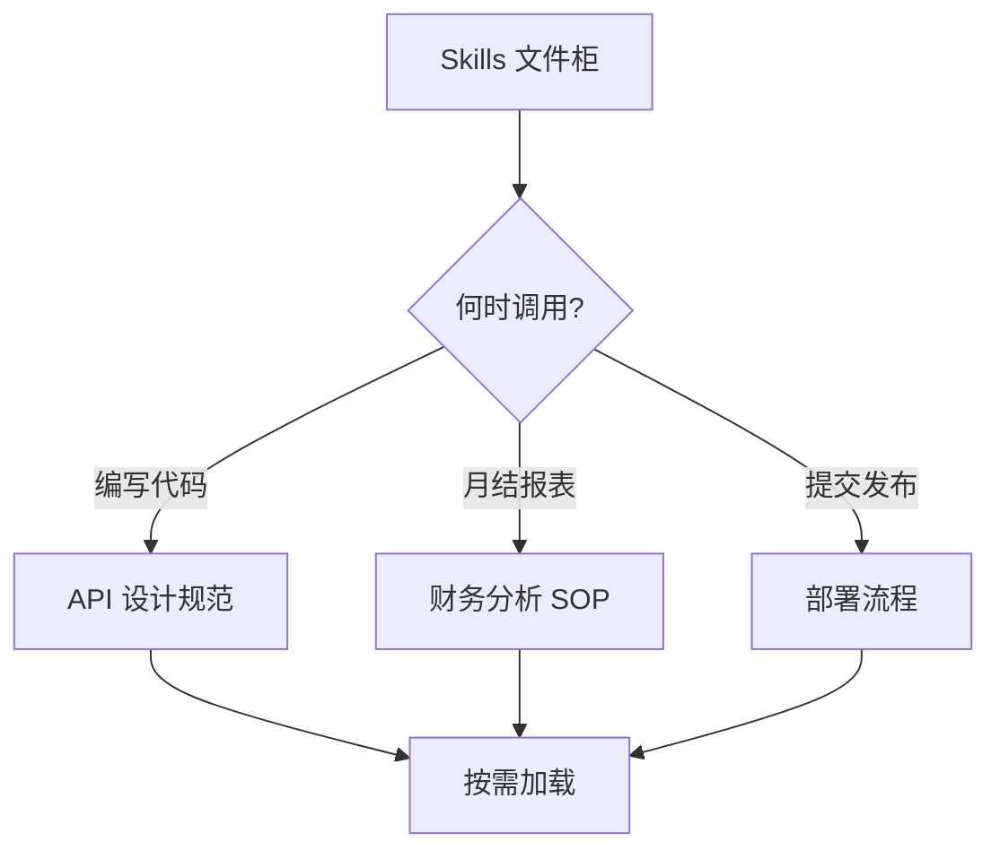
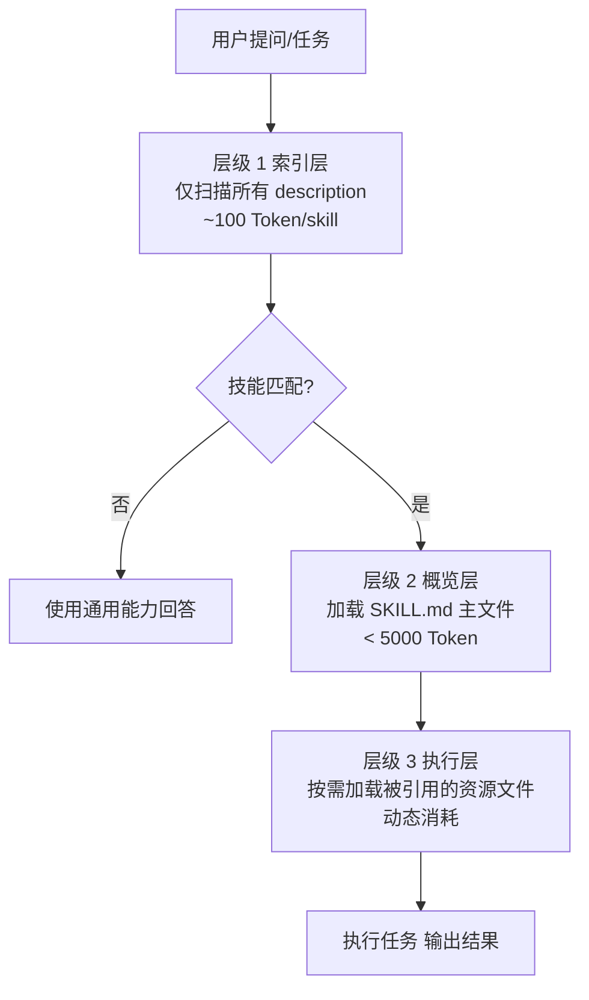
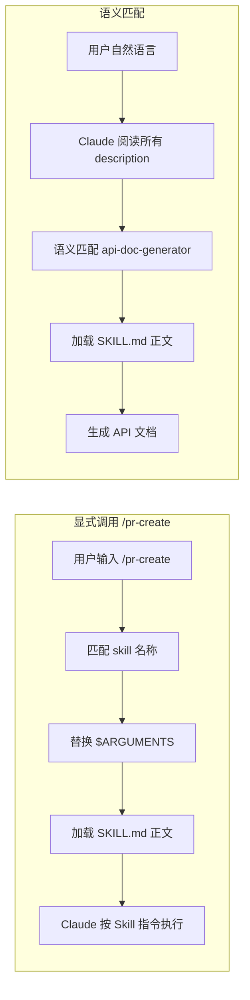
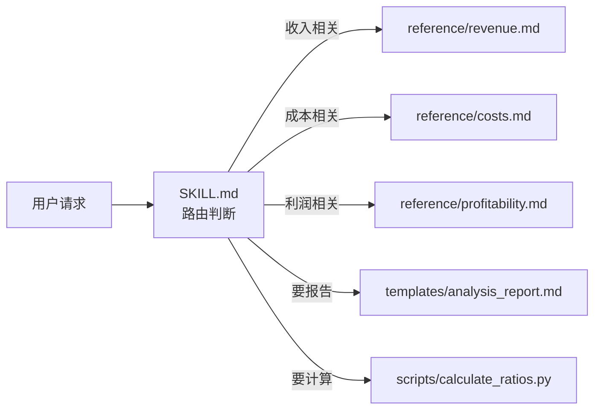
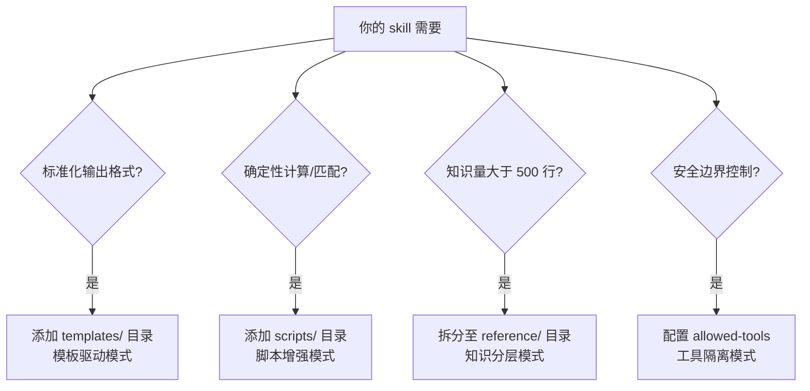

# 把知识装进文件夹：Skills 工程化的 5 大支柱

## 速查表（一页纸地图）

| 模式/概念 | 一句话定义 | 核心比喻 | 典型场景 |
|---------|----------|---------|---------|
| CLAUDE.md vs Skills | 常驻通用规则 vs 按需专业知识 | 墙上标语 vs 部门文件柜 | 区分何时该放哪个文件 |
| 文件夹式封装 | 用目录结构承载完整 Skill 工程化资产 | 庖丁解牛 | 容纳脚本 / 文档 / 模板 / 参考 |
| 渐进式披露 | description → SKILL.md → reference 三层按需加载 | 图书馆检索流程 | 用 100 Token 撬动 5300 Token 知识库 |
| 双通道触发 | 显式 `/skill-name` vs 语义自动匹配 | 终端命令 vs AI 推荐 | 高风险操作 vs 灵活应用 |
| 4 种设计模式 | 模板驱动 / 脚本增强 / 知识分层 / 工具隔离 | 4 种武器按需组合 | 不同场景的 Skill 架构选择 |

## 0. 全章比方：把 SOP 装进文件夹

把 Claude 想象成一位样样都会、但每天清晨都格式化记忆的全能实习生。`CLAUDE.md` 是公司贴在墙上的标语——人人可见、时刻生效；**Skills** 则是按部门归档的文件柜——只有当员工执行特定任务时，才会去翻阅对应的 SOP。本章用「墙上标语 vs 部门文件柜」、「图书馆检索」、「庖丁解牛」三个连续比喻，帮你把 Skills 这套知识工程化体系一次说透。

> **图 3-1：CLAUDE.md 与 Skills 知识类型与加载策略**（原图 Mermaid 重绘）



**关键解读**：
- CLAUDE.md = 规章制度（TypeScript 缩进 / PR 标题）——所有任务都要遵守
- Skills = 部门 SOP（财务月结 / API 文档生成）——只在执行特定任务时调用

---

## 3.1 从 CLAUDE.md 到 Skills：知识的两个维度

### 类比：墙上标语 vs 部门文件柜

CLAUDE.md 像贴在办公室墙上的标语——人人可见、时刻生效，代价是即便在调试 bug、跑测试时，文档规范的 Token 也会赖在上下文里白白占据空间。

Skills 像整芥地存放在部门文件柜里的 SOP——不需要在编写代码时背着财务手册，只在「需要」的那一刻，对应知识才会被精准提取。

> **图 3-2：能力目录按需取用**（原图 Mermaid 重绘）



### 💡 关键洞察：定义中的两个关键词

「一个 Skill 是一个包含指令的文件夹……用来『教』Claude 如何处理特定任务或工作流。」两个关键词值得深究：

- **「文件夹」**：从字符串到工程化。可以容纳代码库、领域文档、模板、可执行脚本
- **「教」**：从约束到内化。不是被动执行指令，而是真正理解一个领域的运作逻辑，成为该领域的「熟手」

---

## 3.2 解剖一个 Skill：骨骼与纹理

### 类比：庖丁解牛

理解 Skill 结构，如同庖丁解牛——先看清「骨架」，明白知识如何安放和组织，之后才能谈如何精妙运用。

### 3.2.1 目录结构

```text
api-doc-generator/
├── SKILL.md                  # 【核心骨架】必需的主技能文件
├── scripts/                  # 【手脚】可执行脚本
│   └── detect-routes.py      #   自动扫描代码库发现路由
├── reference/                # 【记忆库】按需加载参考文档
│   ├── openapi-patterns.md   #   只有生成文档时才读取的规范
│   └── error-codes.md        #   只有处理错误时才查阅的码表
└── templates/                # 【模具】输出模板
    └── endpoint-doc.md       #   定义 API 文档长什么样
```

### 5 条命名铁律

- **`SKILL.md` 文件名**：必须全大写，`skill.md` / `Skill.md` / `SKILL.MD` 一律无效——加载器执行的是精确字符串匹配
- **目录名**：kebab-case（`api-doc-generator`），最多 64 字符，仅限 `[a-z0-9-]`，无空格 / 下划线 / 大写 / 首尾横线
- **README.md 禁入**：Claude 会贪婪读取目录下所有 Markdown，README 会干扰指令理解
- **品牌中立**：`name` 字段不得包含「claude」「anthropic」等品牌词，保持通用可迁移
- **字符集限制**：抹平 Windows / Linux 大小写差异，kebab-case 是互联网的「世界语」

### 3.2.2 YAML Frontmatter：Skill 的「身份证」

```markdown
---
name: api-doc-generator           # 唯一标识符（≤64 字符，省略则用目录名）
description: >                    # 触发描述（≤1024 字符）
  Generate API documentation from source code. Use when
  the user asks to "write API docs", "document endpoints",
  or "create OpenAPI specs". Supports Express, FastAPI, and Spring Boot.
argument-hint: "[source directory] [output format]"
disable-model-invocation: true    # 禁用模型自动调用（默认 false）
user-invocable: false             # 用户可调用性（默认 true）
allowed-tools:                    # 工具白名单（精确控制权限）
  - Read
  - Grep
  - Glob
  - Write
  - Bash (python:*)
model: haiku                      # 指定模型（简单任务用 Haiku 提速降本）
context: fork                     # 隔离子智能体执行
agent: Explore                    # 子智能体类型
hooks:                            # 生命周期事件钩子
  PreToolUse:
    - matcher: "Bash"
      hooks:
        - command: echo "$TOOL_INPUT" >> audit.log
---
```

**3 大逻辑组**：
- **身份字段**（触发机制）：`name` / `description` / `argument-hint`
- **权限字段**（权限控制）：`disable-model-invocation` / `user-invocable` / `allowed-tools` / `model`
- **执行字段**（运行时环境）：`context` / `agent` / `hooks`

### 💡 关键洞察：`disable-model-invocation` vs `user-invocable` 极易混淆

- `disable-model-invocation: true`：「Claude 不能自动触发该 Skill」→ 必须用户 `/skill-name` 手动执行
- `user-invocable: false`：「该 Skill 不出现在 / 菜单中」→ 但 Claude 仍可在内部逻辑中自动调用

两者**正交**，控制两个独立维度：能否被模型自动触发、能否被用户手动触发。

---

## 3.3 渐进式披露：知识的投资回报率

### 类比：图书馆检索流程

想象走进图书馆找资料——你绝不会一次性读完所有藏书，而是遵循一套高效检索流程：
1. 浏览图书分类编目定位分类
2. 提取目标书籍查阅图书目录
3. 仅精读所需章节

Skills 系统正是采用了类似的**三层渐进式披露模型**。

> **图 3-3：三层渐进式披露模型**（原图 Mermaid 重绘）



### 关键数据：财务分析 Skill 的 Token 经济学

| 文件路径 | Token 数 | 说明 |
|---------|---------|------|
| SKILL.md | 800 | 主逻辑与路由指引 |
| reference/revenue.md | 1500 | 收入数据参考 |
| reference/costs.md | 1200 | 成本结构参考 |
| reference/profitability.md | 1000 | 利润率公式参考 |
| templates/report.md | 800 | 报告模板 |
| **合计** | **5300** | |

### Token 消耗对比（传统全量加载 vs 渐进式披露）

| 场景 | 传统全量加载 | 渐进式披露 | 节省比例 |
|------|------------|----------|---------|
| 不激活 Skill | 0 | 约 100（扫描阶段） | — |
| 简单请求（仅需主文件） | 5300 | 800 | **85%** |
| 中等请求（需 1 个参考） | 5300 | 2300 | **57%** |
| 复杂请求（需所有资源） | 5300 | 5300 | 0% |

> 💡 当用户问「毛利率怎么算」时，只需加载 SKILL.md + profitability.md，约 1800 Token；其他 3 个文件（3500 Token）完全保留在磁盘上，零消耗。

### 3.3.2 description 预算机制

Claude Code 的 description 预算上限默认为 **16000 个字符**，由所有已安装 Skill 平分：

```
单个 Skill 可用字符数 = 16000 / Skill 总数
```

安装 20 个 Skill，平均每个只剩 **800 字符**。**如果某个 Skill 的 description 超过 800 字符，它将被静默排除**——Claude 完全不知道它的存在，仿佛「消失」了。

### 3 个避坑技巧

1. `disable-model-invocation: true` → 该 Skill 的 description 不会注入上下文
2. 运行 `/context` → 查看哪些 Skill 被「静默排除」
3. 环境变量 `SLASH_COMMAND_TOOL_CHAR_BUDGET` → 手动扩大预算池

### 💡 关键洞察：少而精的工程哲学

> 「引自原文」：当你发现需要安装超过 20 个 Skill 时，这通常是一个信号，提示你需要重新审视架构策略。

3 个应对策略：合并同类项 / 隐藏内部工具 / Token 投资回报率思维。

---

## 3.4 触发机制：Claude Code 如何抉择 Skills 的调用

Skills 的触发机制是整个系统中最关键、也最需要深入理解的环节——能否在恰当时机被激活，比 Skill 内容本身的优劣更为重要。

### 3.4.1 双通道激活

| 通道 | 触发方式 | 特点 | 适用场景 |
|------|---------|------|---------|
| **显式调用** | 用户输入 `/skill-name arg1 arg2` | 类比终端命令，明确无歧义 | 高风险 / 副作用操作 |
| **语义匹配** | Claude 根据对话意图自动研判 | 「所想即所得」的无缝体验 | 知识提供 / 灵活应用 |

> **图 3-5：显式调用 vs 语义匹配执行流程**（原图 Mermaid 重绘）



### 3.4.2 description：Skills 的灵魂

语义匹配机制**完全依赖** description 字段——它不是人类阅读的说明书，而是 Claude 决策「是否调用此 Skill」时依据的唯一信号。

**高效 description 撰写公式**：

```
[功能定义](做什么) + [触发场景](何时用) + [核心能力](能做什么)
```

### 关键代码：低效 vs 高效 description 对比

**❌ 低效写法**（3 种典型反例）：

```yaml
description: Helps with projects.                    # 过于模糊
description: Implements the Project entity model     # 过于技术化，缺用户视角
description: Generates API documentation.            # 仅描述功能，未界定触发场景
```

**✅ 高效写法**（正确示范）：

```yaml
description: Generate API documentation from Express, FastAPI, or Spring Boot source code.
  Use when user mentions "API docs", "document endpoints", "OpenAPI specs", or "Swagger".
  Supports route detection, request/response schema extraction, and authentication requirement marking.
```

### 3 步高效撰写策略

1. **定义核心能力（What）**：一句话精准概括
2. **明确触发场景（When）**：`Use when user...` 句式列举各种可能的用户表达
3. **划定排除范围（Not For）**：`Not for...` 句式排除误触发场景

### 3.4.3 防止过触发与欠触发

**数据警示**：Vercel 评测显示，若缺乏明确指引，Agent 有 **56% 的概率**完全不会去查看可用的 Skills。

| 失效模式 | 现象 | 根因 | 修复策略 |
|---------|------|------|---------|
| **欠触发** | 应触发未触发 | description 过于技术化，与用户口语化表述存在语义鸿沟 | 「翻译」用户语言，加入同义词 / 口语说法 |
| **过触发** | 不该触发被激活 | description 定义过于宽泛，匹配阈值过低 | 引入负向约束 `Not for...` |

**测试验收标准**：
- 相关任务触发率 **≥ 90%**
- 无关任务误触发率 **≤ 5%**
- 准备 10~20 个测试用例，同时覆盖「应触发」「不应触发」

### 3.4.4 参考型 vs 任务型 Skill

> 「引自原文」：判断标准一句话——「如果 Claude 自动执行这个任务，最坏的情况是什么？」

| 维度 | 参考型 Skill | 任务型 Skill |
|------|------------|------------|
| Claude 自动触发 | ✅ 能（基于语义匹配） | ❌ 不能（必须手动） |
| 用户 / 触发 | ✅ 能 | ✅ 能 |
| description 作用 | 触发条件（注入上下文） | 仅供用户识别（不注入） |
| 消耗 Token 预算 | ✅ 是 | ❌ 否 |
| 典型场景 | 知识提供 / 规范查询 | 动作执行 / 副作用操作 |
| 经典案例 | API 规范 / 审查清单 | /commit / /deploy |

### 💡 关键洞察：副作用决定控制权

> 「引自原文」：副作用越大，控制权越要收紧。对于任何可能改变系统状态、造成不可逆后果的操作，永远不要信任 Claude 的自动判断。

---

## 3.5 SKILL.md 正文：是路由器，不是仓库

### 3.5.1 路由器思维

常见误区：把 SKILL.md 视为「知识仓库」，把所有相关信息堆砌其中。**正确设计思维**：定位为**路由器**——文件自身仅包含核心流程与路由表，详尽知识内容分散存储于被引用文件。

> **图 3-6：SKILL.md 的作用是路由器**（原图 Mermaid 重绘）



**关键技巧**：构建「快速参考」表格，以极低 Token 成本清晰指引路由条件：

```markdown
## Quick Reference
| 分析类型 | 触发关键词 | 参考资源 |
|---------|----------|---------|
| 收入分析（Revenue）| 收入、营收、销售额 | reference/revenue.md |
| 成本分析（Cost）| 成本、费用、支出 | reference/costs.md |
| 盈利分析（Profitability）| 利润、毛利率、净利率 | reference/profitability.md |
```

> 表格仅 3 行 ~50 Token，信息密度是逐行扫描的 10 倍。

### 3.5.2 契约式引用

引用辅助文件时，**切勿只罗列路径**，应建立「契约」明确 3 个要素：触发时机、资源位置、预期产出。

**❌ 弱引用**（缺乏上下文）：

```markdown
See `reference/revenue.md` for more details.
```

**✅ 契约式引用**（明确条件 + 路径 + 内容预期）：

```markdown
## Revenue Analysis
When the user asks about revenue growth, ARPU, or revenue composition:
- Load `reference/revenue.md` for calculation formulas and industry benchmarks.
```

### 3.5.3 500 行法则

Claude Code 建议 SKILL.md 篇幅控制在 **500 行以内**（≈ 2000~3000 Token）。

**重构信号与对策**：

| 重构信号 | 对策 |
|---------|------|
| 大段公式或规范说明 | 移至 reference/ 目录 |
| 多个完整示例（单个 >30 行）| 移至 examples/ 目录 |
| 多个输出模板 | 移至 templates/ 目录 |
| 可独立执行的逻辑 | 封装为 scripts/ 脚本 |
| 多个平行功能模块 | 考虑拆分为多个独立 Skill |

---

## 3.6 allowed-tools：知识约束行动

`allowed-tools` 体现深层设计原则——**知识应当约束行动**。权限配置应基于 Skill 对业务逻辑的「认知」。

### 关键代码：4 类 Skill 的权限模板

```yaml
# 审计类 Skill：严格只读
allowed-tools:
  - Read
  - Grep
  - Glob

# 生成类 Skill：可写不可改
allowed-tools:
  - Read
  - Grep
  - Glob
  - Write              # 允许新建文件

# 分析类 Skill：只读 + 特定脚本
allowed-tools:
  - Read
  - Grep
  - Glob
  - Bash (python:*)    # 仅允许执行 Python 脚本

# 执行类 Skill：受控命令白名单
allowed-tools:
  - Bash (git status:*)
  - Bash (git add:*)
  - Bash (git commit:*)  # 仅允许 git 提交流程
```

### 3.6.2 Bash 精细控制语法

通过 `Bash (prefix:*)` 前缀匹配机制实现细粒度管控：

```yaml
Bash (git:*)              # 允许所有 git 开头的子命令
Bash (git log:*)          # 仅允许 git log，禁止 git push
Bash (npm test:*)         # 仅允许测试，防止误执行 npm install/publish
Bash (python:*)           # 允许所有 Python 脚本执行
Bash (./scripts/*:*)      # 允许执行 scripts/ 目录下特定脚本
```

### 关键代码：精确授权 vs 过度授权

**✅ 精确授权**：

```yaml
allowed-tools:
  - Bash (git status:*)
  - Bash (git add:*)
  - Bash (git commit:*)
```

**❌ 过度授权**（致命风险）：

```yaml
allowed-tools:
  - Bash (*)             # 等同放弃所有防线，等价于未设置 allowed-tools
```

> 「引自原文」：`Bash(*)` 在安全性上几乎等价于未设置 allowed-tools。对于 /deploy 这样的高危任务型 Skill，这种配置是致命的——一旦模型被提示注入攻击，攻击者可利用此权限窃取密钥、删除生产数据或植入后门。

---

## 3.7 参数传递与动态注入

### 3.7.1 $ARGUMENTS 与位置参数

```yaml
name: migrate-component
description: Migrate component between frameworks
argument-hint: "[component] [from] [to]"
disable-model-invocation: true
---

Migrate the $0 component from $1 to $2.
Preserve all existing behavior and tests.
```

执行 `/migrate-component SearchBar React Vue` 时，Claude 实际接收：「Migrate the SearchBar component from React to Vue. Preserve all existing behavior and tests.」

### 3.7.2 动态上下文注入（`!command` 语法）

`!command` 允许在发送 SKILL.md 给 Claude 之前，先在 Shell 执行命令并将输出内联替换：

```markdown
## Current Context (Auto-detected)
Current branch:
!git branch --show-current
Recent commits:
!git log origin/main..HEAD --oneline 2>/dev/null || echo "No commits"
Files changed:
!git diff --stat origin/main 2>/dev/null || git diff --stat HEAD~3
```

执行 `/pr-create "Add auth"` 时，Claude 实际接收的已是填充了动态数据的 Prompt。

### 关键代码：使用 / 不使用 `!command` 特性对比

| 维度 | 未使用 `!command` | 使用 `!command` |
|------|----------------|----------------|
| Claude 启动时的上下文 | 空白，需多轮对话探索 | 已预注入关键信息 |
| 首次响应的工具调用次数 | 3~5 次（用于收集信息） | 0~1 次（直接执行行动） |
| Token 消耗 | 高 | 低 |
| 响应速度 | 慢 | 快 |
| 结果一致性 | 低（存在信息遗漏风险） | 高（固定注入相同信息） |

> ⚠️ **安全警示**：Claude 执行 `!command` 时遵循严格时序：先替换 `$ARGUMENTS` 变量，再执行 Shell 命令。用户输入直接拼接到 Shell 命令中，**极易受 Shell 注入攻击**。任何使用 `!command` 语法的 Skill，**必须**通过 `allowed-tools` 严格限制可执行的命令范围。

---

## 3.8 作用域与优先级

| 存放位置 | 生效范围 | 典型用途 |
|---------|---------|---------|
| 企业配置中心 | 全员生效 | 强制执行的企业级开发规范与安全策略 |
| `~/.claude/skills/<name>/` | 个人所有项目 | 个人编码习惯、通用工具集及跨项目辅助脚本 |
| `<project>/.claude/skills/<name>/` | 仅限当前项目 | 项目特有的工作流、业务逻辑定制及团队协同规范 |
| Plugin 内置资源 | Plugin 启用时 | 社区共享的能力包、特定框架的专用指令集 |

**优先级顺序**：

```
企业策略 > 个人配置（~/.claude/）> 项目配置（.claude/）> Plugin 内置
```

- **企业策略（不可逾越的底线）**：最高权限，强制执行全局安全与合规
- **个人配置（个性化效率工具）**：满足个人习惯，仅作用于个人环境
- **项目配置（业务场景定制）**：专为特定代码库服务

**团队最佳实践**：将 `.claude/skills/` 纳入 Git 版本控制——即插即用、同步演进。

---

## 3.9 实战：从零构建 3 类 Skill

### 3.9.1 参考型 Skill：代码审查

**目录结构**：

```text
code-reviewing/
├── SKILL.md
└── reference/
    └── severity-guide.md     # 详细等级判定标准
```

**SKILL.md 核心内容**：

```markdown
---
name: code-reviewing
description: >
  Performs structured code reviews following team standards.
  Checks security vulnerabilities, performance issues, and code quality
  in priority order. Use when user asks to "review code", "do a code review",
  "check this PR", "audit this function", or provides code and asks for feedback.
allowed-tools:
  - Read
  - Grep
  - Glob
---

# 代码审查流程
你是一名资深代码审查员。执行审查时，请严格遵循以下优先级顺序

## 第一优先级：安全检查
- SQL 注入风险：如直接拼接 SQL 字符串、未使用参数化查询
- XSS 漏洞：未转义的用户输入直接输出至 HTML
- 敏感信息硬编码：包括密码、密钥、Token、数据库连接字符串等
- 权限验证缺陷：如缺失认证中间件、存在越权访问逻辑

## 第二优先级：性能问题
- N+1 查询：循环内频繁调用数据库
- 索引缺失：高频查询字段未建立索引
- 重复计算：循环内存在可提升至循环外的不变量计算
- 内存泄漏风险：如未关闭的连接、持续增长的缓存等

## 第三优先级：代码质量
- 函数过长：超过 50 行且无合理理由
- 命名不规范：变量或函数命名含义不清
- 错误处理缺失：如空的 catch 块、异常被静默吞掉
- 代码重复：违反 DRY 原则

## 输出格式规范
每个发现的问题必须包含以下 4 项要素：
- 严重等级：Critical / Major / Minor
- 问题描述：具体阐述问题所在
- 文件位置：file_path:line_number
- 修改建议：提供具体的代码修正方案或解决策略

若未发现任何问题，请明确回复「通过审查」，并简述已检查的主要方面。

注：详细的等级判断标准请参见 `reference/severity-guide.md`。
```

**3 大设计要点**：
1. **只读权限保障**：仅开放 Read/Grep/Glob，从机制上杜绝意外修改代码
2. **优先级排序策略**：严格遵循「安全 > 性能 > 质量」
3. **结构化输出规范**：统一采用「严重等级 + 问题描述 + 文件位置 + 修改建议」

### 3.9.2 任务型 Skill：智能提交

```markdown
---
name: committing
description: Quick git commit with auto-generated or specified message
argument-hint: "[optional: commit message]"
disable-model-invocation: true            # 必须手动触发
allowed-tools:
  - Bash (git status:*)
  - Bash (git add:*)
  - Bash (git commit:*)
  - Bash (git diff:*)
model: haiku                              # 简单任务用 Haiku 降本提速
---

# Task: Create a git commit

## Input Handling
- If a message is provided: $ARGUMENTS → use as commit message
- If no message provided:
  - Analyze changes with `git diff --staged` (or `git diff` if nothing staged)
  - Generate a concise, meaningful commit message

## Current State (Auto-detected)
Git status: !git status --short 2>/dev/null || echo "Not a git repository"
Staged changes: !git diff --staged --stat 2>/dev/null || echo "Nothing staged"

## Steps
1. Check git status to see current state
2. If nothing staged, run `git add .` to stage all changes
3. Review what will be committed with `git diff --staged`
4. Create commit with appropriate message
5. Show brief confirmation

## Commit Message Format
- Start with type: `feat:`, `fix:`, `docs:`, `refactor:`, `test:`, `chore:`
- Be concise but descriptive (max 72 chars for first line)
- Example: `feat: add user authentication with JWT`

## Output
Show a brief confirmation:
✓ Committed: [commit message]
  [number] files changed
```

**4 项高级特性**：
- `disable-model-invocation: true` 强制用户手动触发
- `$ARGUMENTS` 支持灵活参数传递
- `!command` 动态注入 Git 状态
- `model: haiku` 简单任务降本提速

### 3.9.3 复合型 Skill：财务分析

**目录结构**：

```text
financial-analyzing/
├── SKILL.md                       # 主控层：意图识别 + 流程路由
├── reference/                     # 知识层：领域知识库
│   ├── revenue.md                 #   收入分析公式与基准
│   ├── costs.md                   #   成本结构与分摊
│   └── profitability.md           #   利润率计算模型
├── templates/
│   └── analysis_report.md         # 规范层：输出标准化模板
└── scripts/
    └── calculate_ratios.py        # 执行层：确定性计算
```

**SKILL.md 核心内容**：

```markdown
---
name: financial-analyzing
description: >
  Analyze financial data, calculate financial ratios, and generate analysis reports.
  Use when the user asks about revenue, costs, profits, margins, ROI, financial metrics,
  or needs financial analysis of a company or project.
allowed-tools:
  - Read
  - Grep
  - Glob
  - Bash (python:*)
---

# Financial Analysis Skill
You are a financial analyst. Help users analyze financial data,
calculate key metrics, and generate insightful reports.

## Quick Reference
| 分析类型 | 触发关键词 | 参考资源 |
|---------|----------|---------|
| Revenue Analysis | 收入、营收、销售额 | reference/revenue.md |
| Cost Analysis | 成本、费用、支出 | reference/costs.md |
| Profitability | 利润、毛利率、净利率 | reference/profitability.md |

## Analysis Process
### Step 1: Understand the Question
- What financial aspect is the user asking about?
- What data do they have available?

### Step 2: Gather Data
- Request necessary financial data from user
- Or read from provided files/sources

### Step 3: Calculate Metrics
- Revenue metrics → see `reference/revenue.md`
- Cost metrics → see `reference/costs.md`
- Profitability metrics → see `reference/profitability.md`
- Or run: `bash python scripts/calculate_ratios.py <data_file>`

### Step 4: Generate Report
Use the template in `templates/analysis_report.md` for structured output.

## Output Guidelines
1. Always show your calculations
2. Explain what each metric means in plain language
3. Provide context (industry benchmarks when available)
4. Give actionable recommendations
5. For incomplete data ask for clarification
```

**设计精髓**：
- SKILL.md 仅约 **200 行**，符合 500 行法则
- Quick Reference 表格充当路由器角色
- `calculate_ratios.py` 封装确定性计算，消除浮点数运算幻觉

---

## 3.10 Skills 的 4 种设计模式

> **图 3-7：Skill 设计模式组合决策树**（原图 Mermaid 重绘）



| 模式 | 适用场景 | 核心价值 |
|------|---------|---------|
| **模板驱动** | 周报 / 事故报告 / 审查报告 | 标准化输出确保可预期、可对比、可自动化后处理 |
| **脚本增强** | 财务计算 / 正则匹配 / 数据转换 | 脚本比模型推理更精准、更节省 Token、更具可复现性 |
| **知识分层** | 高频 20% + 低频 80% 的内容组织 | 80/20 法则的渐进式披露模式化总结 |
| **工具隔离** | 任何 Skill（通用安全设计） | 明确「禁止做什么」比定义「能做什么」更关键 |

> 💡 **经验法则**：如果在 SKILL.md 中编写公式让 Claude 运行计算，请立即停止——该逻辑应当被移至脚本中。

---

## 3.11 测试与迭代

### 3 类核心测试方法

1. **触发测试**：准备 10 个应触发 + 10 个不应触发的问题
   - 相关任务触发率 **≥ 90%**
   - 无关任务误触发率 **≤ 5%**
2. **功能测试**：检查点包括输出格式 / 检查项覆盖 / 边界情况处理
3. **性能对比**：同一任务在「有 Skill」「无 Skill」下各执行 5 次，对比 Token 消耗 / 用户修正次数 / 输出质量

### 迭代信号

> 如果发现自己反复手动修正 Claude 的输出（例如，每次都要提醒它「记得标注认证要求」），这是 SKILL.md 正文需要更新的明确信号。

**自举特性**：Claude Code 提供 `skill-creator` Skill，能从自然语言描述生成 SKILL.md 初版本——**Skills 系统已实现自举**。

---

## 3.12 从软件工程看 Skills

### 5 大经典设计原则的迁移

| 软件工程原则 | Skills 中的映射 | 核心价值 |
|------------|--------------|---------|
| **关注点分离** | CLAUDE.md（全局规则）/ Skills（专业工作流）/ 子智能体（任务执行） | 严禁将所有逻辑塞入 CLAUDE.md |
| **依赖倒置** | Claude 依赖 description 和输出契约，而非 Skill 内部实现 | 可随时替换 / 重构 / 升级内部逻辑 |
| **缓存优化 / 惰性加载** | 渐进式披露 = 按需加载 | 类似 Web 代码分割 / 数据库延迟加载 |
| **最小权限原则** | `allowed-tools` 精确限定工具范围 | 明确「不能做什么」比定义「能做什么」更安全 |
| **开放标准** | agentskills.io 规范 | 27+ Agent 平台原生支持 |

### Skills 成功的 3 大本质属性

- **声明式（Declarative）**：纯 Markdown 格式，任何大模型可读取理解，无黑盒二进制
- **自包含（Self-contained）**：一个文件夹即包含全部所需，复制即安装
- **知识本位（Knowledge-Centric）**：核心价值在于内容本身而非特定格式

> 「引自原文」：开发者精心设计的 Skill，理论上可无缝迁移至任何支持该标准的 AI 平台，真正实现「一次编写，到处运行」——这不仅仅是一个关于产品特性的故事，而是一个关乎行业标准的故事。

---

## 横向对比：3 类 Skill 哲学

| 维度 | CLAUDE.md | 参考型 Skill | 任务型 Skill |
|------|----------|------------|------------|
| 知识类型 | 通用规则 | 专业知识 | 操作动作 |
| 加载策略 | 常驻 | 按需 | 用户主动 |
| 触发方式 | 自动生效 | 语义匹配 | `/skill-name` 显式 |
| 典型场景 | 缩进 / 包管理 / PR 规范 | API 文档 / 审查清单 / 行业基准 | /commit / /deploy / /notify |
| 控制权 | — | AI 自主 | 用户绝对控制 |
| 核心比喻 | 墙上标语 | 部门文件柜 | 终端命令 |

---

## 工程踩坑清单

| 踩坑场景 | 症状 | 规避方案 |
|---------|------|---------|
| SKILL.md 当成知识仓库堆砌 | 突破 500 行法则，Token 失控 | 立即重构：知识 → reference/，模板 → templates/ |
| description 写得像产品说明书 | 触发率仅 56% | 用 `Use when user...` 句式，穷举用户口语化表达 |
| description 超过 800 字符 | Skill 被静默排除 | 精简至 1024 字符内，或设 `disable-model-invocation: true` |
| 用 `Bash(*)` 全通配 | 致命安全风险 | 用 `Bash (prefix:*)` 精准授权 |
| 用 `!command` 但不限制命令范围 | Shell 注入风险 | 必须配套 `allowed-tools` 严格限定命令前缀 |
| 不做触发测试就直接上线 | 误触发 / 漏触发 | 准备 10+10 用例，应触发 ≥90%、误触发 ≤5% |
| 把 `/commit` 配成参考型 Skill | 模型可能自动提交未测试代码 | 高风险操作必须 `disable-model-invocation: true` |
| 目录名用 camelCase 或下划线 | 跨平台兼容性问题 | 统一 kebab-case，限 `[a-z0-9-]` |
| 在 Skills 内放 README.md | Claude 误读为指令 | 人类文档放父目录，Skill 目录保持纯净 |

---

## 全章知识地图

```mermaid
graph TD
    A[Skills 工程实践] --> B[CLAUDE.md vs Skills]
    B --> B1[墙上标语 vs 部门文件柜]
    A --> C[Skill 解剖]
    C --> C1[目录结构: SKILL.md + scripts/ + reference/ + templates/]
    C --> C2[YAML Frontmatter 3 大逻辑组]
    A --> D[渐进式披露]
    D --> D1[图书馆检索模型]
    D --> D2[description 预算池]
    A --> E[触发机制]
    E --> E1[双通道: 显式 vs 语义]
    E --> E2[description 灵魂]
    E --> E3[防止过/欠触发]
    A --> F[SKILL.md 设计]
    F --> F1[路由器思维]
    F --> F2[契约式引用]
    F --> F3[500 行法则]
    A --> G[allowed-tools]
    G --> G1[4 类 Skill 权限模板]
    G --> G2[Bash 精细控制]
    A --> H[动态注入]
    H --> H1[$ARGUMENTS 参数传递]
    H --> H2[!command 动态上下文]
    A --> I[4 种设计模式]
    I --> I1[模板驱动]
    I --> I2[脚本增强]
    I --> I3[知识分层]
    I --> I4[工具隔离]
    A --> J[5 大软件工程原则]
    J --> J1[关注点分离]
    J --> J2[依赖倒置]
    J --> J3[惰性加载]
    J --> J4[最小权限]
    J --> J5[开放标准]
```



---

## 贯穿主线：一句话哲学总结

> **Skills 是知识工程化的 SOP 文件柜**——通过渐进式披露 + 描述精准化 + 权限最小化，把 SOP 从人脑中外化为机器可读、可触发、可治理的标准资产。

---

## 学习路径建议

1. **第 1 步**：从 `code-reviewing` 这样的参考型 Skill 开始，练手 YAML Frontmatter
2. **第 2 步**：打造 `committing` 任务型 Skill，体会 `!command` 动态注入威力
3. **第 3 步**：构建 `financial-analyzing` 复合型 Skill，掌握渐进式披露架构
4. **第 4 步**：建立触发测试集（10+10 用例），验证 description 准确率
5. **第 5 步**：将团队 `.claude/skills/` 纳入 Git，实现零成本知识共享

每一步完成后，务必在真实项目中验证两周再进入下一阶段。