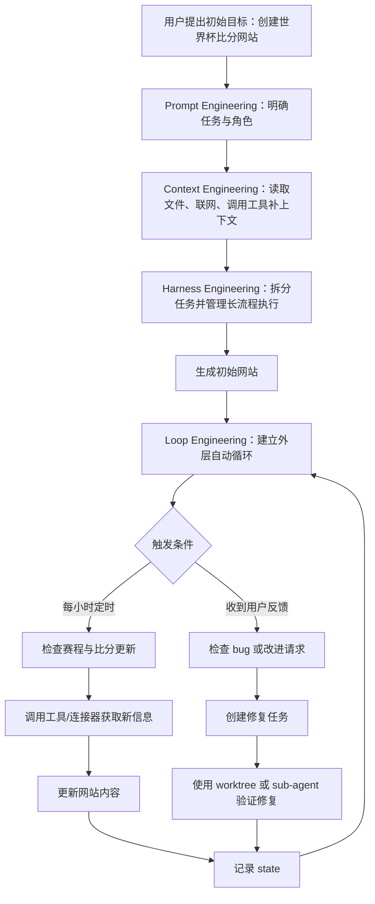

# Loop Engineering explained in 8min：中文结构化笔记

## 一句话总结

这段视频把 AI Agent 工程从 `prompt engineering`、`context engineering`、`harness engineering` 一路讲到 `loop engineering`：核心变化是 Agent 的能力边界从“被人提示后执行”逐步扩展为“能获取上下文、能被外部运行时管理、最终能在自动循环中自我触发任务并持续维护系统”。

## 来源类型

- 类型：视频字幕 / 概念讲解
- 主题：AI Agent 工程范式演进
- 重点术语：prompt engineering、context engineering、harness engineering、loop engineering、automation、worktree、skills、plugins/connectors、sub-agents、state

## 核心观点

1. `loop engineering` 不是凭空出现的新概念，而是建立在前面几层 Agent 工程能力之上的外层循环。
2. 每一层工程范式都在解决上一层的限制：
   - prompt engineering 解决“告诉模型做什么”。
   - context engineering 解决“模型如何获得完成任务所需的信息”。
   - harness engineering 解决“长任务如何在上下文窗口之外被稳定拆解和管理”。
   - loop engineering 解决“任务如何不再完全依赖人类反复提示，而能由系统按条件、时间或状态自我触发”。
3. 视频对 loop engineering 的态度不是完全拥护，而是保留怀疑：它可能只是 buzzword，也可能是 Agent 范式继续扩大后的自然演进。

## 内容结构

### 1. Prompt Engineering：让模型扮演一个角色并执行指令

视频用“你是一个友好的客服代表，请善待客户”作为例子说明 prompt engineering。这里的关键是：人类通过 prompt 隐式告诉 Agent 应该扮演什么角色、用什么语气、完成什么任务。

它适合非常简单、无需外部信息的任务。比如视频中的例子：“地球和月球之间能塞多少个 cheeseburger？”这类问题主要依靠模型已有知识和推理即可回答。

局限是：prompt 本身只是上下文窗口中的一小段指令。它没有自动获取外部信息、维护长期状态、拆解复杂任务的能力。

### 2. Context Engineering：让 Agent 自己获取上下文

context engineering 的起点是：既然 prompt 位于 context window 里，而窗口还可以容纳更多有用信息，那么就让 Agent 根据任务需要主动调用工具，把文件、网页、数据库、外部应用的信息加载进上下文。

视频举例：如果问“NASA 最新发现是什么”，模型不能只靠已有知识回答，因为它需要最新信息。此时 Agent 需要搜索网页、收集 NASA 相关资料，再把这些内容纳入上下文后生成答案。

这里的关键变化是：Agent 不再只被动接收 prompt，而是能通过工具调用补全信息。

### 3. Harness Engineering：在上下文窗口外管理长任务

视频认为 context engineering 本身没有根本缺陷，但不擅长处理超过 5 到 10 分钟的长任务。原因是长任务通常需要大量上下文，Agent 虽然可以不断总结自己的上下文，但这种总结是“leaky”的：每次压缩都可能丢掉关键细节。

harness engineering 因此出现：它不是让 Agent 在 context window 里自己硬撑，而是在外部提供一个运行时和管理系统，帮助拆分需求、管理任务列表、维持执行稳定性。

视频例子是：“克隆整个 NASA 网站”。这种任务远比问答复杂，单靠上下文工程容易中途卡住。harness engineering 的价值在于：外部 harness 可以持续管理 Agent 的任务、上下文和运行状态。

### 4. Loop Engineering：在 harness 外再加一层自我触发循环

视频指出，context engineering 和 harness engineering 本身已经包含循环：

- context engineering 中，Agent 会递归调用工具，直到认为上下文足够。
- harness engineering 中，Agent 会根据外部任务列表，逐项迭代直到完成整个操作。

loop engineering 则是在 harness engineering 外面再叠一层循环，用来指导 harness。它关注的是“人类是否还必须不断给 Agent 下 prompt”。

传统模式里，人类需要不断输入：

- 帮我查 NASA 最新消息。
- 帮我克隆 NASA 网站。
- 帮我更新网站内容。
- 帮我修这个 bug。

loop engineering 想解决的是：能否搭建一个外层脚手架，让 Agent 根据时间、事件、状态、反馈或系统目标，自己决定接下来需要 prompt 自己做什么。

## 关键方法或步骤

视频用“世界杯比分网站”解释 loop engineering 的潜在形态：

1. 用户让 Codex 创建一个 World Cup scores website。
2. Codex 使用 prompt、context、harness engineering 完成初始网站。
3. 由于世界杯比赛每天都在发生，网站需要持续更新比分和信息。
4. 如果每次更新都需要人类提示，维护成本会很高。
5. 用户可以创建一个 scheduled task，让 Codex 每小时检查新信息。
6. Agent 如果发现新比分或新赛程，就自动更新网站。
7. 同理，Agent 也可以定期检查用户报告的 bug，并自主修复。
8. Agent 可以利用已有 skills、plugins、connectors 访问知识库、外部服务和项目上下文。
9. Agent 可以调用 sub-agents 验证自己的工作。
10. Agent 可以使用 worktree 并行处理多个修复，避免运行时污染。
11. Agent 需要维护 state，知道上次检查了什么、当前任务进展如何、哪些问题仍未完成。

## Mermaid 流程图

## Loop Engineering 的六个组件

视频提到 Addy Osmani 的文章将 loop engineering 描述为六个组成部分。字幕中列出的组件是：

| 组件 | 作用 | 在世界杯网站例子中的体现 |
| --- | --- | --- |
| Automation | 让任务按时间、事件或条件自动触发 | 每小时检查比分、自动处理 bug |
| Worktree | 隔离并行改动，避免运行时污染 | 多个修复同时进行时保持代码环境隔离 |
| Skills | 沉淀可复用能力和知识 | 使用已有知识库、规则和工作流持续改进 |
| Plugins and Connectors | 连接外部系统、数据源和服务 | 读取比分源、issue、数据库、部署系统 |
| Sub-agents | 分工、验证或并行执行 | 让子 Agent 检查主 Agent 的更新或修复 |
| State | 保存长期状态和任务记忆 | 记录上次更新时间、已修复问题、待处理事项 |

## 可照做操作步骤

如果要把视频中的 loop engineering 思路落地到一个实际项目，可以按下面方式设计：

1. 先选一个需要持续维护的目标，而不是一次性任务  
   例如新闻站、体育比分站、产品文档、客户反馈修复、监控报告、数据看板。

2. 明确初始人类 prompt  
   写清楚系统目标、成功标准、更新频率、禁止操作、需要人工确认的边界。

3. 给 Agent 配置上下文获取能力  
   包括代码库访问、文件读写、网页检索、数据库、API、Gmail、Slack、GitHub issue、日志系统等。

4. 设计 harness 层  
   把大任务拆成可执行任务列表，要求 Agent 每一步保存输出、检查错误、必要时回滚或等待审批。

5. 增加 loop 触发器  
   可以是定时任务、webhook、issue 更新、监控告警、邮件到达、用户反馈、数据源变化。

6. 给每个循环定义输入和退出条件  
   例如“每小时检查一次，如果没有新比分则只记录状态，不修改文件；如果有新比分则更新页面并运行测试”。

7. 引入验证机制  
   使用测试、lint、截图检查、子 Agent review、对比前后输出，避免自动循环不断放大错误。

8. 使用隔离环境处理并行修改  
   如果多个修复可能同时发生，用 worktree 或分支隔离，防止不同任务互相污染。

9. 维护 state  
   保存上次运行时间、已处理项目、失败原因、未完成任务、用户反馈、重要决策。

10. 设定人工介入边界  
   对发布、删除数据、发送消息、改动账单、修改权限等高风险动作，要求人类确认。

## 常见误区

1. 把 loop engineering 当成“多跑几轮 prompt”  
   视频中的 loop engineering 不是简单重复执行，而是把触发、状态、工具、验证和持续维护组织成外层系统。

2. 以为 loop engineering 会替代 prompt/context/harness engineering  
   视频明确说，它不是替代下层工程，而是在 Agent 范围变大后叠加在上面的外层能力。

3. 忽视 token 和 AI slop 风险  
   视频承认很多人批评 loop engineering 只是鼓励消耗更多 token、制造更多低质量 AI 内容。这个质疑成立，除非循环中有明确目标、验证和退出条件。

4. 没有 state 就谈自动循环  
   没有状态记录，Agent 每轮都像第一次运行，容易重复处理、遗漏上下文或产生不一致改动。

5. 没有人工边界就自动执行  
   loop engineering 的价值在持续性，但风险也在持续性。越是自动运行，越要明确什么能自动做、什么必须等待确认。

## 值得质疑的地方

- 视频承认目前还很少看到 loop engineering 带来“巨大差异”的真实案例，因此它仍有概念炒作成分。
- “自我提示”听起来很强，但如果没有可靠的目标函数和验证机制，Agent 可能只是更快地产生错误结果。
- 自动维护网站的例子合理，但是否能推广到高风险业务流程，还取决于权限控制、审计、回滚、成本和安全机制。
- 视频中赞助内容与主题无直接关系，应视为广告信息，不纳入方法论本身。

## 可执行建议

1. 先把 loop engineering 理解为“自动化运行系统”，不要神化为全自动智能体。
2. 任何 Agent 循环都必须有四个最小要素：触发器、状态、验证、人工边界。
3. 如果任务无法定义验收标准，就不适合直接放进自动循环。
4. 对个人工作流，可以从低风险任务开始：定期整理资料、生成摘要、检查链接、更新文档、归档 issue。
5. 对代码项目，可以让 Agent 自动检查 bug report，但提交 PR 或部署前保留人工 review。
6. 记录每轮循环的输入、输出和决策依据，这比让 Agent “看起来很聪明”更重要。

## 一句话复盘

`loop engineering` 的核心不是发明了一个新 prompt 技巧，而是把 Agent 放进一个可持续运行的外部循环里，让它在自动触发、状态记忆、工具连接、隔离执行和验证反馈的约束下，持续维护一个目标系统。
